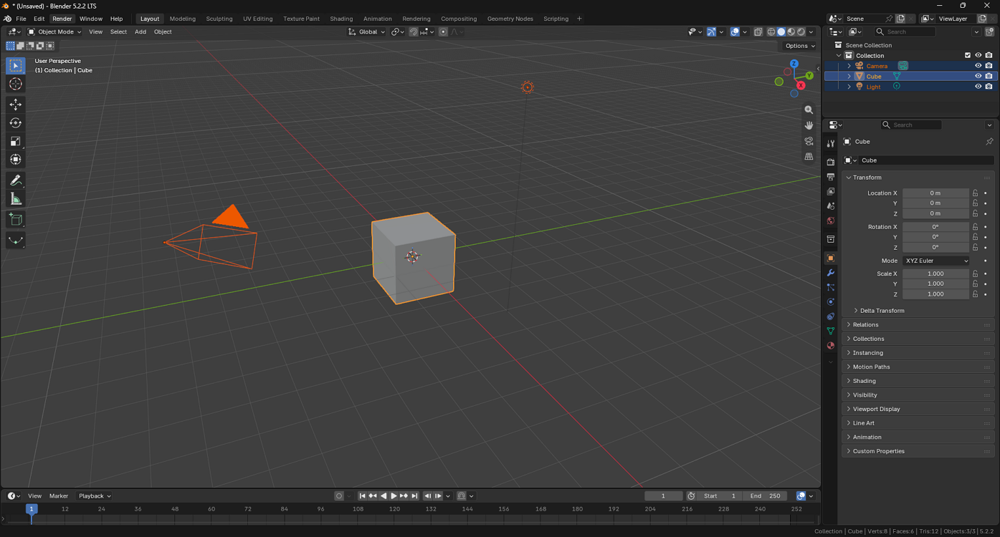

# Selecting All Objects

> **Note:** This document was generated by Claude Code and has not been reviewed by a human. Please use it as a reference only.

Select everything in the scene at once, rather than clicking each object individually.

## Select All

With the cursor over the viewport, press `A`.

> **Note:** To deselect everything instead, press `Alt+A`.
