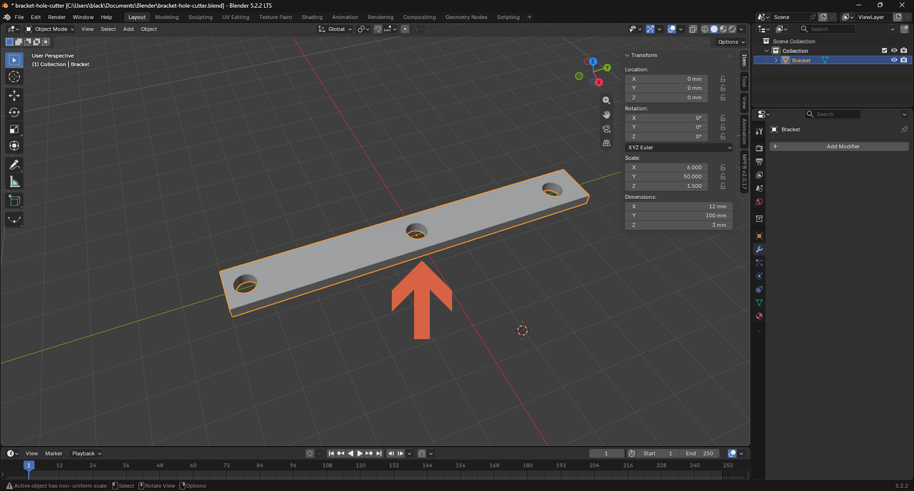
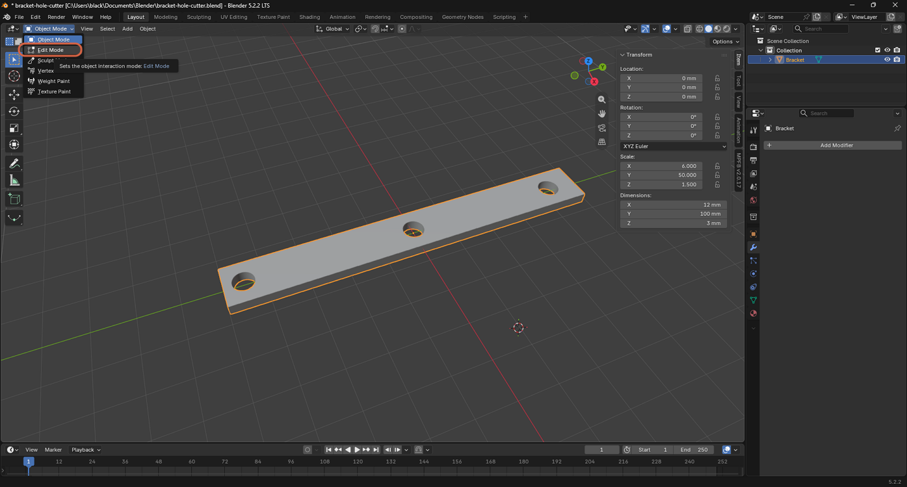
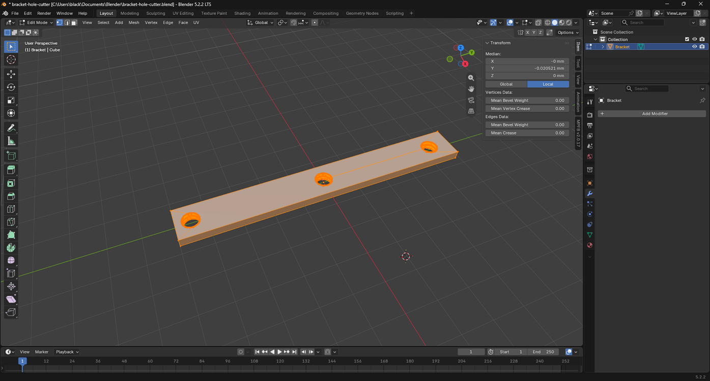
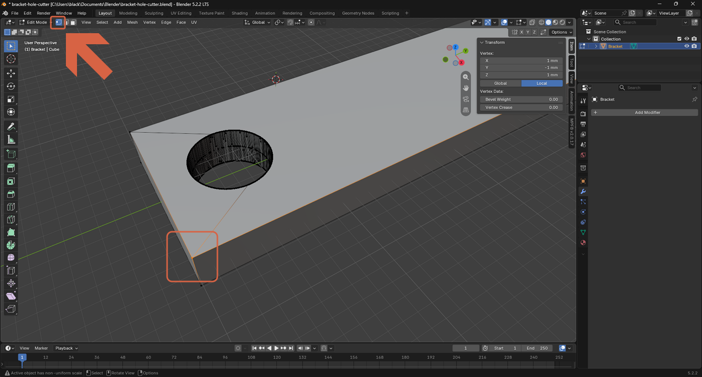
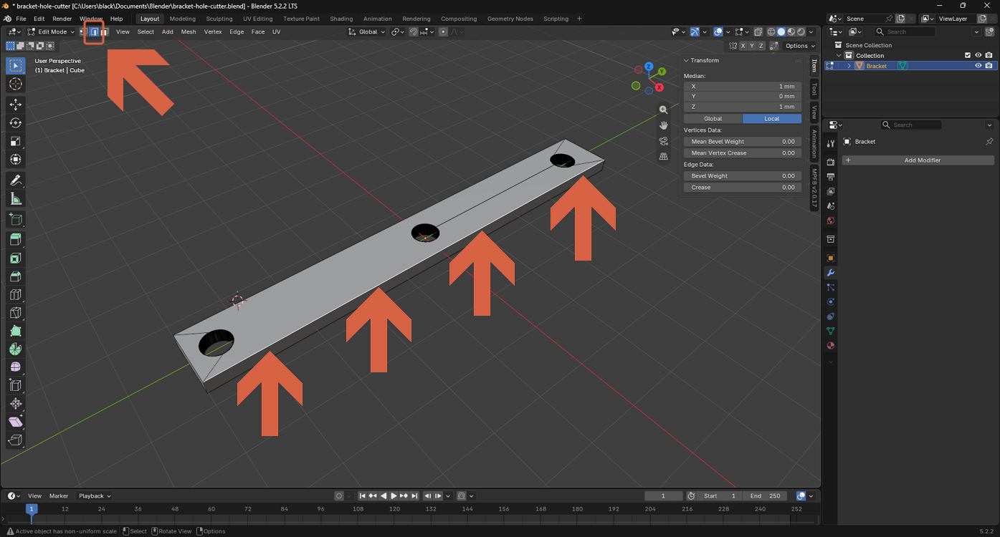
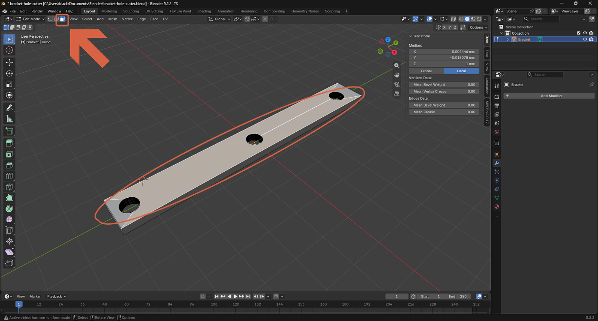

# Selecting Vertices, Edges, and Faces

> **Note:** This document was generated by Claude Code and has not been reviewed by a human. Please use it as a reference only.

Blender's Edit Mode lets you select an object's individual vertices, edges, or faces to modify its mesh directly, instead of moving the whole object.

## Step 1: Select the Object

In Object Mode, select the object you want to edit.

## Step 2: Enter Edit Mode

Click the mode dropdown in the header (or press `Tab`), then select **Edit Mode**.

Edit Mode opens in **Vertex Select** by default, with the mesh's vertices, edges, and faces all selected.

## Step 3: Switch Select Modes

Use the three icons next to the mode dropdown (or press `1`, `2`, or `3`) to switch between selecting vertices, edges, or faces.

**Edge Select** — selects a line between two vertices.

**Face Select** — selects a flat surface, shown with a dot at its center.

## Step 4: Select Multiple Elements at Once

Drag a selection box over several elements to select them all together, instead of clicking each one individually.

