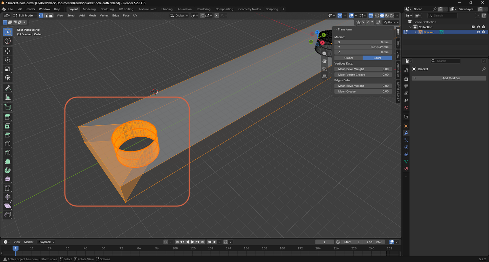
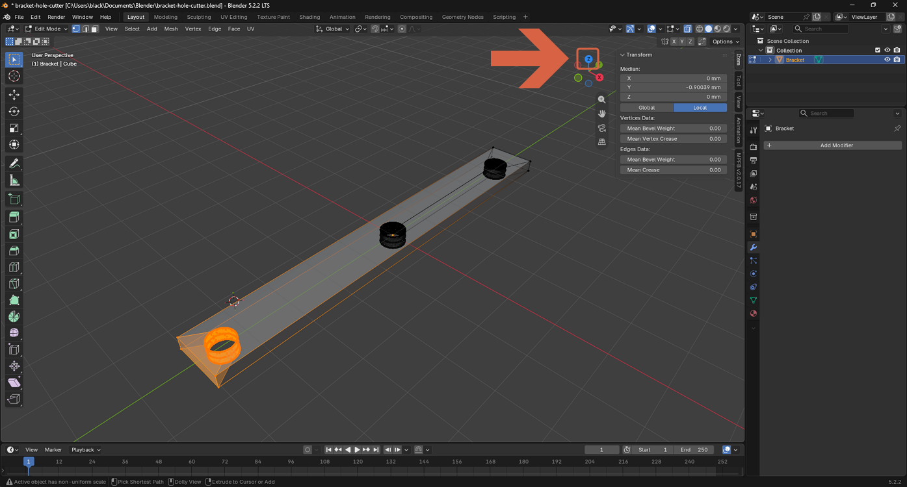
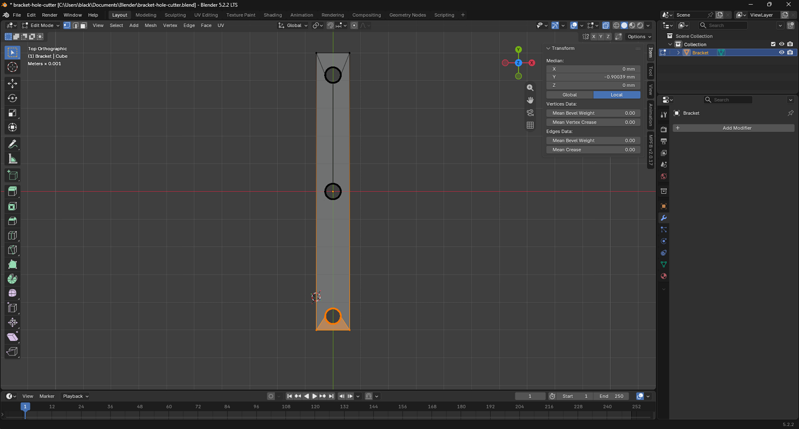

# Switching to Top View

> **Note:** This document was generated by Claude Code and has not been reviewed by a human. Please use it as a reference only.

Clicking an axis on the navigation gizmo snaps the viewport to a straight-on orthographic view from that direction, instead of the free-rotating perspective view.

## Click the Z Axis on the Navigation Gizmo

Click the blue **Z** dot at the top of the gizmo in the viewport's top-right corner (or press `Numpad 7`).

The view switches to **Top Orthographic**, looking straight down the Z axis.

> **Note:** The gizmo's other dots work the same way — for example, `Numpad 1` for Front and `Numpad 3` for Right.
