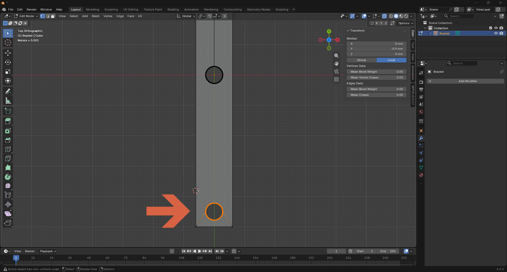
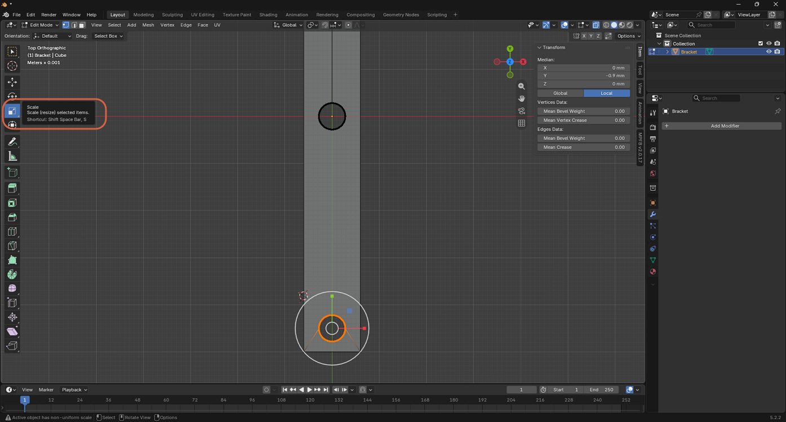
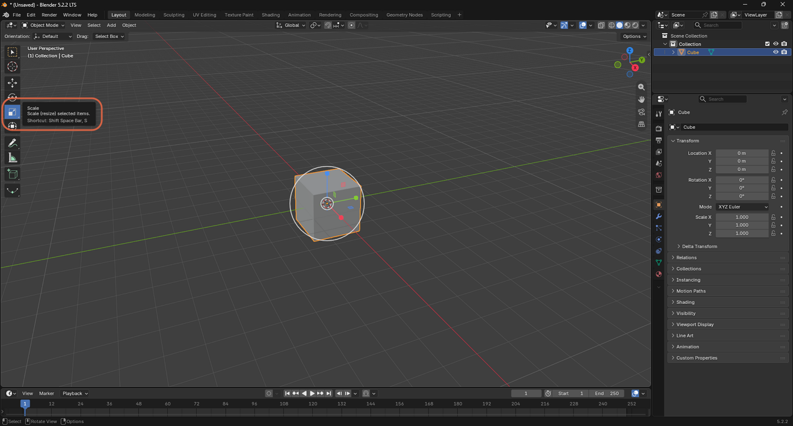
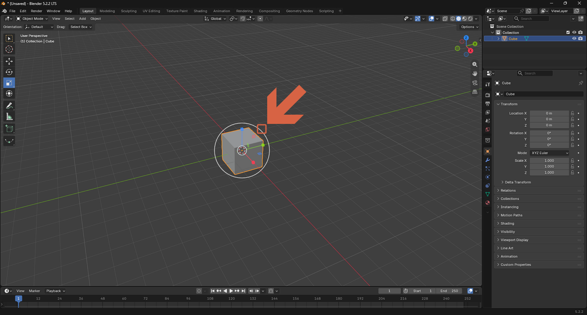
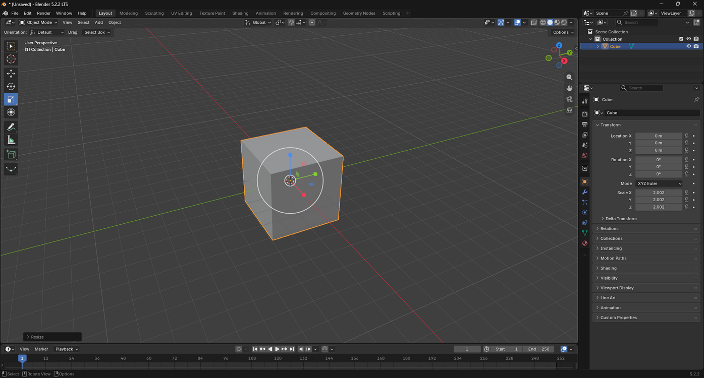

# Using the Scale Tool

> **Note:** This document was generated by Claude Code and has not been reviewed by a human. Please use it as a reference only.

The **Scale** tool resizes the current selection — a whole object in Object Mode, or selected vertices, edges, or faces in Edit Mode — by dragging an on-screen gizmo, instead of typing exact numbers.

## Step 1: Select What to Scale

Select the object, or the vertices, edges, or faces you want to resize.

## Step 2: Choose the Scale Tool

Click the **Scale** tool in the toolbar (or press `S`).

Drag the gizmo's outer circle to scale evenly in all directions, or drag one of its colored axis handles to scale along just that axis.

## Step 3: Scale Evenly in All Directions

Grab the small white square on the gizmo's outer circle, then drag it.

The object scales up or down evenly on all axes at once, rather than stretching along a single direction.

