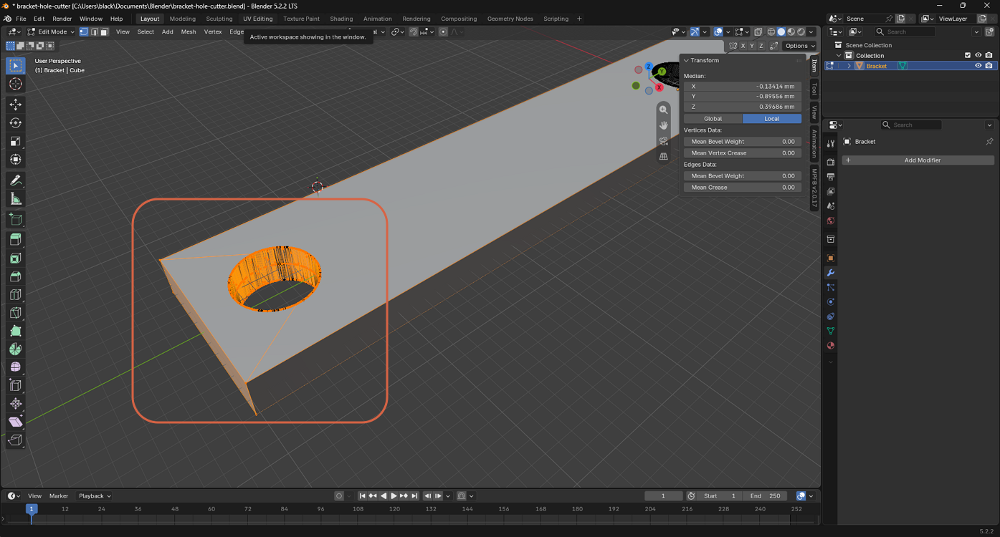
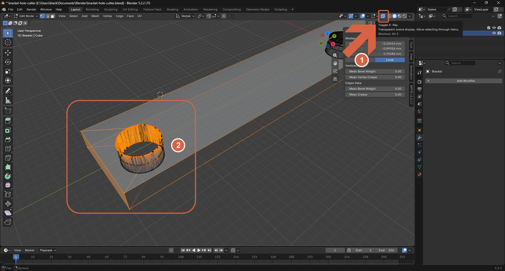

# Using X-Ray Mode

> **Note:** This document was generated by Claude Code and has not been reviewed by a human. Please use it as a reference only.

X-Ray mode makes the mesh semi-transparent, so you can see and select vertices, edges, or faces on the far side of the object — geometry that would otherwise be hidden behind the near side.

## Toggle X-Ray Mode

Click the **Toggle X-Ray** icon in the header (or press `Alt+Z`).

**Before** — with X-Ray off, only the near side of the hole's geometry is visible and selectable.

**After** — with X-Ray on, the mesh becomes semi-transparent, revealing and allowing selection of the far side of the hole too.

> **Note:** X-Ray mode also works in Object Mode, where it lets you box-select through overlapping objects instead of only the ones on top.
