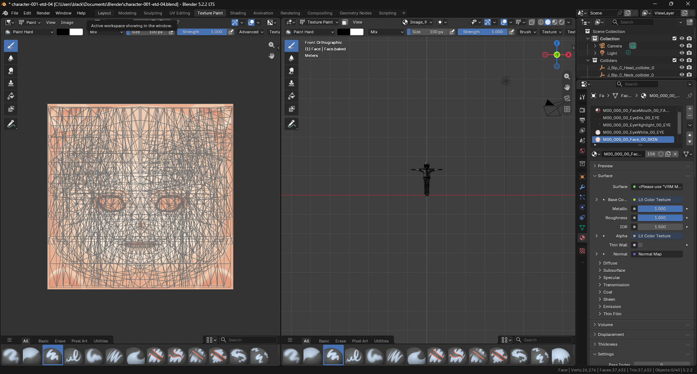
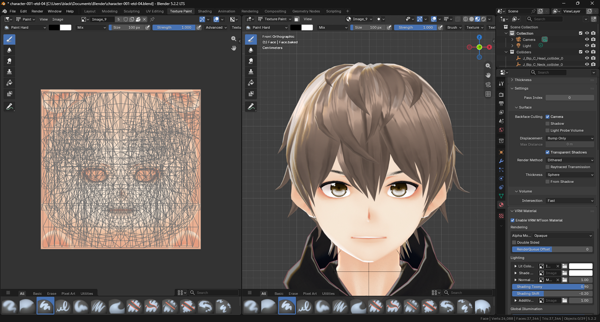
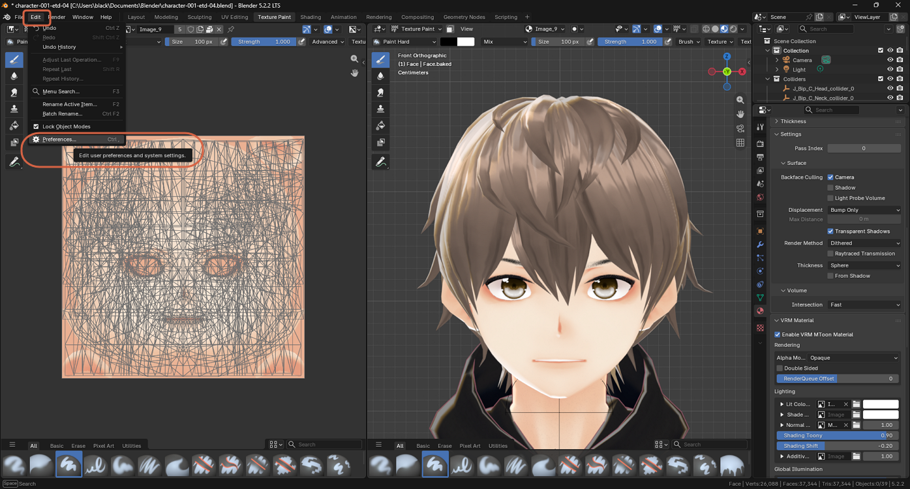
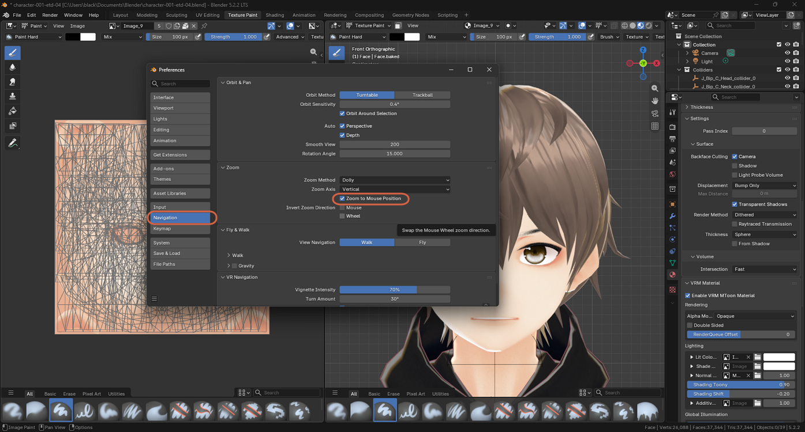
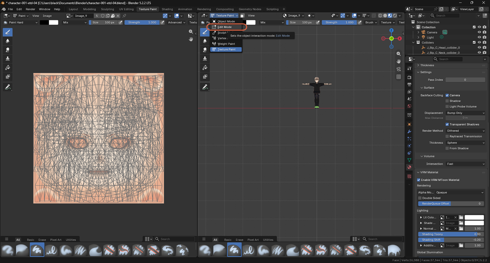
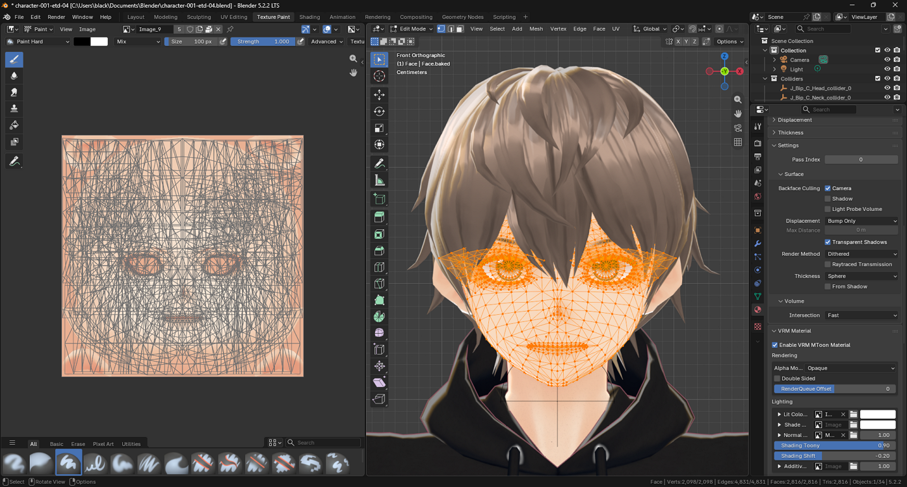
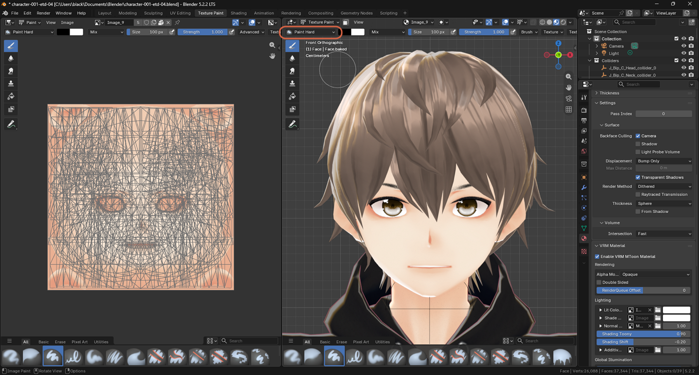

# Zooming In on the Face in Texture Paint Mode

> **Note:** This document was generated by Claude Code and has not been reviewed by a human. Please use it as a reference only.

In Texture Paint mode, the **View** menu is trimmed down and has no **Frame Selected** option, so a small character can be hard to zoom in on. Several navigation shortcuts still work — hover the mouse over the 3D viewport before using any of them.

## Method 1: Zoom Region

The fastest option. Press `Shift+B`, then drag a box around the character's head. The view zooms straight into that rectangle. You can also find it under **View** → **Navigation** → **Zoom Region**.

## Method 2: Center on the Face, Then Scroll

1. Press `Alt` and middle-click on the face. The view orbits around and centers on that point.
2. Scroll the mouse wheel to zoom in, or drag with `Ctrl` and the middle mouse button.

### Zoom Toward the Mouse (Optional)

To make scrolling zoom toward wherever the cursor is — helpful for painting — turn on **Zoom to Mouse Position**:

1. Go to **Edit** → **Preferences**.

    

2. Click **Navigation**, then check **Zoom to Mouse Position** under **Zoom**.

    

Now you can point at the face and scroll.

## Method 3: Frame Selected from Another Mode

1. Switch to Edit Mode (`Tab`, or the mode dropdown in the viewport header).

    

2. Select a few vertices on the face, then press `Numpad .` (**View Selected**). If your keyboard has no numpad, see [Using Number Keys as a Numpad](emulate-numpad.md).

    

3. Switch back to Texture Paint mode. The view stays where you put it.

    
