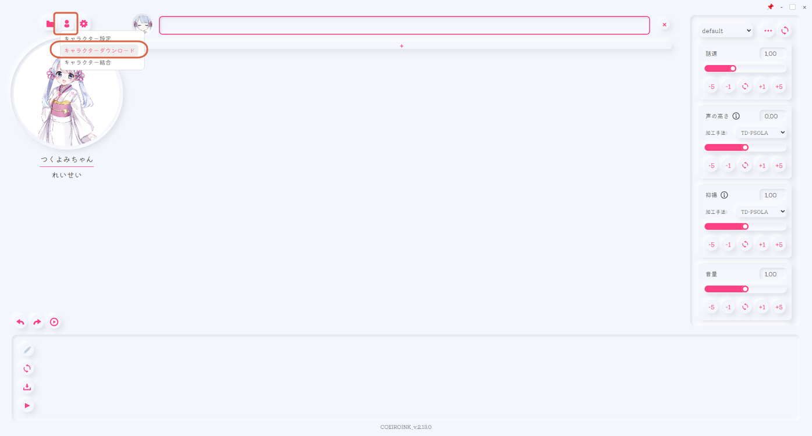
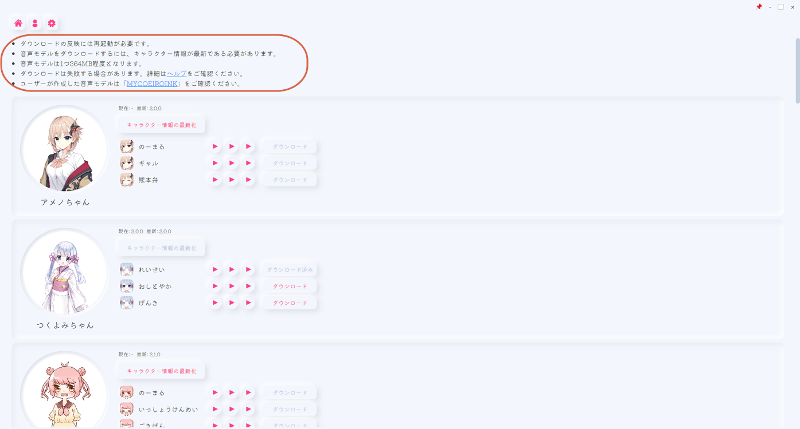
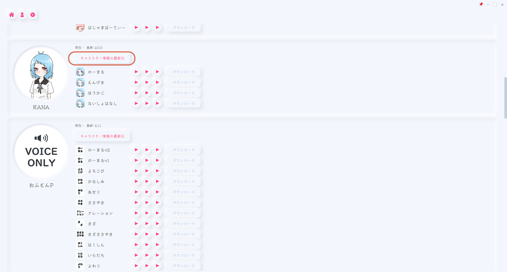
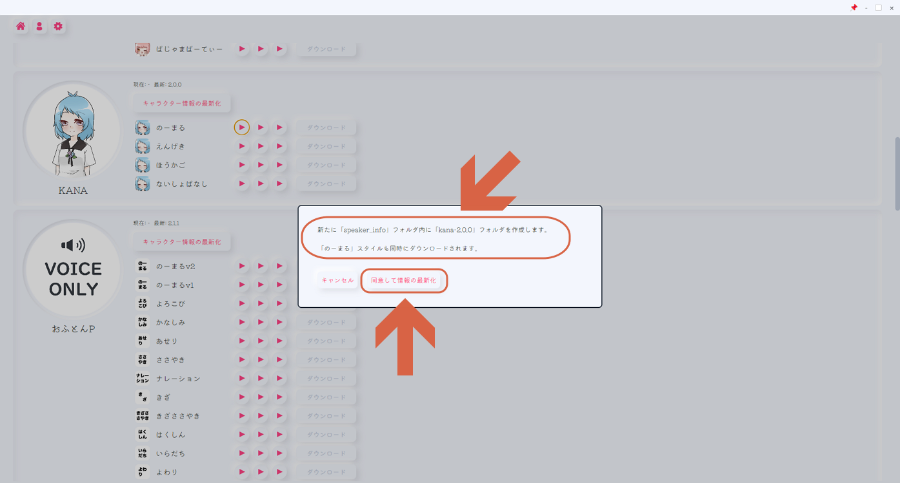
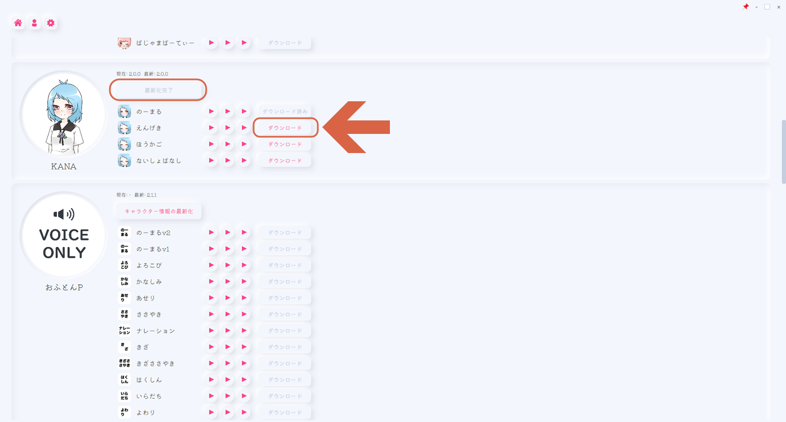
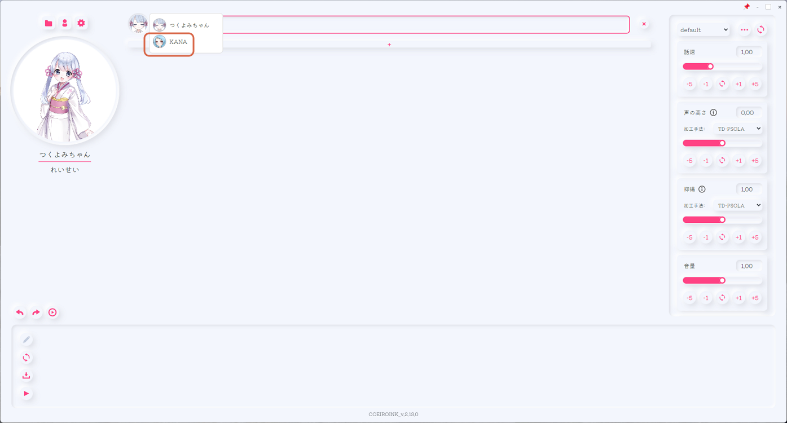

# Downloading Built-In Character Voices

> **Note:** This document was generated by Claude Code and has not been reviewed by a human. Please use it as a reference only.

CoeiroInk ships with more official character voices than the one or two loaded by default — the rest are downloaded on demand from inside the app. This is separate from [MyCoeiroInk](add-mycoeiroink-voice-to-coeiroink.md), which distributes community-made voices as ZIP files instead.

## Step 1: Open Character Download

Click the character icon, then **キャラクターダウンロード** (Character Download).

## Step 2: Read the Notes

A few things worth knowing before downloading:

- Downloads take effect only after restarting CoeiroInk.
- Character info must be up to date before you can download a voice model.
- Each voice model is roughly 364 MB.
- Downloads can occasionally fail — check the Help page if that happens.
- User-created voice models are found on **MYCOEIROINK** instead, not here.

## Step 3: Update Character Information

Find the character you want, then click **キャラクター情報の最新化** (Update Character Information).

## Step 4: Confirm the Update

A dialog explains that a new folder will be created under `speaker_info`, and that the default style downloads along with it. Click **同意して情報の最新化** (Agree and Update Information).

## Step 5: Download a Style

Once the button reads **最新化完了** (Update Complete), click **ダウンロード** (Download) next to any style you want.

## Step 6: Restart and Confirm

Restart CoeiroInk. The new character now appears in the character dropdown alongside the default one.

