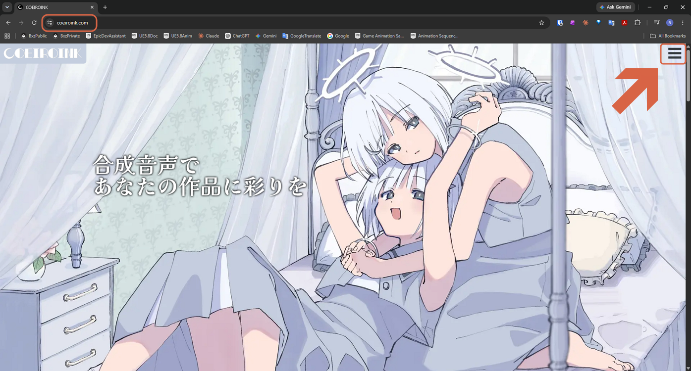
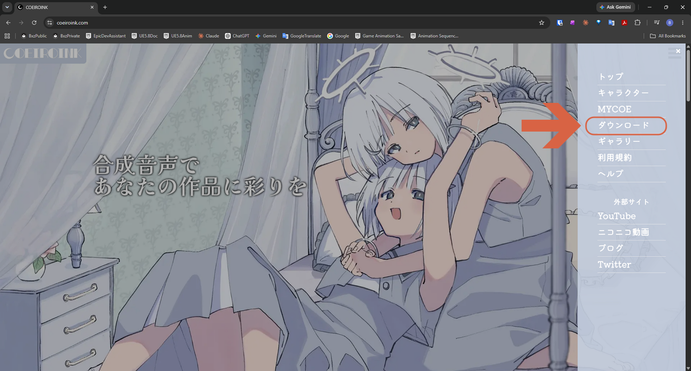
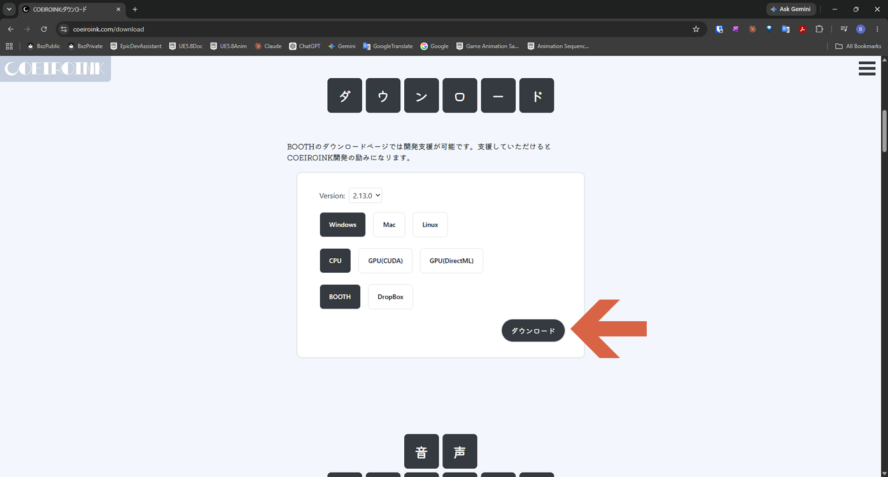
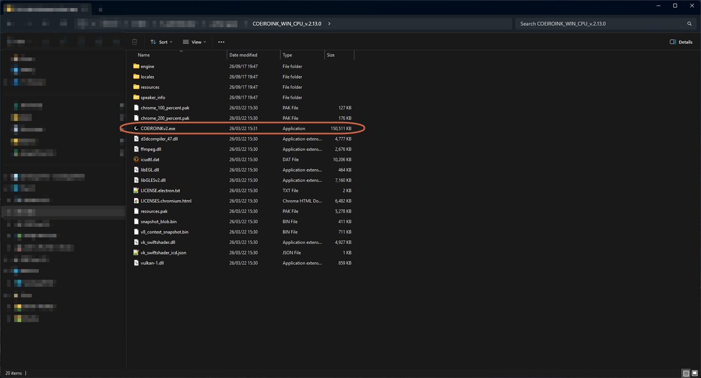

# Getting Started with CoeiroInk

> **Note:** This document was generated by Claude Code and has not been reviewed by a human. Please use it as a reference only.

CoeiroInk is a free Japanese text-to-speech app. It's portable — no installer, just extract and run.

## Step 1: Open the Download Page

Go to the [official site](https://coeiroink.com), click the hamburger menu, then **ダウンロード** (Download).

## Step 2: Configure and Download

Choose your version, OS, and mode (CPU or GPU), then click **ダウンロード** (Download). The **BOOTH** source is selected by default.

## Step 3: Download from BOOTH

On the BOOTH page, click **無料ダウンロード** (Free Download) to get the ZIP file.

## Step 4: Extract and Launch

Extract the downloaded ZIP file, then double-click `COEIROINKv2.exe` inside it. No installation step is needed.

