# Building an Image-to-Image Workflow for Anima

> **Note:** This document was generated by Claude Code and has not been reviewed by a human. Please use it as a reference only.

Text-to-image starts from a blank **Empty Latent Image** (pure noise). Image-to-image starts from your own reference image instead. This adds a **Load Image** → **Upscale Image** → **VAE Encode** chain inside the [Anima](run-anima-locally-with-comfyui.md) template, feeding the reference into the KSampler in place of the empty latent. The KSampler's **denoise** value then decides how much of the reference gets repainted.

## Step 1: Open the Subgraph

The **Text to Image (Anima)** node is a subgraph — a node with a small workflow inside it. Click the small icon at the top-right corner of the node (tooltip: "Subgraph node for Text to Image (Anima)") to open it.

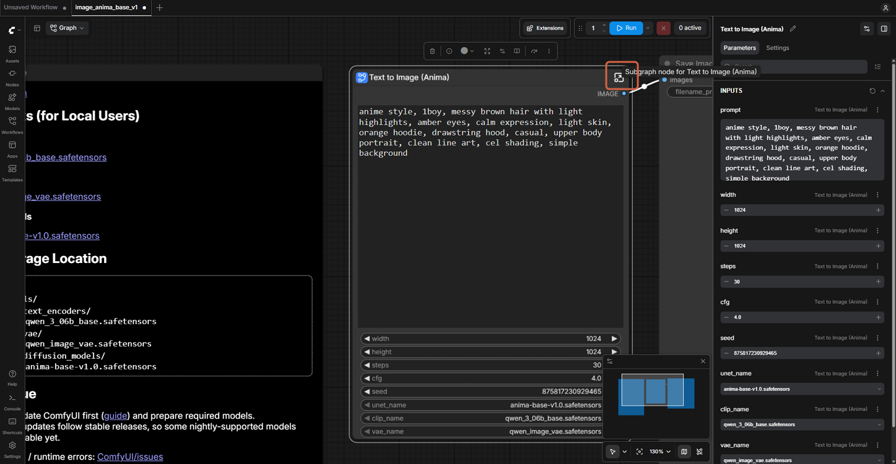

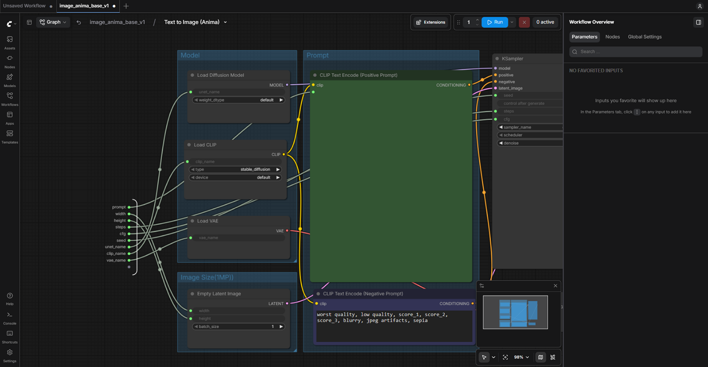

## Step 2: Add a Load Image Node

Double-click an empty part of the canvas to open the node search, then click **Load Image** in the list (or press Enter). The panel on the right is only a preview until you click.

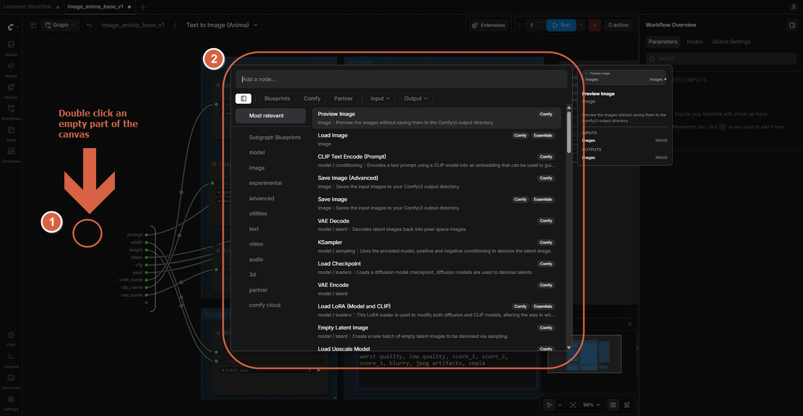

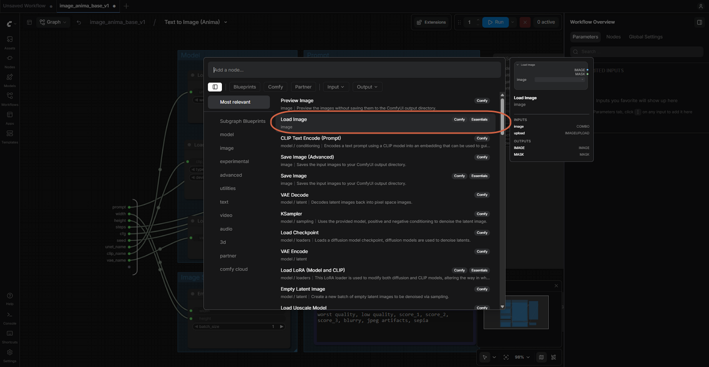

## Step 3: Load Your Reference Image

Drop the file directly onto the **Load Image** node, or click **choose file to upload**. Dropping it onto empty canvas may load it as a workflow instead.

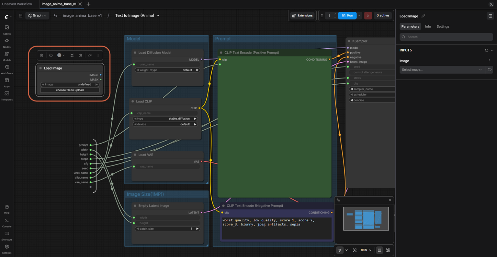

> **Note:** Crop the reference first. A first attempt here used a full screenshot with the source app's interface still around the character — the model copies whatever is in the picture, interface included.

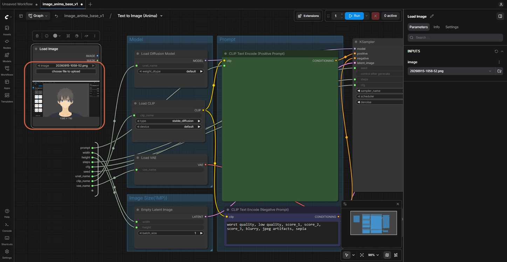

## Step 4: Add Upscale Image and Set the Size

Search **Upscale Image** and add it. Connect Load Image's `IMAGE` output to Upscale Image's `image` input, then set **width** and **height** to `1024` (it defaults to `512`).

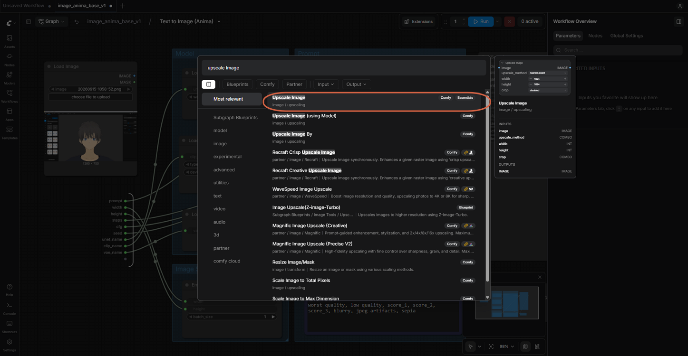

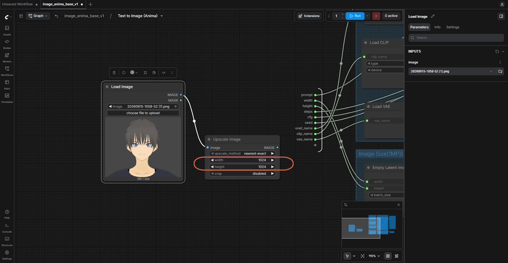

## Step 5: Add VAE Encode and Connect It

Search **VAE Encode** — the plain one, not **VAE Encode (for Inpainting)**.

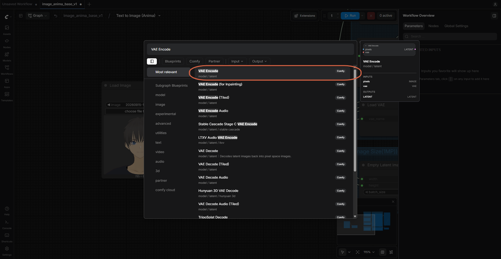

Connect:

- Upscale Image's `IMAGE` → VAE Encode's `pixels`
- Load VAE's `VAE` (in the Model group) → VAE Encode's `vae`

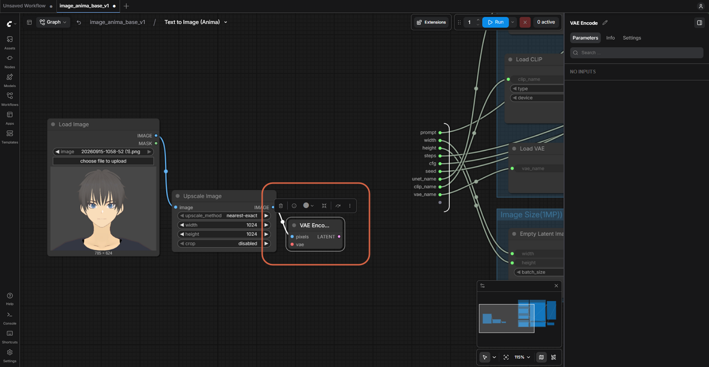

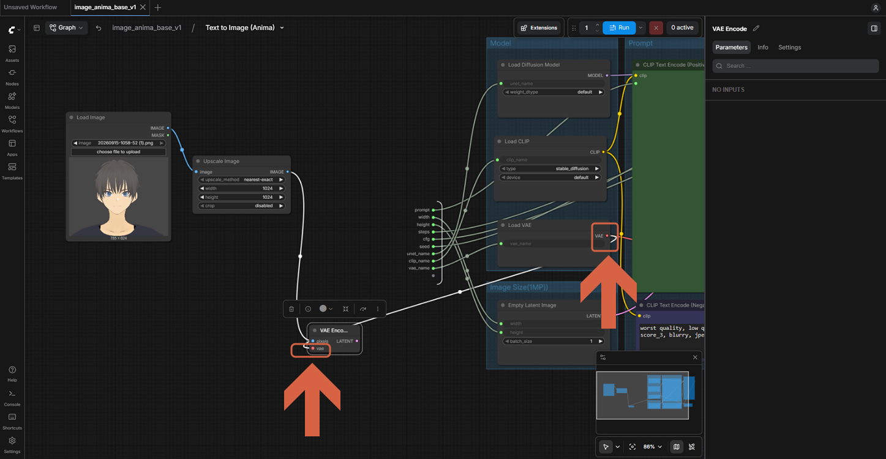

## Step 6: Feed the Encoded Image into the KSampler

Drag VAE Encode's `LATENT` output to the KSampler's `latent_image` input. This replaces the link from Empty Latent Image, which can stay where it is, unused. From here on, the subgraph's width/height fields have no effect.

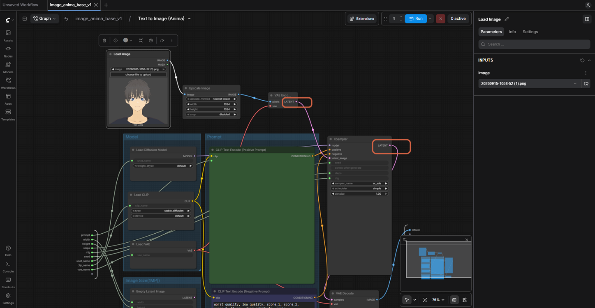

## Step 7: Lower Denoise to 0.60

At `1.00`, the reference is ignored completely. `0.60` is a good starting point.

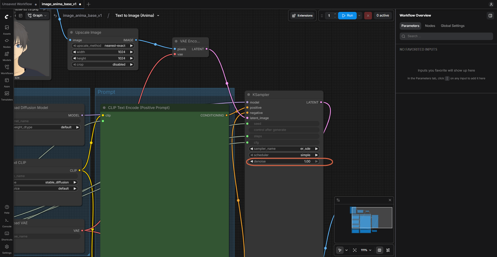

## Step 8: Fine-Tune Upscale Image

- **crop → center.** The reference isn't square, so `disabled` would squash it into 1024 × 1024 and stretch the face. `center` trims the sides instead.
- **upscale_method → lanczos.** `nearest-exact` gives a blocky enlargement that the model may copy.

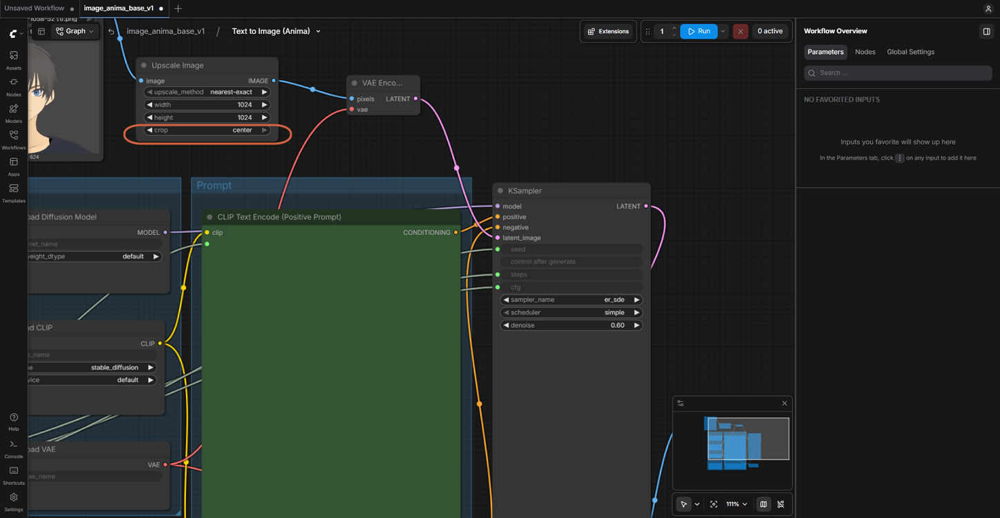

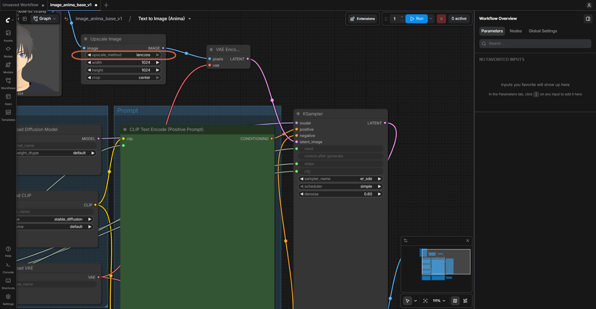

## Step 9: Run It

Run works from inside the subgraph too. A message appears near the Run button once the job finishes.

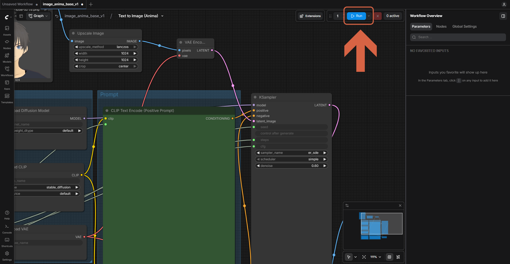

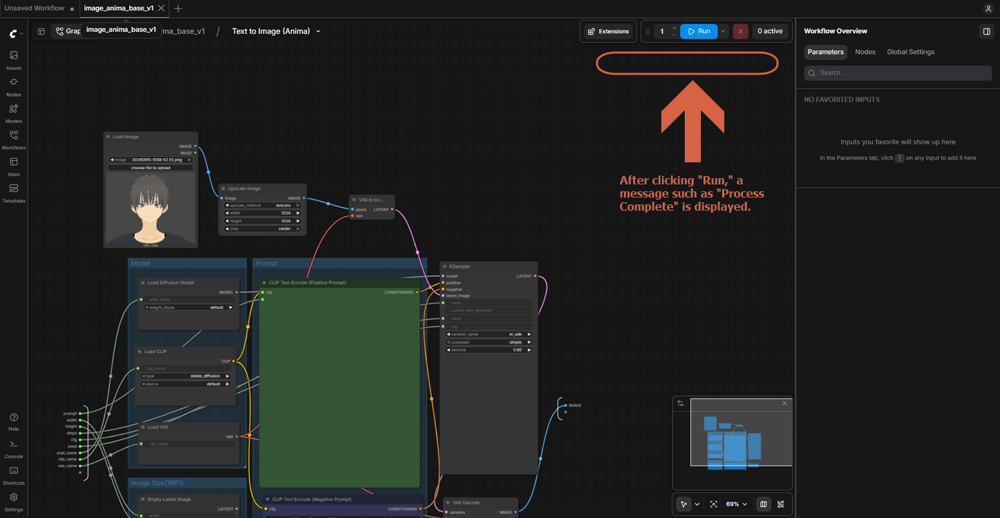

## Step 10: Return to the Main View and Check the Result

The path at the top — for example, `image_anima_base_v1 / Text to Image (Anima)` — is the breadcrumb. Click the first part to leave the subgraph. This is not the same as the tab at the very top of the window, which is the open workflow file.

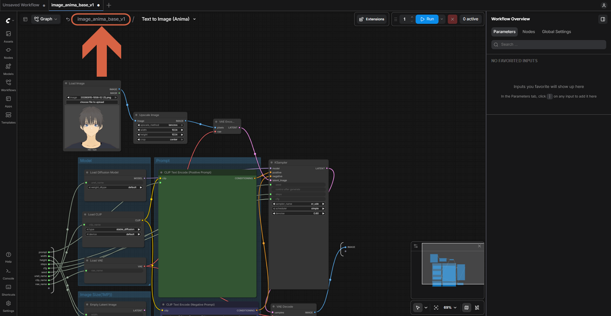

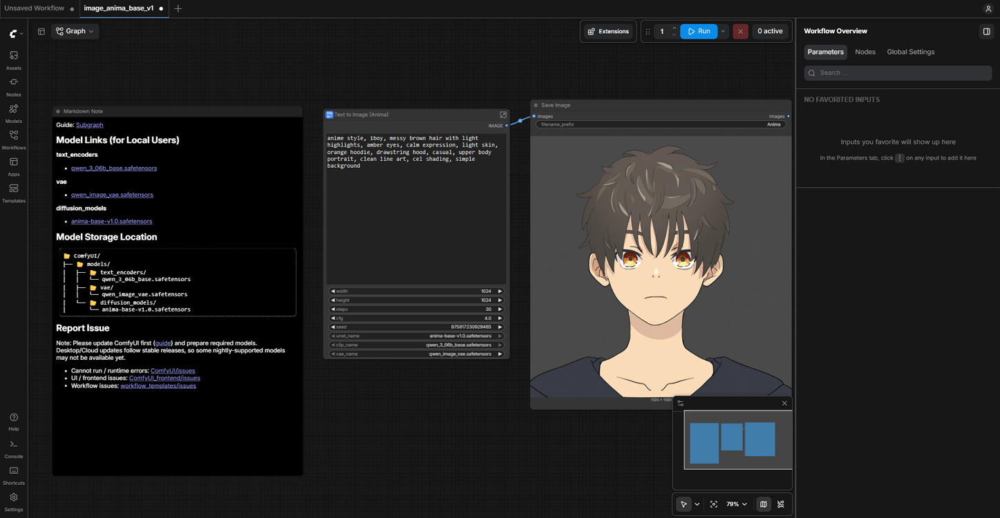

> **Note:** The prompt still influences details even at a moderate denoise. In this test, the prompt still described the reference's original character — "amber eyes" — and the result kept the reference's pose, hair shape, and dark top, but the eyes came out amber rather than matching the reference's blue eyes. At denoise 0.60, the reference controls layout and color while the prompt still wins on fine details. Update the prompt to match your reference for a closer result.

## Choosing a Denoise Value

| Denoise | What Happens |
|---|---|
| 0.30 – 0.50 | Stays close to the reference; mostly changes style and fine detail. |
| 0.55 – 0.70 | Keeps pose, layout, and colors but redraws a lot. Usually the sweet spot. |
| 0.80+ | Only loosely follows the reference. |
| 1.00 | Ignores the reference — the same as text-to-image. |

If the result looks too much like the reference image, raise denoise. If the face or pose drifts, lower it.

## Backing Up a Prompt

Every PNG that ComfyUI saves also stores the full workflow inside it, including the prompt, seed, and settings. Drag an output PNG onto the canvas to restore everything that made it. You can also keep prompts in a Note or Markdown Note node, or save separate workflows — see [Saving and Finding ComfyUI Workflows](save-and-find-comfyui-workflows.md).

> **Warning:** Image-to-image copies a picture, not a character. Keeping the same character consistent across new poses and scenes needs other methods, such as IPAdapter or ControlNet.

## References

- [Image to Image Workflow](https://docs.comfy.org/tutorials/basic/image-to-image) — official docs.
- [Anima Base v1 ComfyUI Workflow Example](https://docs.comfy.org/tutorials/image/anima/anima) — official docs.
- [image_anima_base_v1.json](https://github.com/Comfy-Org/workflow_templates/blob/main/templates/image_anima_base_v1.json) — the template's source file.
