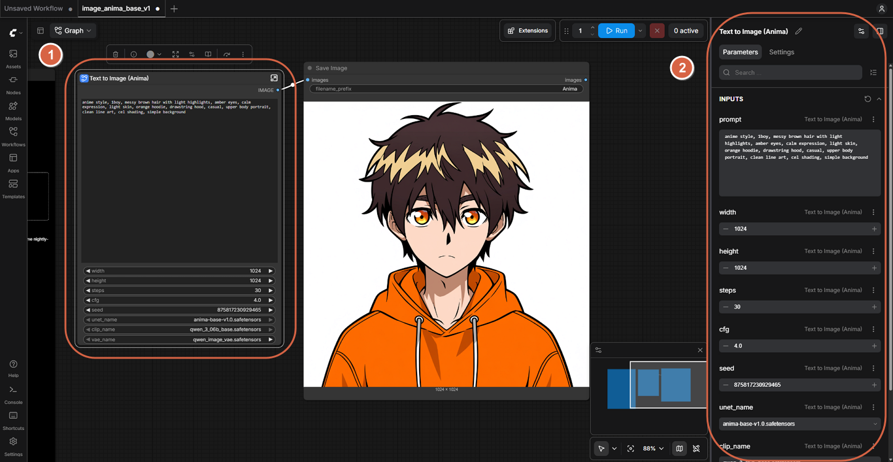
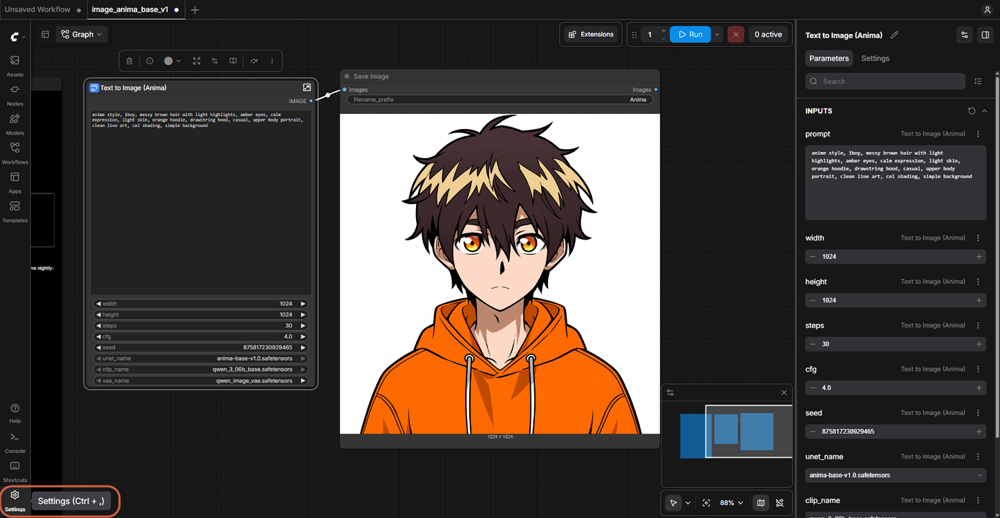
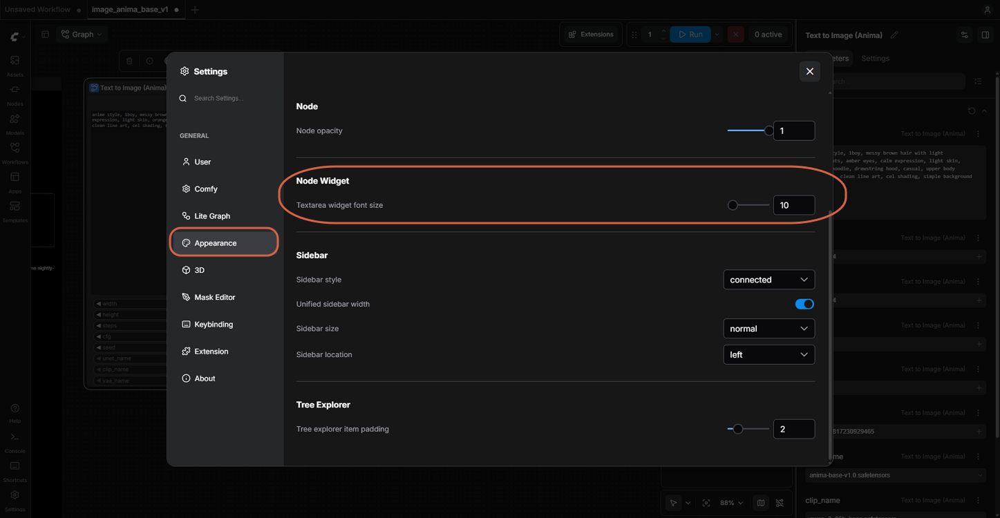
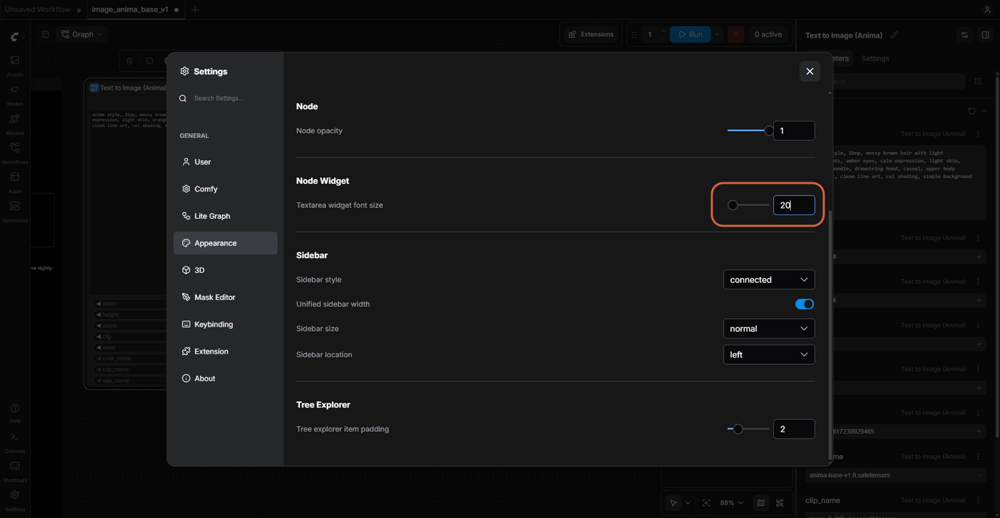
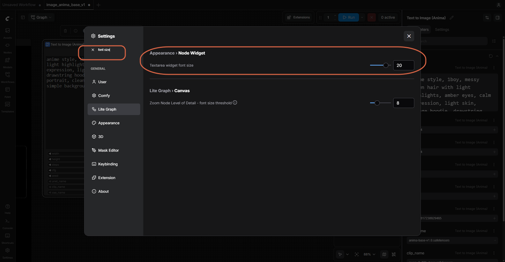
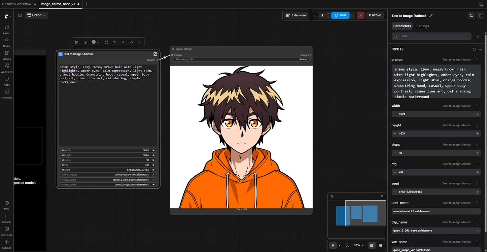
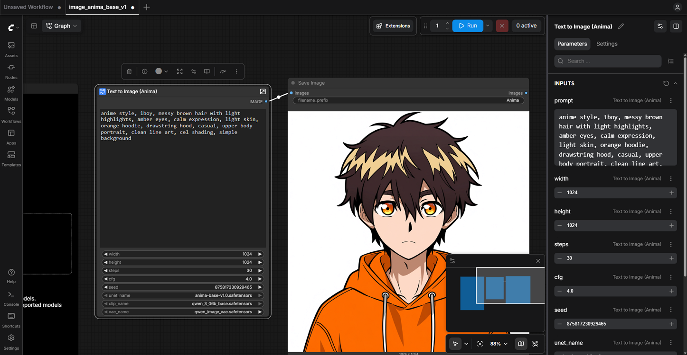

# Enlarging the Prompt Text in ComfyUI

> **Note:** This document was generated by Claude Code and has not been reviewed by a human. Please use it as a reference only.

The prompt text inside a node's textarea is small by default. These are three ways to make it more readable, from quickest to most persistent.

## Method 1: Edit in the Parameters Panel

Select the node. Its prompt appears in the right-hand **Parameters** panel at a normal, readable size, and you can edit it there directly — no settings change needed.

## Method 2: Raise the Textarea Widget Font Size

This changes the font size in every text node's textarea, not just one.

1. Click **Settings** (gear icon, bottom-left).

    

2. Click **Appearance**, then find **Node Widget** → **Textarea widget font size**. It defaults to `10`.

    

3. Raise the value — for example, to `20`.

    

You can also type "font size" into the settings search box to jump straight to it. The search also surfaces a related **Lite Graph** → **Canvas** → **Zoom Node Level of Detail - font size threshold** setting, which controls how far you can zoom out before node text stops rendering in detail.

> **Note:** A [GitHub issue](https://github.com/comfyanonymous/ComfyUI/issues/11121) reports that this setting has no effect when "Nodes 2.0" is enabled. If raising the value doesn't change anything, check whether Nodes 2.0 is turned on.

## Method 3: Zoom the Canvas

The prompt text scales with the graph's zoom level, so zooming in on the node makes it more readable without changing any setting.

> **Note:** `Ctrl++` / `Ctrl+-` should zoom the entire ComfyUI Desktop window, similar to a browser. This comes from the app's Electron base, not from a ComfyUI setting.

## Reference

- [Customizing ComfyUI Appearance](https://docs.comfy.org/interface/appearance) — official docs, covers the font size setting and a custom `user.css` for further control.
