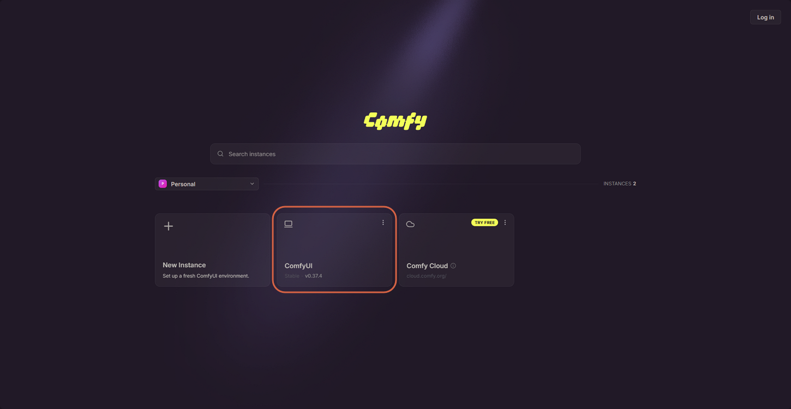
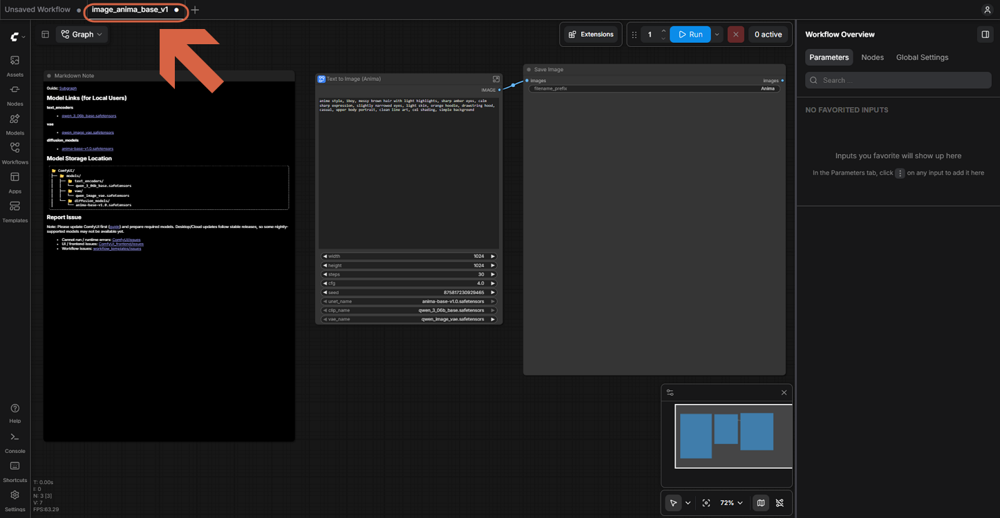
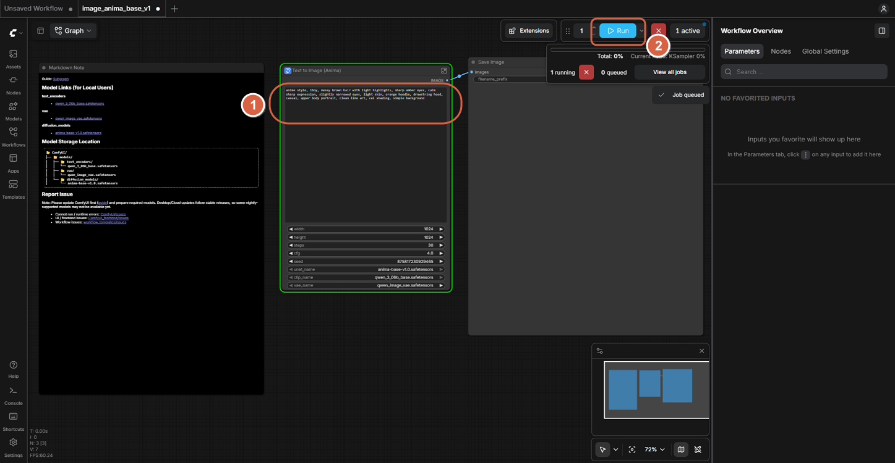
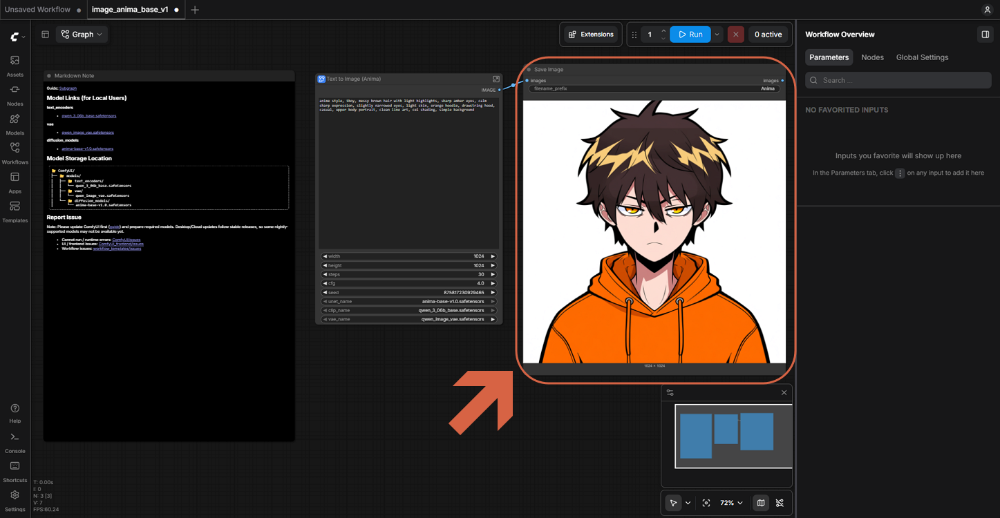

# Running Anima Locally with ComfyUI

> **Note:** This document was generated by Claude Code and has not been reviewed by a human. Please use it as a reference only.

**Anima** is a text-to-image model with a ready-made workflow template bundled in ComfyUI Desktop, so no manual node setup is needed.

## Step 1: Open Your ComfyUI Instance

From the ComfyUI Desktop launcher, open your local **ComfyUI** instance (not **Comfy Cloud**).

## Step 2: Open the Anima Template

Open the **Text to Image (Anima)** template. It loads as a small graph with a text prompt node connected to a **Text to Image (Anima)** node and a **Save Image** node.

> **Note:** The Markdown Note node on the template lists where its models are stored and links to download them if they're missing.

## Step 3: Enter a Prompt and Run

Type your prompt into the text box, then click **Run**.

## Step 4: View the Result

The generated image appears in the **Save Image** node once the job finishes.

> **Note:** The prompt box in the node is small and hard to read. See [Enlarging the Prompt Text in ComfyUI](enlarge-prompt-text-in-comfyui.md) for ways to fix that.
