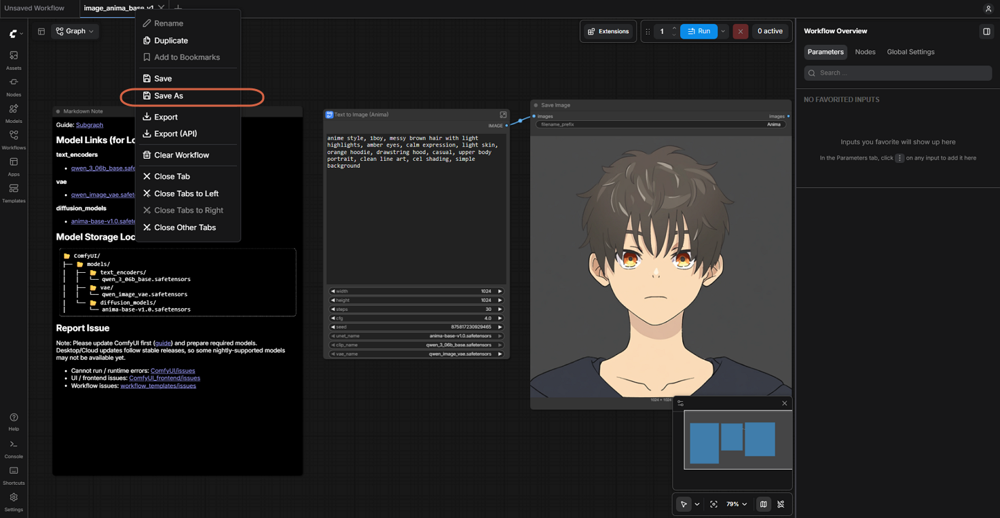
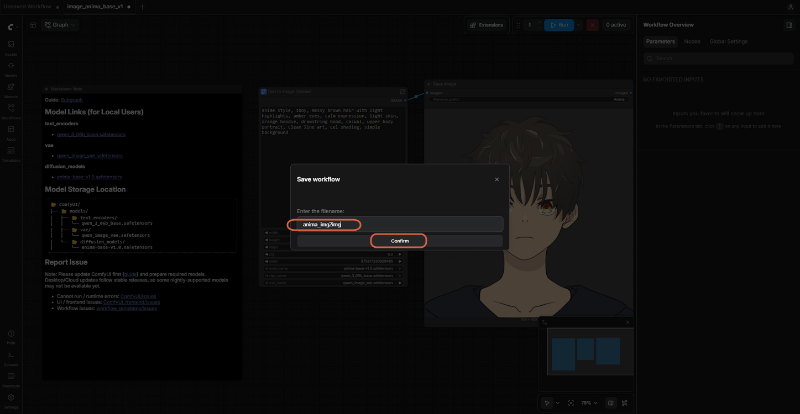
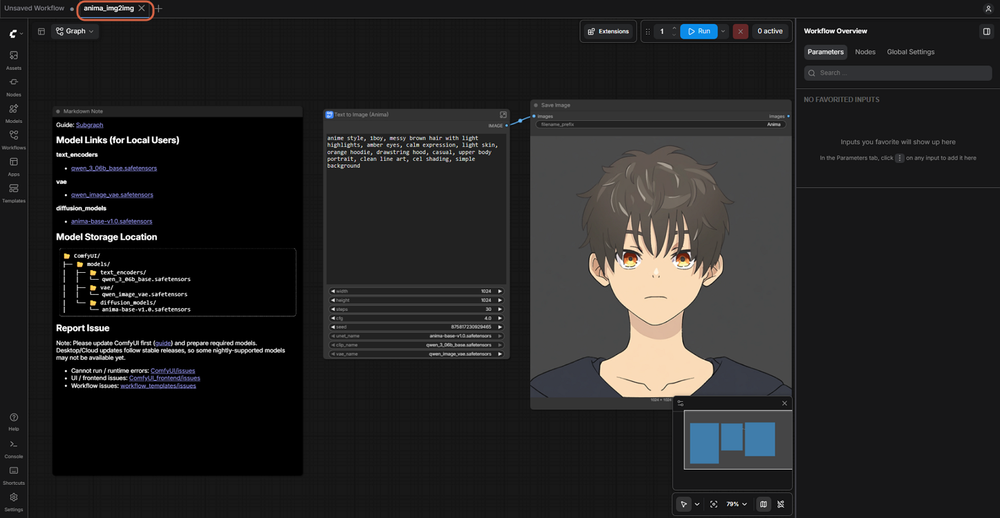
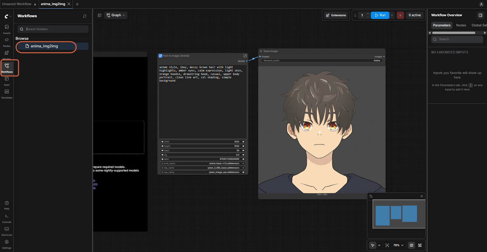
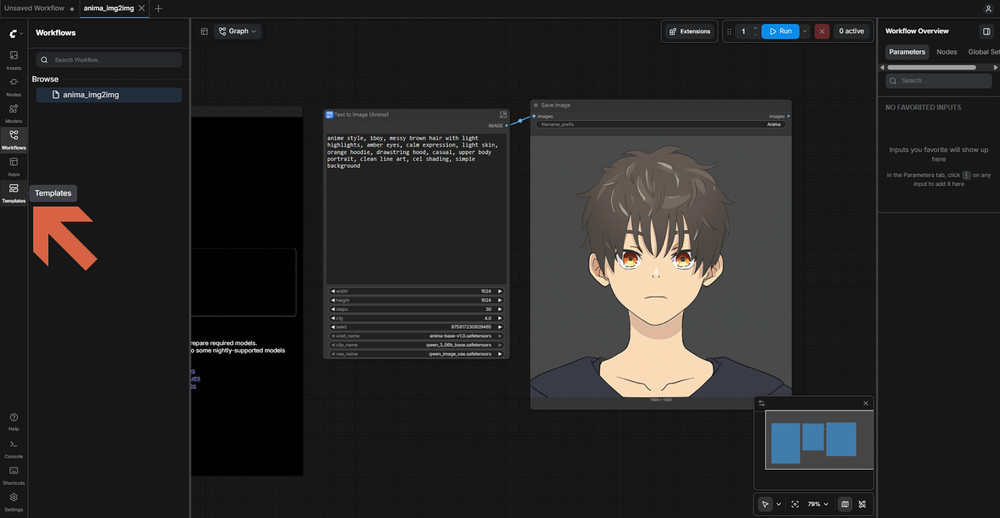
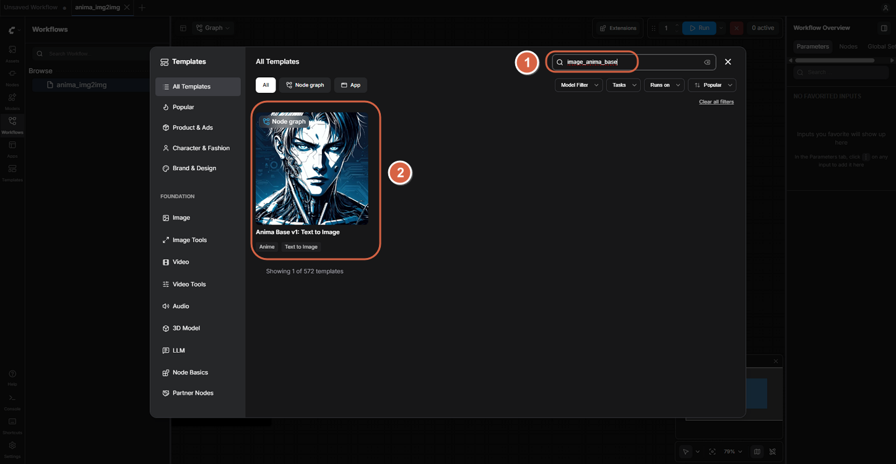
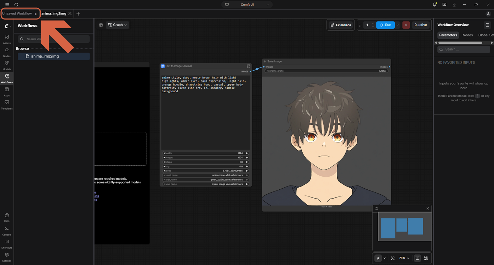

# Saving and Finding ComfyUI Workflows

> **Note:** This document was generated by Claude Code and has not been reviewed by a human. Please use it as a reference only.

The **Workflows** sidebar only lists workflows you've saved. It has no save button of its own, so a new, unsaved workflow shows "No workflows found" until you save it.

## Step 1: Save As

Right-click the workflow tab, then choose **Save As**. Other ways: the **C logo** (top-left) → **File** → **Save As**, or `Ctrl+S`.

## Step 2: Name It and Confirm

Enter a filename — for example, `anima_img2img` — then click **Confirm**. The tab takes the new name, and the dot marking unsaved changes disappears.

## Step 3: Find It Again Later

It now appears in the **Workflows** sidebar. Click it to open it.

## Templates vs. Workflows

Saving a workflow doesn't change the template it was based on. **Templates** are the read-only starting points bundled with ComfyUI; **Workflows** are your own saved files.

Open **Templates** in the left sidebar, and search for the original template's name to open it fresh again.

An unsaved workflow tab and a saved one are separate: the "Unsaved Workflow" tab is a workflow that has never been saved, distinct from a saved workflow like `anima_img2img` open in another tab.

## References

- [Workflow Metadata](https://docs.comfy.org/development/api-development/workflow-metadata) — official docs.
- [Saving & Loading Workflows](https://comfyui.nomadoor.net/en/begin-with/saving-and-loading-workflows/) — Comfy with ComfyUI.
