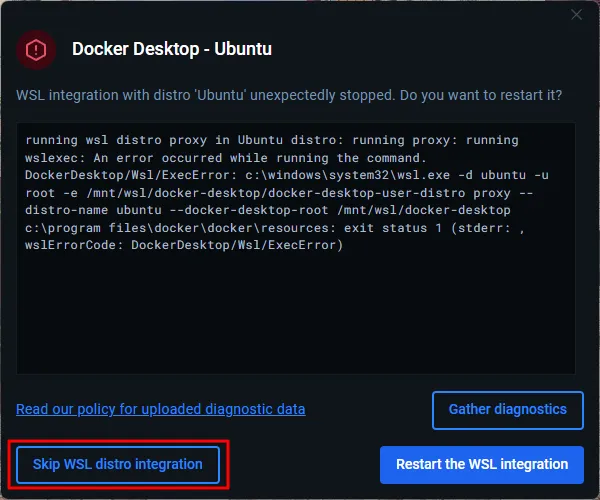
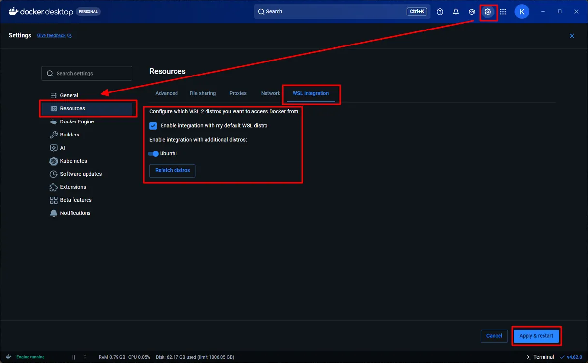

# Fixing WSL Integration Unexpectedly Stopped in Docker Desktop

Restart WSL integration for your Linux distribution in Docker Desktop.

---

## Steps

### Method 1: Restart WSL Integration from the Prompt

1. When the error dialog appears, click **Restart the WSL integration**.

2. Wait for Docker Desktop to restart the integration.

### Method 2: Re-enable WSL Integration from Settings

1. Click **Skip WSL distro integration**.

    

2. Open Docker Desktop.

3. Click **Settings** (gear icon).

4. Go to **Resources** → **WSL integration**.

5. Enable:

    * **Enable integration with my default WSL distro**
    * Your distribution (for example, **Ubuntu**)

5. Click **Apply & restart**.

    

6. Wait for Docker Desktop to restart.

---

## Verify

Open a WSL terminal and run:

```bash
docker version
```

Confirm that Docker responds without errors.

---

## Note

If integration repeatedly stops:

* Restart WSL:

  ```bash
  wsl --shutdown
  ```

* Then reopen Docker Desktop.

* Ensure your WSL distribution is running:

  ```bash
  wsl -l -v
  ```
