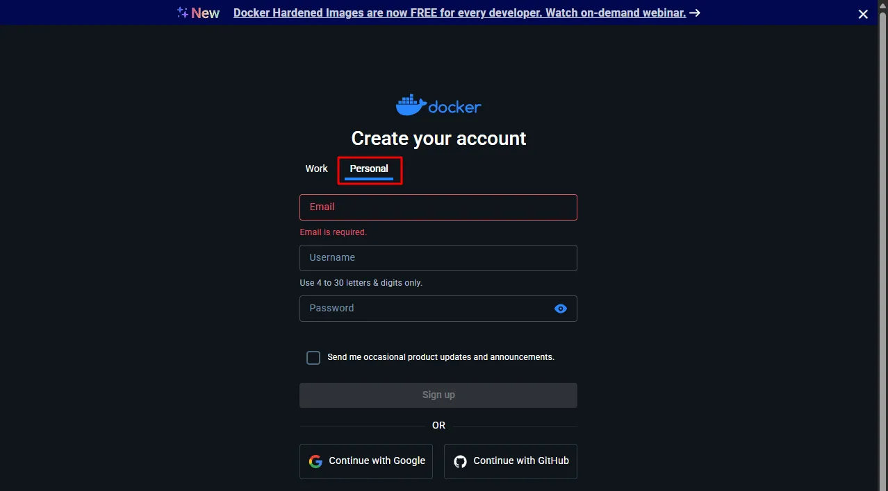

# Signing In to Docker Desktop as a Personal User

> **Note:** This document was generated by Claude Code and has not been reviewed by a human. Please use it as a reference only.

On the sign-in screen, select **Personal**.

> **Note:** The default selection is **Work** — make sure to switch to **Personal**.

You do not need to sign in to use Docker Desktop. However, a "not signed in" notification appears each time Docker Desktop starts and cannot be disabled through settings. Signing in removes this notification.
