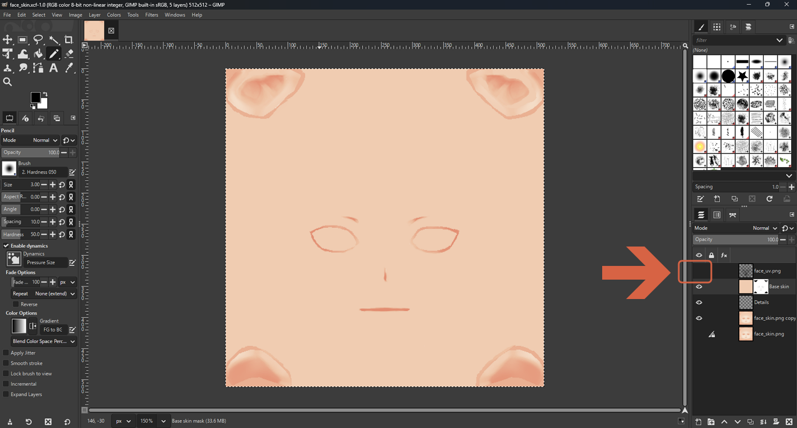
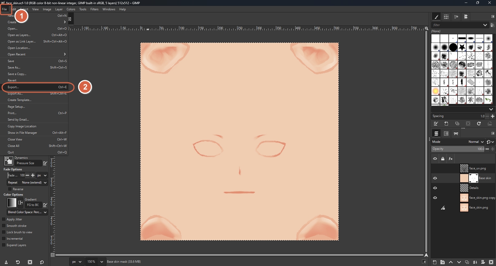
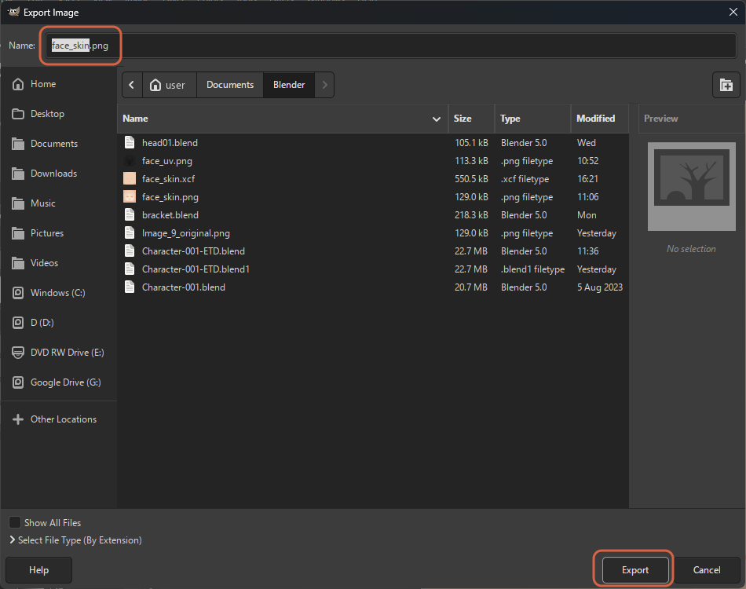
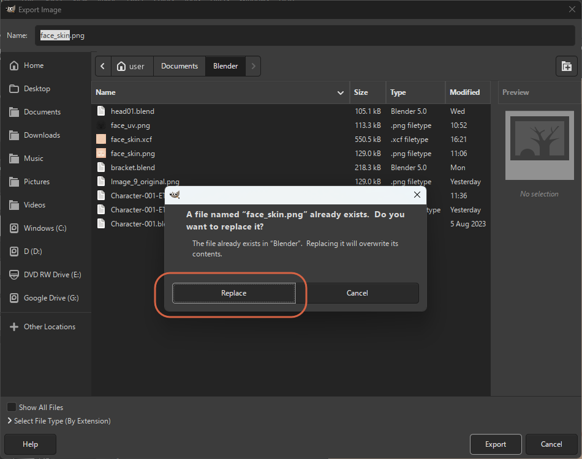

# Repainting a Texture with Flat Anime Colors

> **Note:** This document was generated by Claude Code and has not been reviewed by a human. Please use it as a reference only.

Flat, solid colors are a defining trait of anime-style art. This repaints a soft, gradient-shaded texture — such as a VRM or VRoid model's skin — into flat color regions in GIMP.

> **Note:** This assumes the shader itself has already been set up for hard-edged shadows — see [Adjusting MToon Shading for a Hard Cel-Shaded Look](../blender/adjust-mtoon-shading.md). Repainting the texture alone won't produce a cel-shaded look if the shader is still set to a soft transition.

## Set Up a Reference Layer

Open a backup copy of the original texture, then use **File** → **Open as Layers** to add the exported UV layout (see [Exporting a UV Layout as an Image](../blender/export-uv-layout.md)) as a layer on top. Lower that layer's opacity to around **40%** (right-click it → **Edit Layer Attributes**) so it acts as a faint guide rather than obscuring the texture underneath — enough to see where the eyes, mouth, and face edges are.

## Paint in Flat Layers

- **Base skin layer** — fill the face area with one flat skin color using the **Bucket Fill** tool (**Fill whole selection**). Anime skin reads as flat because the shader itself draws the shadow.
- **Blush layer** — paint the cheeks with the **Pencil** tool, or the **Paintbrush** with **Hardness** at 100, for hard edges. A few diagonal hatch lines on the cheeks is a classic anime touch.
- **Detail layer** — crisp nose and mouth lines, if needed.

## Useful GIMP Tools

- **Colors** → **Posterize** quickly reduces a soft gradient to a few flat color steps — useful as a quick test, though hand-painting usually looks cleaner.
- The **Color Picker** (`O`) samples a skin tone from the original, so the new colors stay related to it.

## Export Back to the 3D Application

1. Hide the reference layer — click its visibility (eye) icon in the Layers panel — so the UV wireframe isn't included in the exported image.

    

2. Open **File** → **Export** (`Ctrl+E`) to re-export using the same filename and settings as your last export.

    

3. Confirm the filename and click **Export**.

    

4. If the file already exists, confirm **Replace** to overwrite it.

    

Keep the image the same size as the original. GIMP's **Save** only creates an `.xcf` project file — keep saving that too, so your layers and masks are still there for later tweaks, but it isn't what the 3D application reads.

Once exported, reload the texture in Blender — see [Adjusting MToon Shading for a Hard Cel-Shaded Look](../blender/adjust-mtoon-shading.md).

> **Note:** VRoid Studio (free) also has built-in texture editing with layers, letting you paint directly on the 3D model and export a new VRM. This is worth considering instead of GIMP if you haven't made any Blender-side edits yet, since those wouldn't carry over to a re-exported VRM — see [Editing Face Texture](../vroid-studio/edit-face-texture.md).
