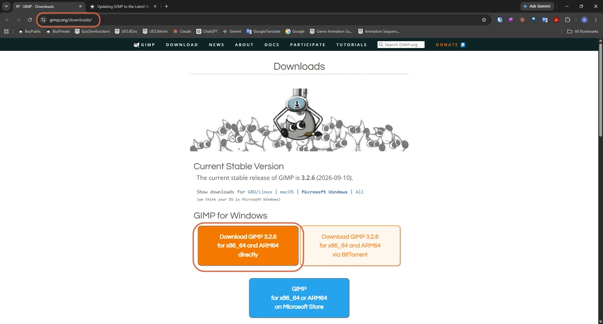
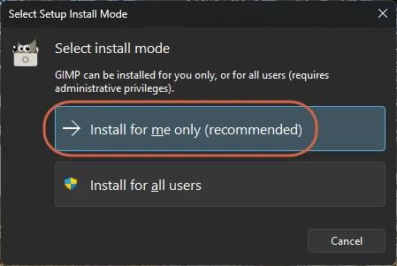

# Updating GIMP to the Latest Version

> **Note:** This document was generated by Claude Code and has not been reviewed by a human. Please use it as a reference only.

Uninstall the older version before installing the latest version to avoid having multiple installations.

## Steps

1. Open **Settings** → **Apps** → **Installed apps**.

2. Locate the older version of **GIMP**.

3. Click **Uninstall** and complete the removal process.

4. Restart your PC.

    > **Warning:** Installing the new version without restarting first can cause an error during setup.

5. Go to the [official GIMP download page](https://www.gimp.org/downloads/) and click **Download GIMP x.x.x directly** under **GIMP for Windows**.

    

6. Run the installer. In **Select install mode**, click **Install for me only (recommended)**.

    

7. Follow the remaining setup wizard steps to complete the installation.

## Note

* Your custom brushes, plugins, and preferences are stored in your user profile and are not removed when uninstalling the application.
* If both versions were installed using different methods (for example, Microsoft Store and standalone installer), uninstall the version you do not intend to use.
