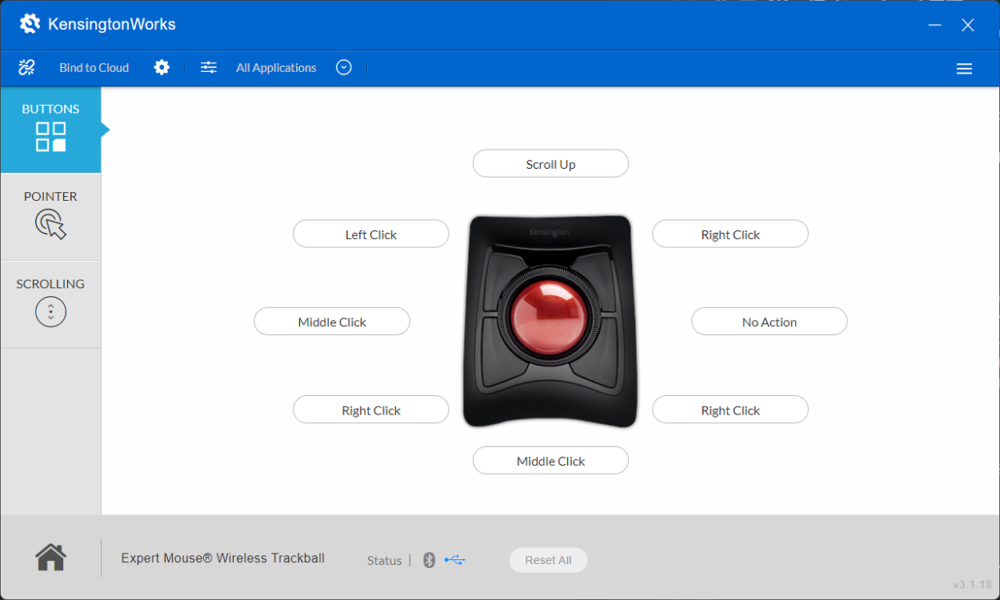
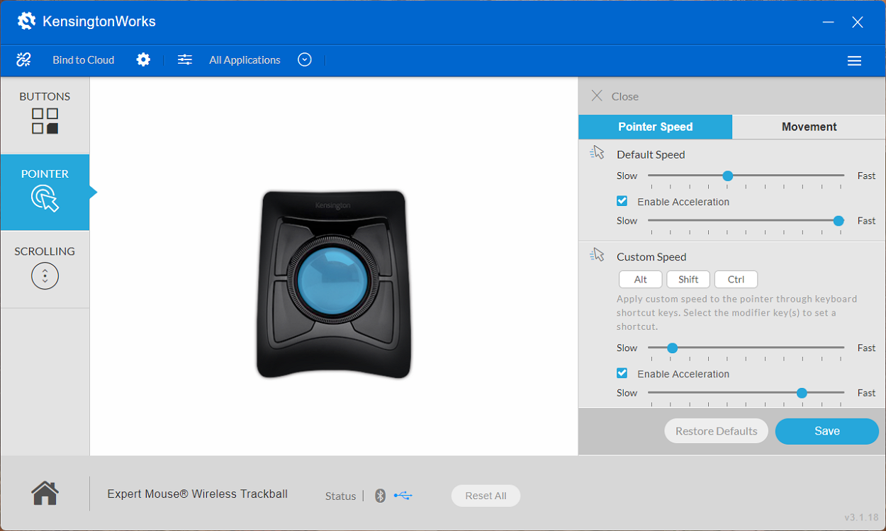
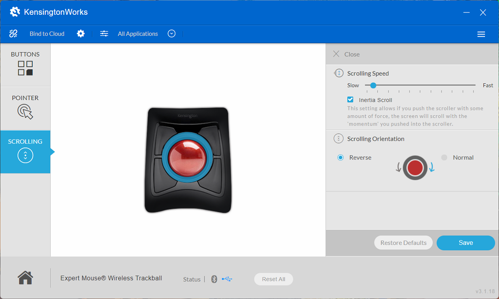

# Favorite Trackball Settings in KensingtonWorks

> **Note:** This document was generated by Claude Code and has not been reviewed by a human. Please use it as a reference only.

These are recommended starting settings for the Expert Mouse Wireless Trackball, covering the **Buttons**, **Pointer**, and **Scrolling** tabs in KensingtonWorks.

## Set the Buttons

Location: **Buttons** tab.

Assign the eight button zones around the ball as follows:

- Top: **Scroll Up**
- Upper Left: **Left Click**
- Upper Right: **Right Click**
- Middle Left: **Middle Click**
- Middle Right: **No Action**
- Lower Left: **Right Click**
- Lower Right: **Right Click**
- Bottom: **Middle Click**

## Set the Pointer Speed

Location: **Pointer** tab → **Pointer Speed**.

For **Default Speed**, set the speed slider to around the middle of the range and enable **Enable Acceleration**, with the acceleration slider set close to the **Fast** end.

For **Custom Speed**, set the speed slider close to the **Slow** end and enable **Enable Acceleration**, with the acceleration slider set around the middle of the range.

## Set the Scrolling Behavior

Location: **Scrolling** tab.

Set **Scrolling Speed** close to the **Slow** end, enable **Inertia Scroll**, and set **Scrolling Orientation** to **Reverse**.

