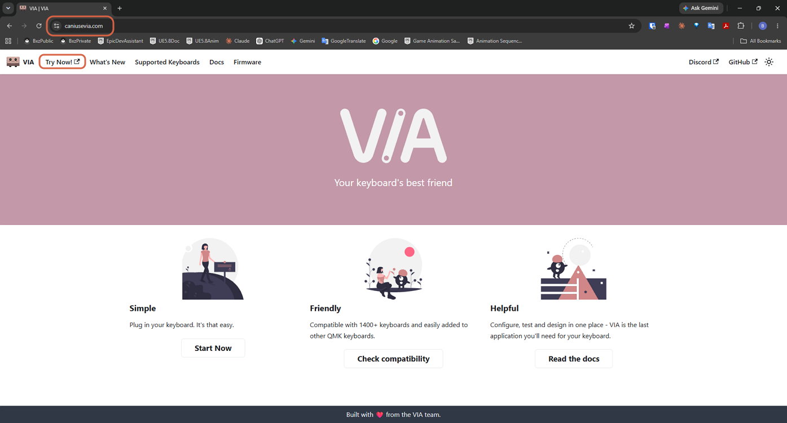
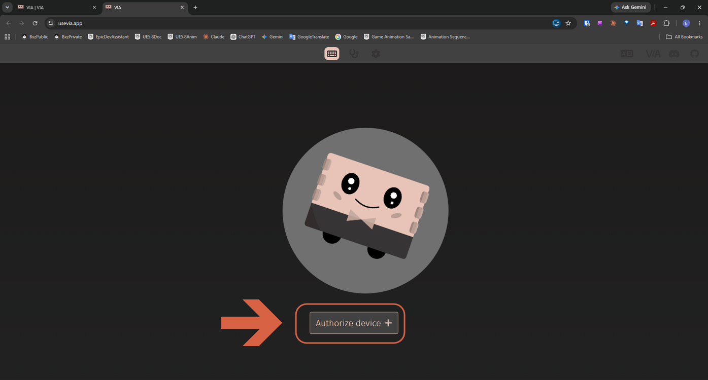
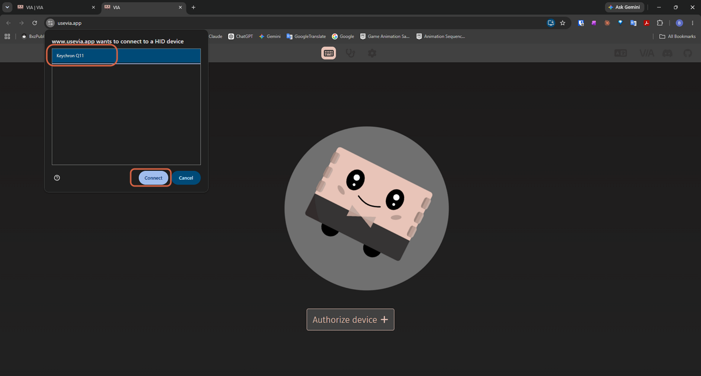

# Connecting a Keychron Keyboard to VIA

> **Note:** This document was generated by Claude Code and has not been reviewed by a human. Please use it as a reference only.

[VIA](https://www.usevia.app) is the open-source keymap configurator that Keychron Launcher is built on. Use it directly if a keyboard isn't yet supported in Keychron Launcher, or if you prefer VIA's own interface.

## Step 1: Open VIA

Go to [usevia.app](https://www.usevia.app) and click **Try Now!**.

## Step 2: Authorize the Device

Click **Authorize device +**.

## Step 3: Select and Connect

In the browser's device picker, select your keyboard, then click **Connect**.

> **Note:** This uses your browser's WebHID API, so it works in Chrome and Edge, but not in Firefox or Safari.
