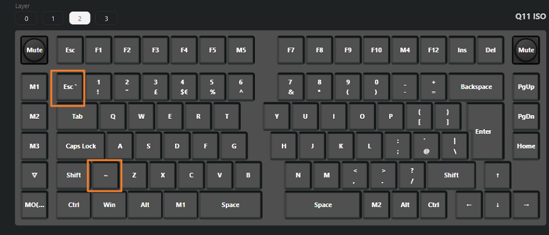

# Typing a Tilde or Backquote on a Keychron Q11

> **Note:** This document was generated by Claude Code and has not been reviewed by a human. Please use it as a reference only.

The Keychron Q11 ISO (Layer 2) has two dedicated keys for these characters, highlighted in the layout below.



- The **`~` key** is to the right of Shift on the bottom row.
- The **`Esc*` key** is at the top-left of the number row. It is separate from the standard Escape key and has a backquote engraved on it.

## Type a Tilde

Press the **`~` key**, or press `Shift + Esc*`.

## Type a Backquote

> **Note:** A Keychron Q11 firmware update changed the behaviour of `Win + Esc*` — it now opens Command Prompt instead of typing a backquote. Use the AutoHotKey workaround below.

Use an AutoHotKey script to remap `Ctrl + '` to type a backquote:

```ahk
^'::           ; Ctrl + '
{
    Send("``") ; sends one `
}
```

> **Note:** In AutoHotKey, a single backtick is an escape character. Two backticks inside `Send()` are required to produce one literal backquote.

If `Ctrl + '` does not work, open **PowerToys** → **Keyboard Manager** and check whether the key combination has been remapped.
