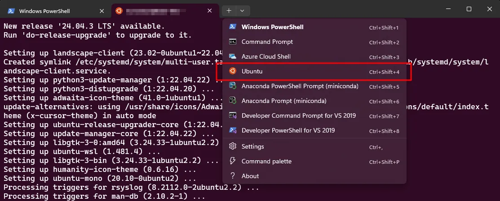
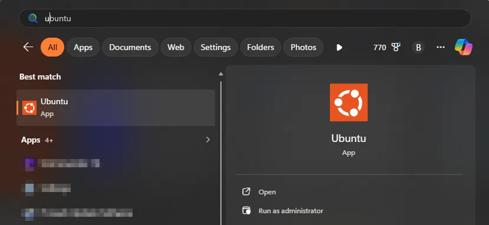

# Opening Ubuntu Terminal

> **Note:** This document was generated by Claude Code and has not been reviewed by a human. Please use it as a reference only.

There are three ways to open an Ubuntu terminal:

| Method | When to Use |
|---|---|
| From VS Code | Best option when working in VS Code |
| From PowerShell | Best option when not using VS Code |
| From the app list | Ties the terminal to the system environment — avoid for development |

## From VS Code

## From PowerShell

## From the App List

