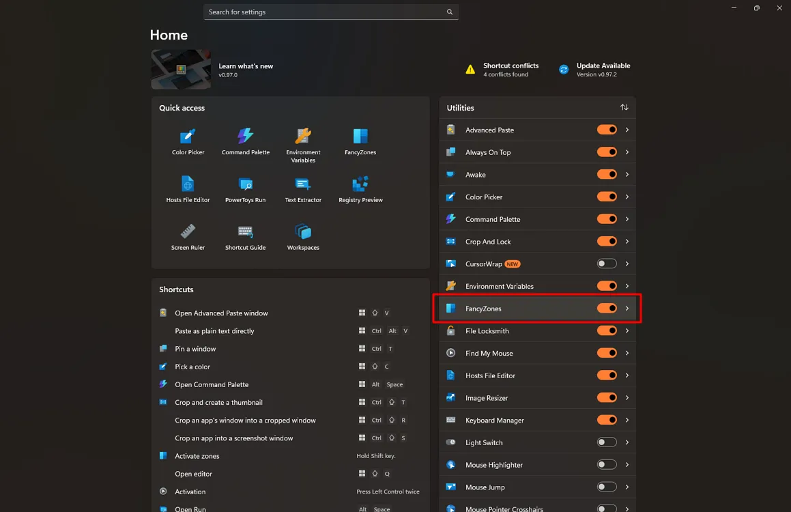
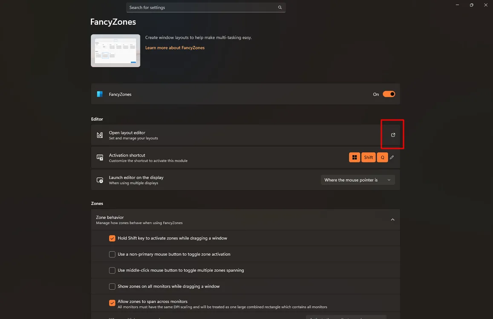
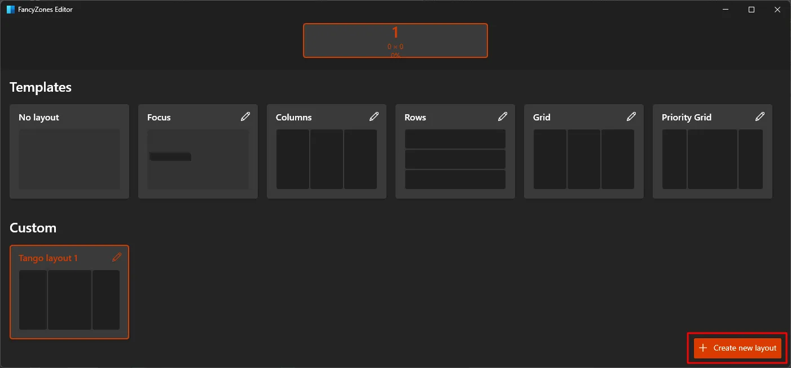
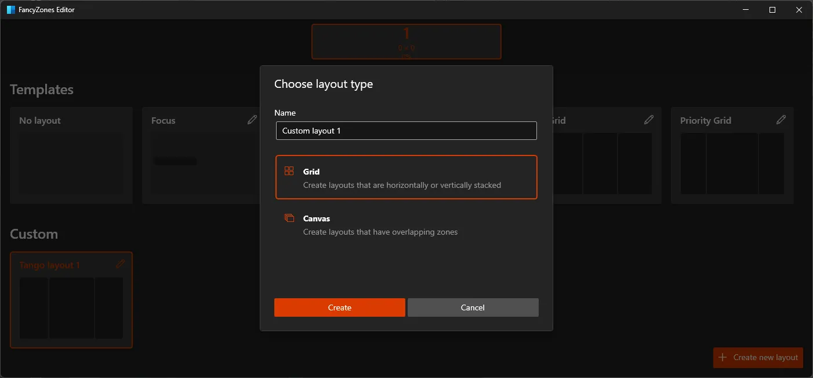

# Creating a Window Layout Using FancyZones

1. Open **PowerToys**.

2. Select **FancyZones**.

    

3. Click **Open layout editor**
   *(Shortcut: Win + Shift + ` )*.

    

4. Click **Create new layout**.

    

5. Enter a **Name**.

6. Select the layout type:

    * **Grid** – stacked rows or columns
    * **Canvas** – freely positioned zones

7. Click **Create**.

    