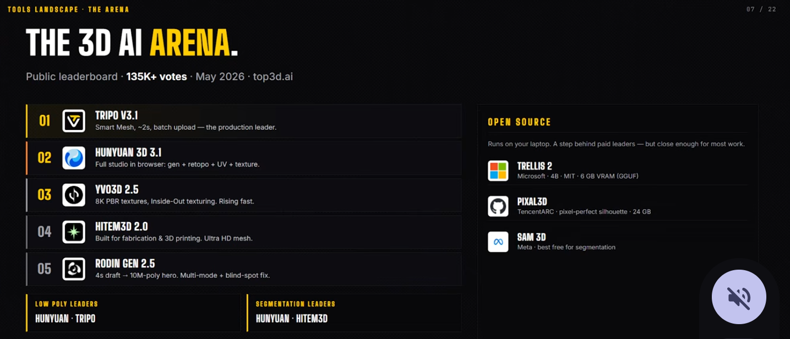
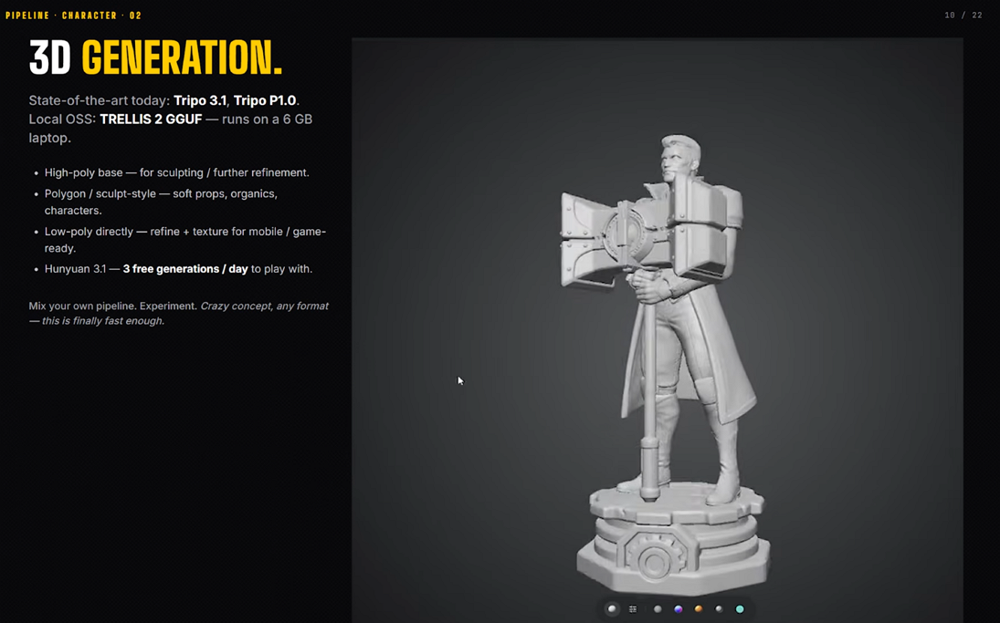
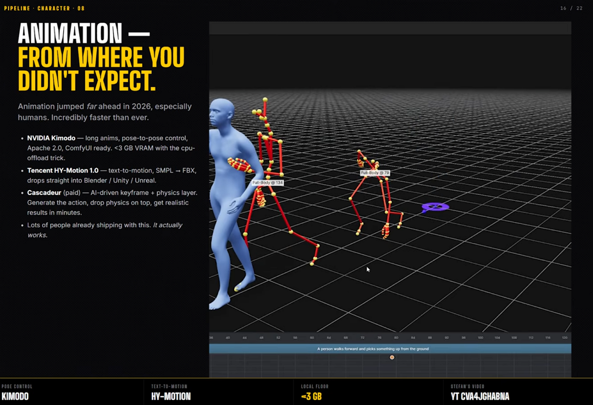
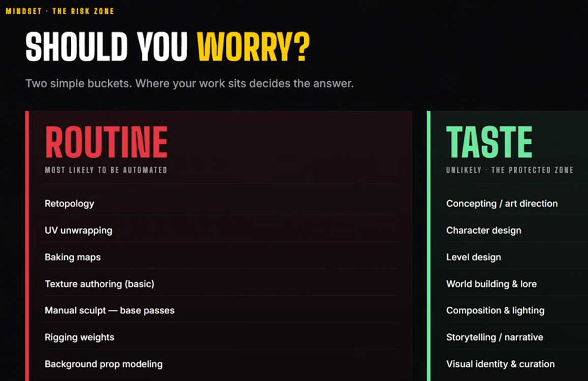

# Understanding the State of AI 3D in 2026

> **Note:** This document was generated by Claude Code and has not been reviewed by a human. Please use it as a reference only.

Source: [The State of AI 3D in 2026](https://youtu.be/SCQt6B96DSs) by Stefan 3D AI — based on the top3d.ai public leaderboard, 130K+ tests, May 2026.

## The 3D AI Arena

### Top 5 (Ranked)

| Rank | Tool | Notes |
|------|------|-------|
| 1 | **Topo 63.1** | The production leader |
| 2 | **Hunyuan 3D 2.1** | Full results in browser; gen + refine pipeline |
| 3 | **VRoid 2.0** | 3D Stylistic; rising star |
| 4 | **Nitenso 2.0** | — |
| 5 | **Rodin Gen 2.0** | High quality; multi-mode + detail |

### Open Source

| Tool | Notes |
|------|-------|
| **Trillo 2** | — |
| **Pikalo** | — |
| **SAM** | — |

## 3D Generation

| Tool | Notes |
|------|-------|
| **Tripo 3.1 / Tripo FLO** | Best overall workflow |
| **TRELLIS 2** | Best local option; runs on 4 GB VRAM |

- High-proxy output — suitable for sculpting and further refinement.
- Built-in plugins — handles soft props, organics, and characters.
- Use the API directly — often the better path for indie and game developers.
- Faceted 3 — 3 free generations per day.

## Animation

Animation made the biggest leap in 2026, especially for humans. Machines and non-humanoid characters are less mature.

| Tool | Type | Notes |
|------|------|-------|
| **NVIDIA Animate** | Cloud | Long-action support; pose-to-pose control |
| **Tencent VTT Motion 1.x** | Cloud | Cleaner motion; requires substantial training data |
| **Cascadeur** | Desktop (paid) | AI-driven keyframe + physics layer |

Other tools worth tracking: Kinemix, My-Motion.

## Should You Worry?

Where your work sits decides the answer.

| Routine — Likely to Be Automated | Taste — The Protected Zone |
|----------------------------------|----------------------------|
| Retopology | Concepting / art direction |
| UV unwrapping | Character design |
| Baking maps | Level design |
| Kitbashing (basic) | World building & lore |
| Manual sculpt — base passes | Composition & lighting |
| Rigging weights | Storytelling / narrative |
| Background prop modeling | Visual identity & curation |
