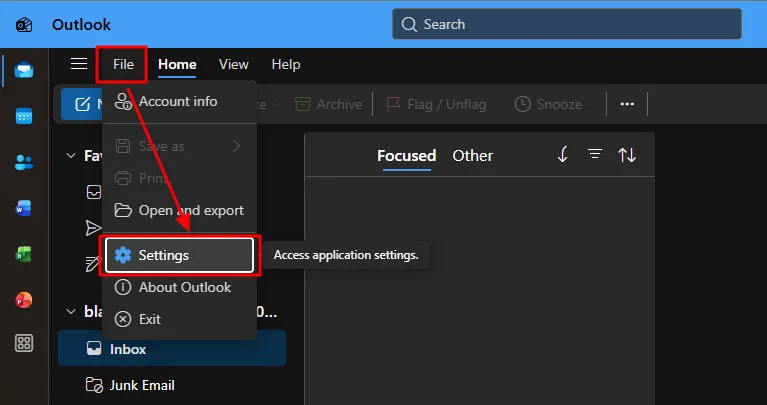
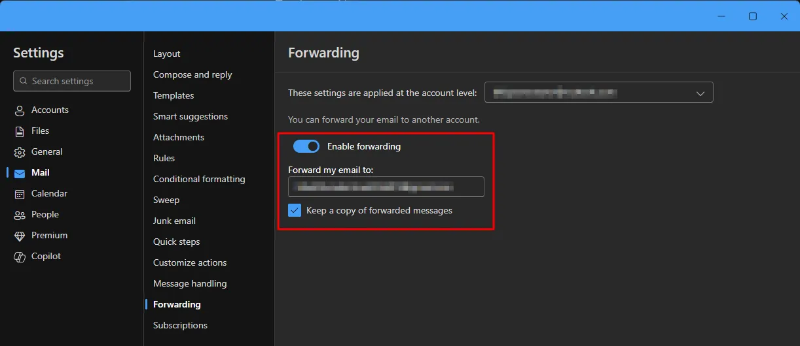

# Disabling Email Forwarding in Outlook

> **Note:** This document was generated by Claude Code and has not been reviewed by a human. Please use it as a reference only.

1. Click **File** → **Settings**.

    

1. Turn off **Enable forwarding**.

    
