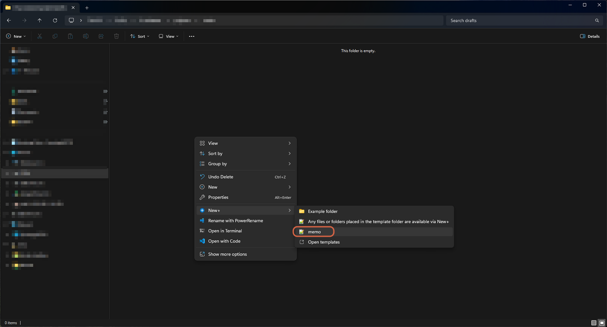
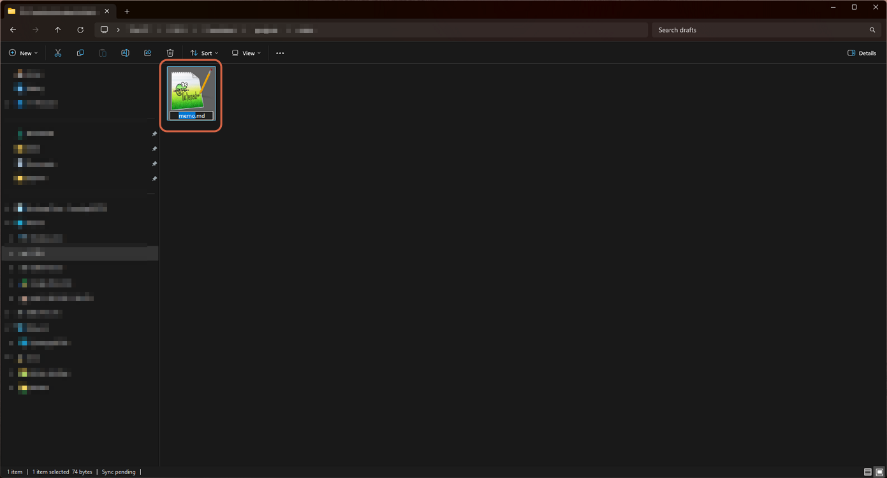
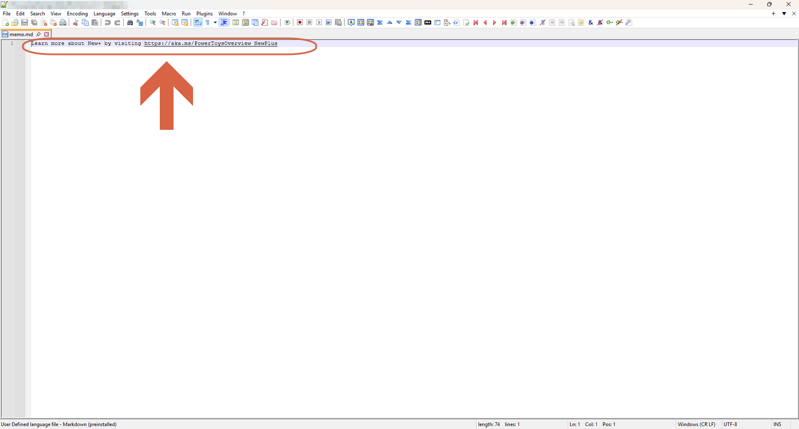
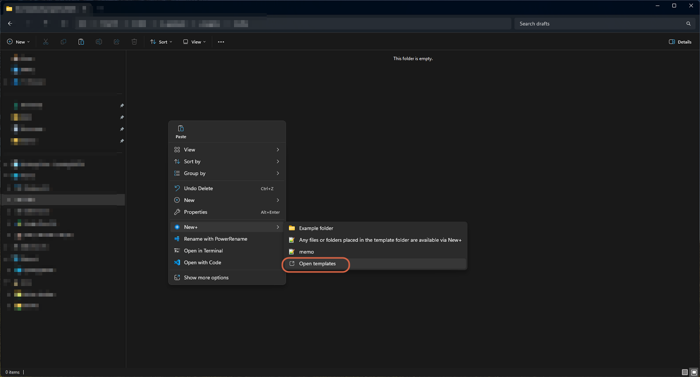
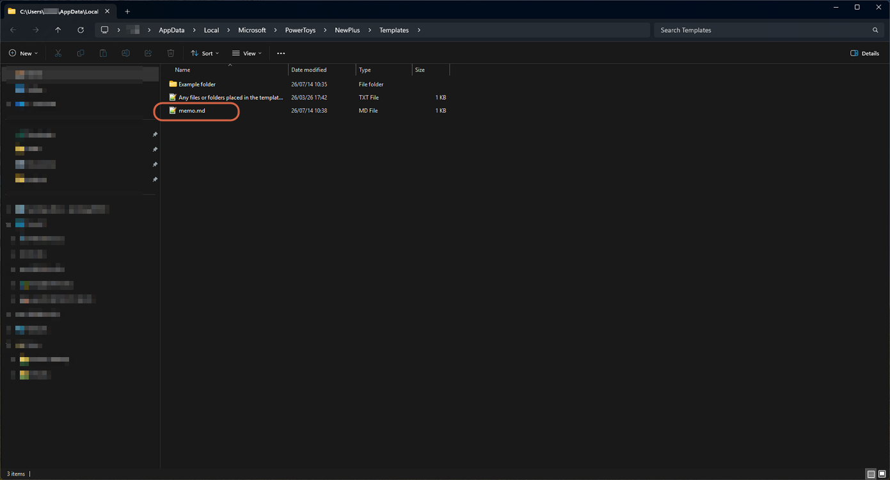
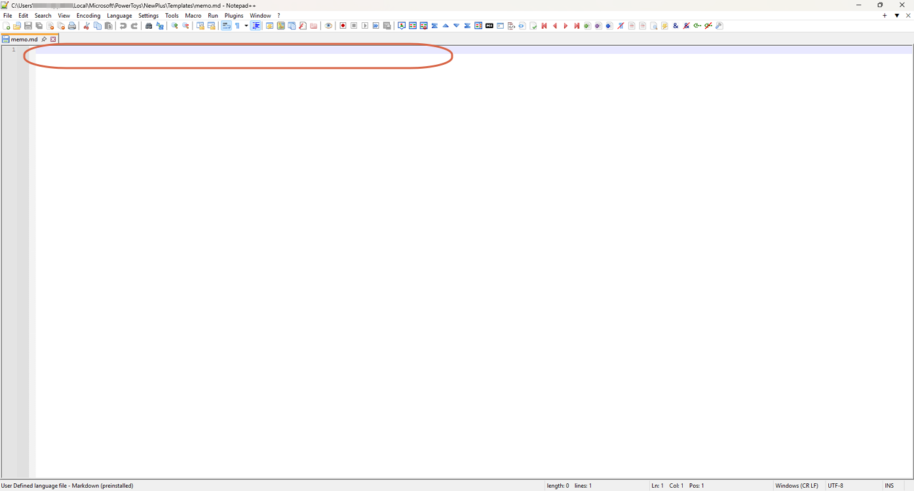
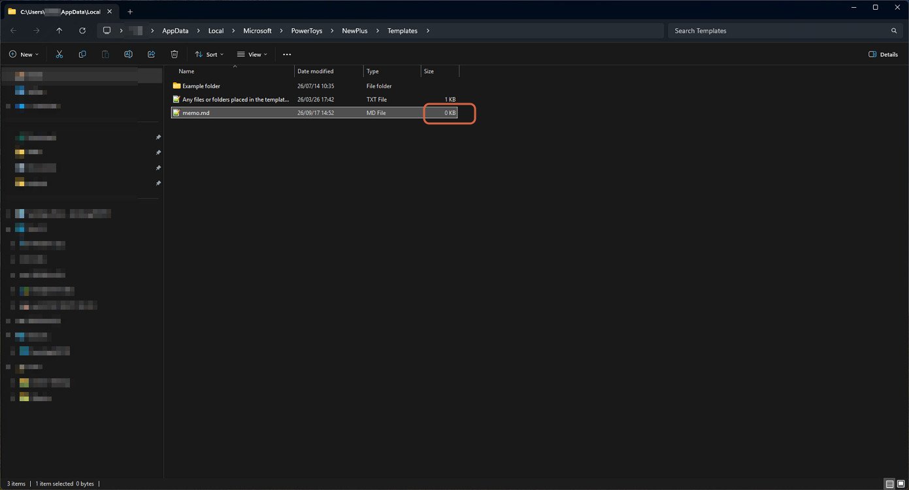

# Removing New+ Boilerplate Text

> **Note:** This document was generated by Claude Code and has not been reviewed by a human. Please use it as a reference only.

PowerToys' **New+** module adds a **New** item to File Explorer's right-click menu that creates a file from a template you define. If a file created this way isn't blank, the source template still contains the sample text PowerToys ships with by default. Fix it once in the template source and every file created from it afterward is blank.

## The Symptom

Right-click in a folder → **New** → your template name (e.g. `memo`) creates a new file, but it isn't empty — it already contains:

```
Learn more about New+ by visiting https://aka.ms/PowerToysOverview_NewPlus
```







## The Fix

The text isn't coming from the folder you're working in — it's baked into the template file itself, in New+'s templates folder. Edit that file once and the boilerplate is gone for good.

## Step 1: Open the Templates Folder

Right-click → **New** → **Open templates**. This jumps straight to New+'s template source folder, so you don't have to hunt for it manually.



By default this folder is:

```
%LOCALAPPDATA%\Microsoft\PowerToys\NewPlus\Templates
```

## Step 2: Find Your Template File

Locate the template that matches the one you use from the New menu (here, `memo.md`).



## Step 3: Clear Its Contents

Open the file in a text editor, select all the text, delete it, and save.



## Step 4: Confirm the File Is Empty

Back in the templates folder, check the file's size — it should now show **0 KB**.



From now on, right-click → **New** → your template copies this now-empty file, so every new file it creates starts completely blank.

> **Note:** If you have more than one New+ template (e.g. one per file type), repeat Steps 2–4 for each one that still contains the default boilerplate.
