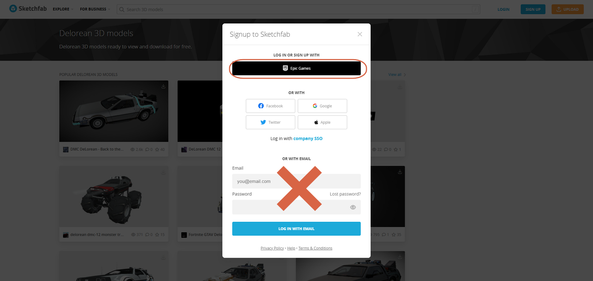
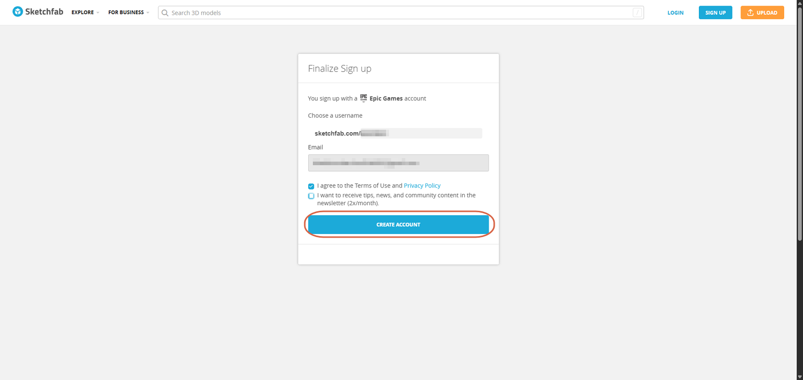

# Creating an Account

> **Note:** This document was generated by Claude Code and has not been reviewed by a human. Please use it as a reference only.

Sketchfab no longer supports creating an account with just an email address and password — you must sign up through a third-party provider.

## Step 1: Open the Sign-Up Dialog

Click **SIGN UP** in the top-right corner, next to **LOGIN**.

## Step 2: Choose a Login Provider

Select **Epic Games**, or another provider such as Facebook, Google, Twitter, or Apple. Signing up with an email and password directly is no longer available.

## Step 3: Finalize the Sign-Up

After logging in with your provider, choose a username for your Sketchfab profile (`sketchfab.com/<username>`). Your provider's email fills in automatically. Check **I agree to the Terms of Use and Privacy Policy**, then click **Create Account**.

