# Add a Second SSD to Synology DS720+

> **Note:** This document was generated by Claude Code and has not been reviewed by a human. Please use it as a reference only.

## Overview

Notes from installing a second M.2 SSD (4TB WD Red SA500) alongside an existing 2TB SSD in a Synology DS720+, and setting it up as an independent storage volume via DSM.

- NAS: Synology DS720+ (two M.2 NVMe/SATA SSD slots)
- Existing setup: one 2TB SSD, already running as **Storage Pool 1 / Volume 1**
- New drive: WD Red SA500 2.5" 4TB SSD, installed in the second slot

Installing the drive physically is not enough on its own — Windows won't show any change, since the new drive isn't part of a Windows-visible volume yet. Everything else happens inside **DSM Storage Manager**.

---

## Step 1: Install the SSD into a Drive Tray

Before the drive can be recognized, mount it in one of the NAS's drive trays (cassettes):

1. Remove an empty cassette from the NAS.
1. Remove the two side rails from the cassette.

    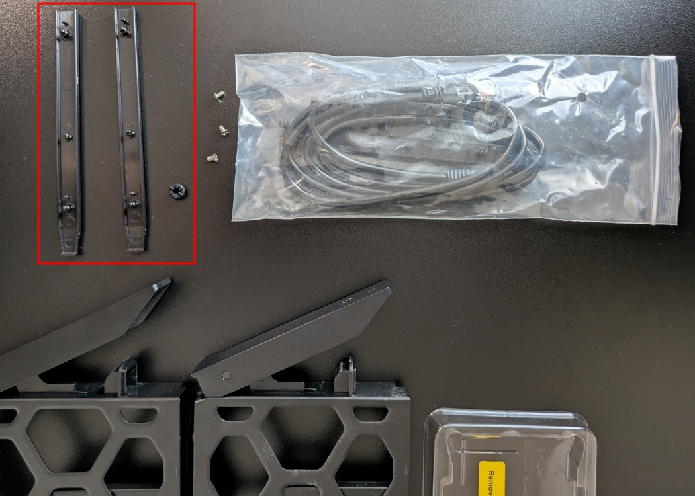

1. Remove the yellow "Remove Before Installing" sticker covering the SSD's connector terminal.
1. Screw the SSD into the cassette at all four corners.

    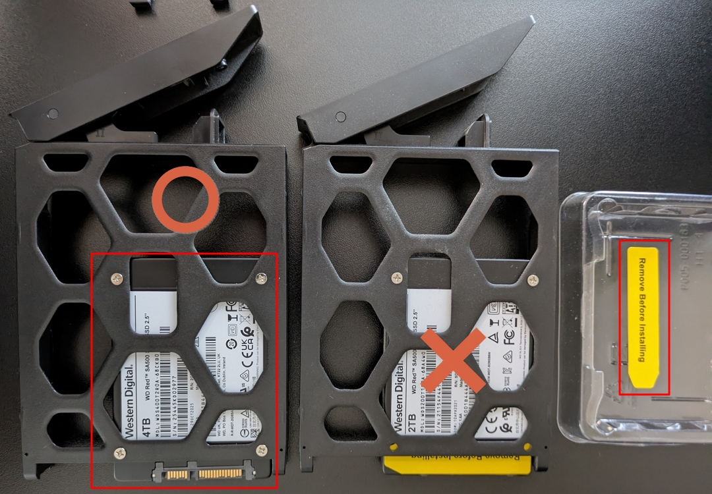

1. Slide the cassette back into the NAS.

---

## Step 2: Confirm the Drive Is Detected

Log in to DSM (`http://find.synology.com` or the NAS's IP address) and open **Storage Manager** → **HDD/SSD**. Both drives should appear, healthy.


---

## Step 3: Decide How to Use the New Drive

A brand-new SSD doesn't automatically merge into the existing 2TB volume. Options:

- **Separate, independent volume** (used here) — the 4TB drive becomes its own storage pool and volume, showing up alongside the existing one.
- **RAID 1 mirror** — requires destroying and rebuilding the existing single-drive volume, and with a 2TB + 4TB pair, usable capacity is capped at 2TB (the smaller drive). Generally not worth it unless redundancy matters more than capacity.

### SSD Cache vs. Storage Volume

The DS720+'s two M.2 slots can be used either as normal storage (each slot holds its own volume) or as **SSD cache** for spinning HDDs, where the SSD doesn't appear as its own drive but instead transparently accelerates reads and writes to HDD volumes. This guide covers using the M.2 slot as a standalone storage volume, not as cache.

---

## Step 4: Create a New Storage Pool

> **Note:** The **Action** button on the HDD/SSD page only has drive-level tools (Benchmark, Secure Erase, Configure Write Cache) — it does not create pools.

1. In the left sidebar, go to **Storage** → **Storage Pool 1** (the existing pool's page).
2. Click **Create** → **Create Storage Pool**.


---

## Step 5: Choose the RAID Type

For a single drive, only **Basic** or **JBOD** make sense (SHR also technically works with one drive, but Basic is simpler and standard for a single disk).


The **Storage pool description** field is optional — safe to leave blank.

---

## Step 6: Select the Drive

Select the new drive (Drive 2). DSM may show a warning:

> "This drive is not supported for storage pool use. Refer to the compatibility list for supported drives."


This warning is expected for third-party (non-Synology-branded) drives like the WD Red SA500 — it is not a blocker. The drive works fine; DSM just cannot guarantee full validation and health-reporting support, and may show occasional compatibility notifications.

---

## Step 7: Run a Drive Check

Choose **Perform drive check** (not the default "Skip"). For a brand-new drive, a full surface scan up front is worth the extra time — it catches bad sectors before you start storing data, rather than discovering them later.

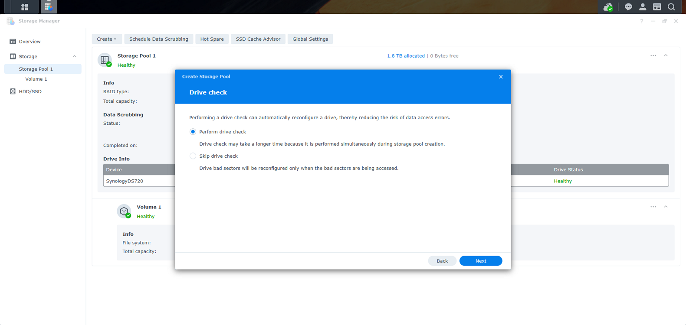

---

## Step 8: Confirm and Apply

Review the summary (RAID type: Basic, Drive 2, ~3.7TB estimated capacity, drive check enabled) and click **Apply**.

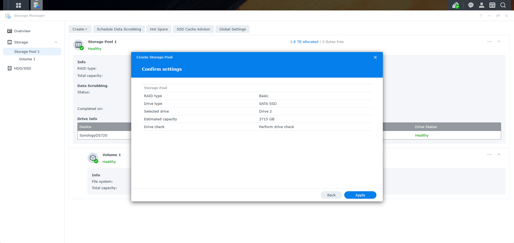

This starts the drive check and pool initialization, which can take over an hour for a full scan on a 4TB drive.

---

## Step 9: Create the Volume

Once the drive check completes, Storage Pool 2 shows **Healthy** with free capacity (3.6TB in this case).

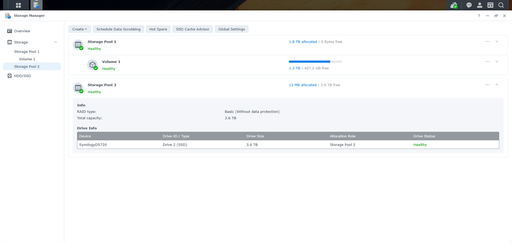

Click **Create** → **Create Volume**.

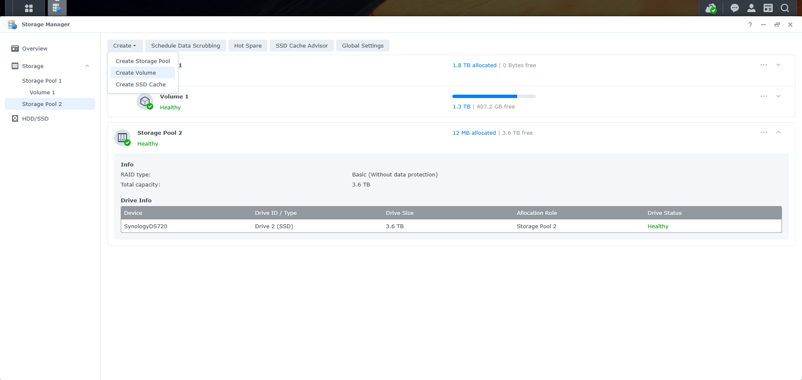

### Allocate Capacity

Storage Pool should default to the new pool (**Storage Pool 2**). Click **Max** to allocate the full available capacity, unless you want to reserve space. Volume description is optional.


### Choose File System

Keep **Btrfs (recommended)** — it supports snapshots, shared folder quotas, and data integrity checksums, which ext4 doesn't.

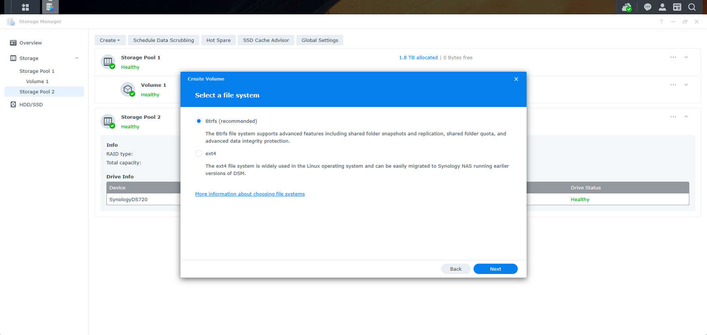

### Encryption

Leave **Encrypt this volume** unchecked, unless the volume will hold sensitive data and you're specifically concerned about physical theft of the NAS. Reasons to skip: performance overhead (the DS720+ lacks AES-NI hardware acceleration) and permanent data loss risk if the Encryption Key Vault/key is ever lost.

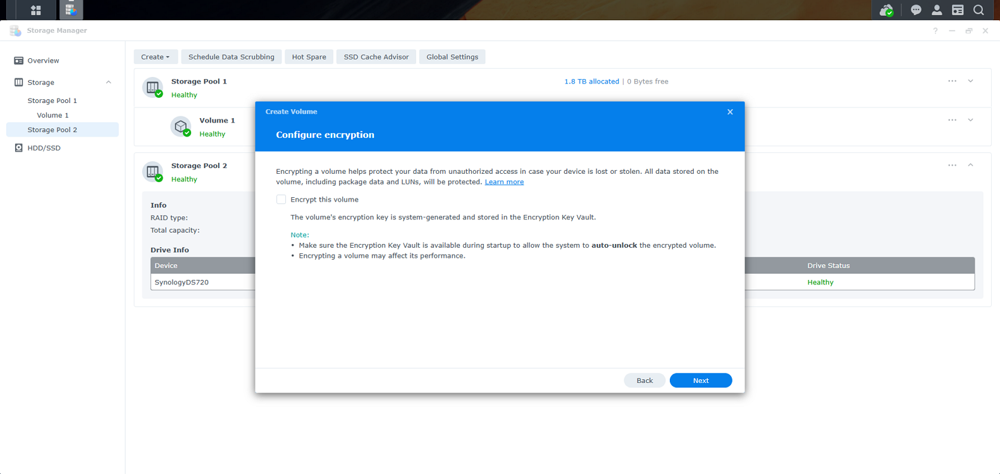

### Confirm and Apply

Review the summary (Storage pool, allocated capacity, file system) and click **Apply**.

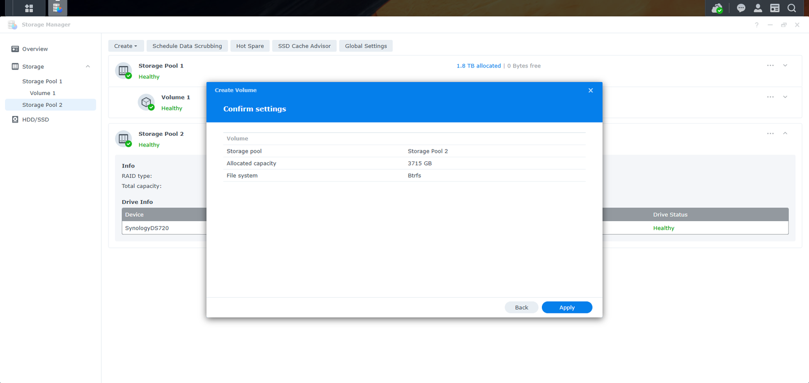

Volume creation is much faster than the storage pool's drive check. Once done, **Volume 2** appears healthy with free space.

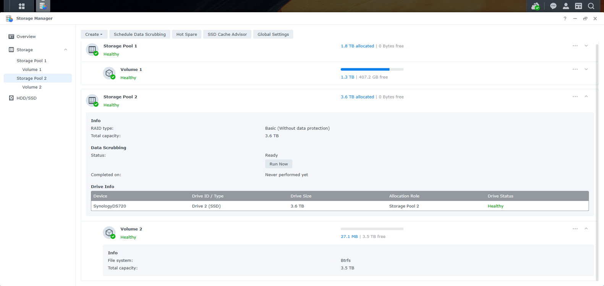

---

## Step 10: Create a Shared Folder on the New Volume

A volume alone isn't accessible from Windows — you need a shared folder on it.

Open **Control Panel** → **Shared Folder**. Existing shared folders (all on Volume 1) are listed here.

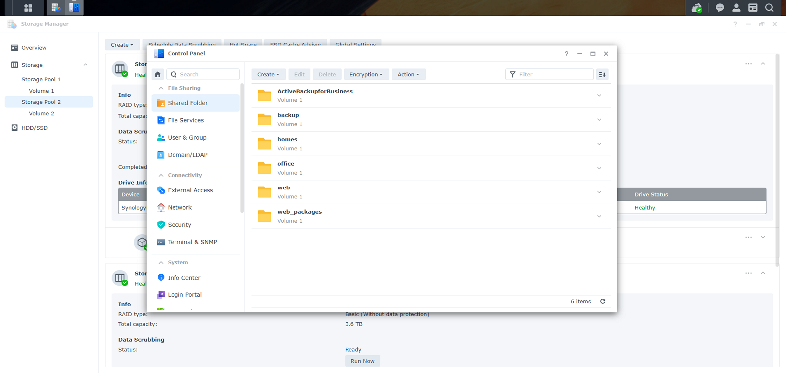

Click **Create** → **Create Shared Folder** (not "Mount Hybrid Share Folder" — that's for Synology's cloud-linked Hybrid Share feature, unrelated).


### Basic Information

- **Name**: shared folder names must be unique across the entire NAS (they're all top-level network shares), not just per volume. Pick something new — reusing a name that already exists on Volume 1 isn't allowed. This guide uses `<YOUR-FOLDER>-2` as a counterpart to an existing `<YOUR-FOLDER>` shared folder on Volume 1.
- **Location**: change from the default (Volume 1) to **Volume 2**.
- **Enable Recycle Bin**: leave checked (recommended).

> **Note:** System-generated folders like `homes`, `ActiveBackupforBusiness`, `web`, `web_packages` are created by specific DSM services/packages (User Home Service, Active Backup for Business, Web Station) the first time each is enabled, and stay on whichever single volume they were pointed to. Adding a new volume does not cause DSM to recreate them there — no need to avoid those names when naming a new folder.

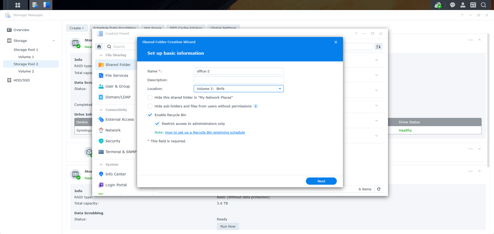

### Additional Security Measure

Leave **Skip** selected. Encryption has the same tradeoffs as at the volume level; WriteOnce/WORM is only relevant for compliance scenarios requiring files to be locked from editing/deletion for a retention period.

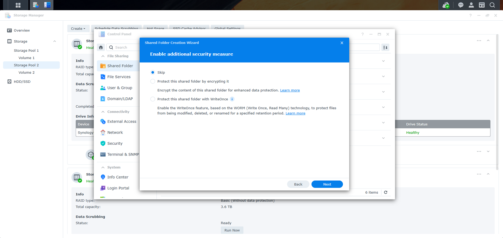

### Advanced Settings

- **Enable data checksum for advanced data integrity**: worth enabling for general file storage — it's one of the main benefits of Btrfs (self-healing, detects corruption). Skip it only if this folder will host a database, VM, Surveillance Station recordings, or be an Active Backup for Business target (per DSM's own note), since checksums add overhead in those cases.
- **Enable shared folder quota**: optional, leave unchecked unless you want to cap this folder's size within the volume.

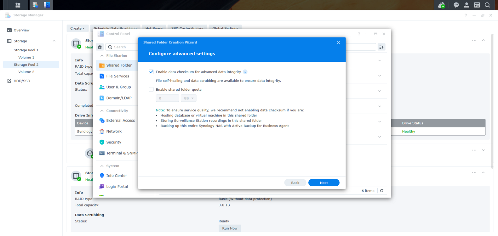

### Permissions

The wizard's permissions step lets you assign per-user access. Defaults (based on existing group permissions) are usually already correct — confirm your account shows Read/Write before finishing.

---

## Step 11: Verify the Result

Back in **Control Panel** → **Shared Folder**, the new folder appears in the list. Expanding it shows the configured settings (Recycle Bin enabled, Data Integrity Protection enabled, no quota).

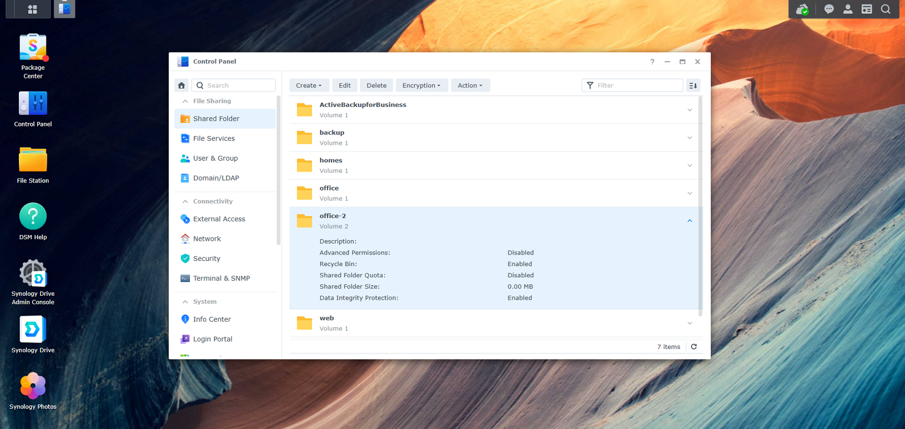

To double check permissions later: select the folder, click **Edit** → **Permissions** tab. Confirm your account(s) show **Read/Write**.

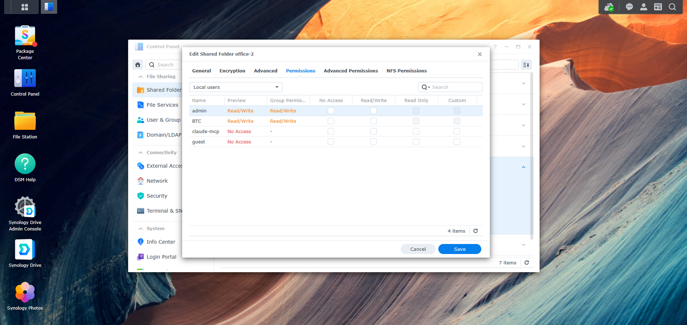

---

## Step 12: Access from Windows

The new shared folder is now reachable at:

```
\\<NAS-IP-or-name>\<YOUR-FOLDER>-2
```

Enter that path in File Explorer's address bar, or map it as a network drive via **This PC** → **Map network drive**.

---

## Result

Two independent storage pools, volumes, and shared folders on the DS720+:

| | Storage Pool | Volume | Shared Folder |
|---|---|---|---|
| Original | Storage Pool 1 (2TB SSD) | Volume 1 | `<YOUR-FOLDER>`, `homes`, `backup`, `web`, `web_packages`, `ActiveBackupforBusiness` |
| New | Storage Pool 2 (4TB SSD) | Volume 2 | `<YOUR-FOLDER>-2` |
