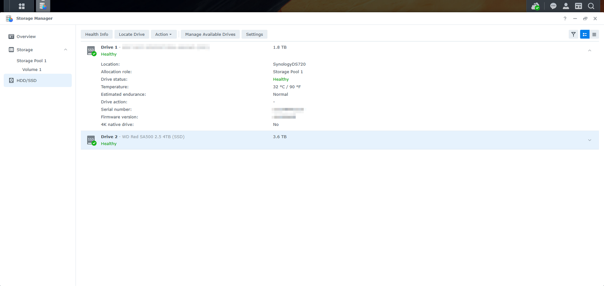
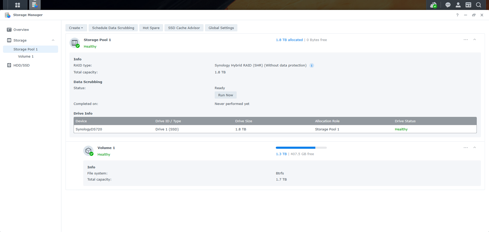
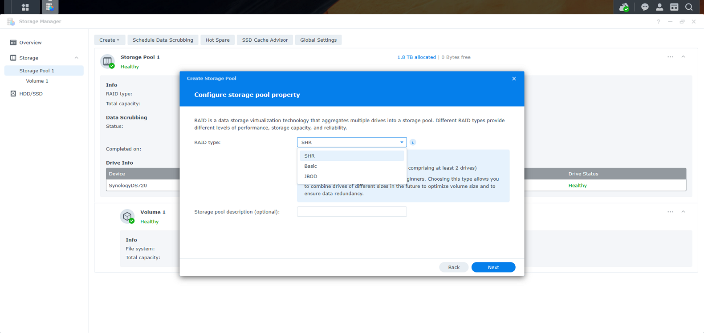
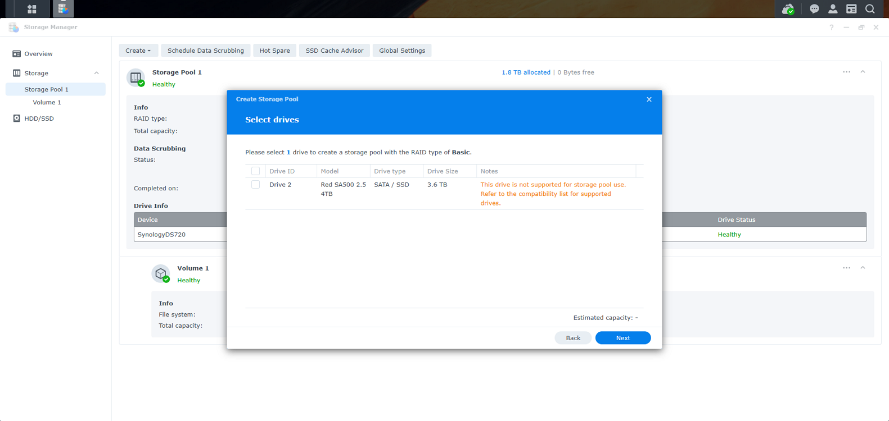
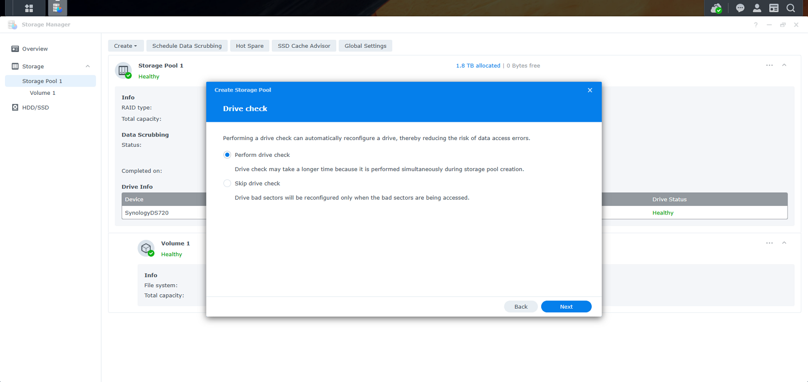

# Add a Second SSD to Synology DS720+

> **Note:** This document was generated by Claude Code and has not been reviewed by a human. Please use it as a reference only.

## Overview

Notes from installing a second M.2 SSD (4TB WD Red SA500) alongside an existing 2TB SSD in a Synology DS720+, and setting it up as an independent storage volume via DSM.

- NAS: Synology DS720+ (two M.2 NVMe/SATA SSD slots)
- Existing setup: one 2TB SSD, already running as **Storage Pool 1 / Volume 1**
- New drive: WD Red SA500 2.5" 4TB SSD, installed in the second slot

Installing the drive physically is not enough on its own — Windows won't show any change, since the new drive isn't part of a Windows-visible volume yet. Everything else happens inside **DSM Storage Manager**.

---

## Step 1: Confirm the Drive Is Detected

Log in to DSM (`http://find.synology.com` or the NAS's IP address) and open **Storage Manager** → **HDD/SSD**. Both drives should appear, healthy.

---

## Step 2: Decide How to Use the New Drive

A brand-new SSD doesn't automatically merge into the existing 2TB volume. Options:

- **Separate, independent volume** (used here) — the 4TB drive becomes its own storage pool and volume, showing up alongside the existing one.
- **RAID 1 mirror** — requires destroying and rebuilding the existing single-drive volume, and with a 2TB + 4TB pair, usable capacity is capped at 2TB (the smaller drive). Generally not worth it unless redundancy matters more than capacity.

### SSD Cache vs. Storage Volume

The DS720+'s two M.2 slots can be used either as normal storage (each slot holds its own volume) or as **SSD cache** for spinning HDDs, where the SSD doesn't appear as its own drive but instead transparently accelerates reads and writes to HDD volumes. This guide covers using the M.2 slot as a standalone storage volume, not as cache.

---

## Step 3: Create a New Storage Pool

> **Note:** The **Action** button on the HDD/SSD page only has drive-level tools (Benchmark, Secure Erase, Configure Write Cache) — it does not create pools.

1. In the left sidebar, go to **Storage** → **Storage Pool 1** (the existing pool's page).
2. Click **Create** → **Create Storage Pool**.

---

## Step 4: Choose the RAID Type

For a single drive, only **Basic** or **JBOD** make sense (SHR also technically works with one drive, but Basic is simpler and standard for a single disk).

The **Storage pool description** field is optional — safe to leave blank.

---

## Step 5: Select the Drive

Select the new drive (Drive 2). DSM may show a warning:

> "This drive is not supported for storage pool use. Refer to the compatibility list for supported drives."

This warning is expected for third-party (non-Synology-branded) drives like the WD Red SA500 — it is not a blocker. The drive works fine; DSM just cannot guarantee full validation and health-reporting support, and may show occasional compatibility notifications.

---

## Step 6: Run a Drive Check

Choose **Perform drive check** (not the default "Skip"). For a brand-new drive, a full surface scan up front is worth the extra time — it catches bad sectors before you start storing data, rather than discovering them later.

---

## Step 7: Confirm and Apply

Review the summary (RAID type: Basic, Drive 2, ~3.7TB estimated capacity, drive check enabled) and click **Apply**.

This starts the drive check and pool initialization, which can take over an hour for a full scan on a 4TB drive.

---

## Step 8: Create the Volume

Once the pool finishes initializing:

1. Back in **Storage Pool**, click **Create** → **Create Volume** on the new pool.
2. Choose a file system — **Btrfs** is recommended (snapshots, checksums) over ext4.
3. Allocate full capacity to the volume.
4. Go to **Control Panel** → **Shared Folder** → **Create**, pick the new volume, name it, and set permissions.

> **Note:** The shared folder is what becomes visible and mappable from Windows as a network drive.

---

## Result

Two independent volumes on the DS720+: the original 2TB (Storage Pool 1 / Volume 1) and the new ~3.7TB (Storage Pool 2 / Volume 2), each with its own shared folders.
