# Backing Up Documents from Android to Synology NAS

> **Note:** This document was generated by Claude Code and has not been reviewed by a human. Please use it as a reference only.

This guide explains how to back up documents and other files from an Android phone (e.g., Google Pixel) to a Synology NAS using a Synology Drive sync task. The sync task uploads files from the phone to the NAS. Files you delete from the phone afterward stay on the NAS, so you can treat the phone storage as temporary and manage everything on the NAS.

> **Note:** For screenshots specifically, see [Backing Up Screenshots Automatically with Synology Photos](back-up-screenshots-automatically.md) instead — no manual sync task or file-moving needed.

## Step 1: Open the Sync Task Settings

1. Open **Synology Drive** on your phone.

    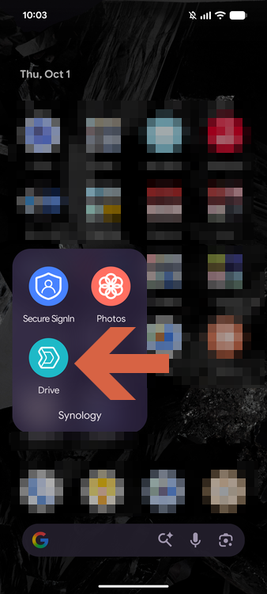

2. Tap **More** → **Backup and Sync Tasks**.

    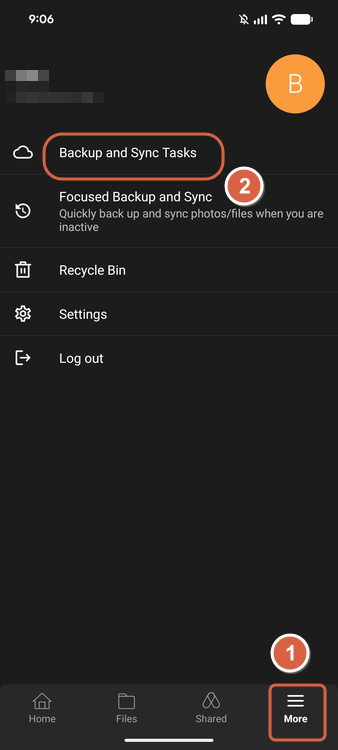

3. Tap **Sync Tasks**.

    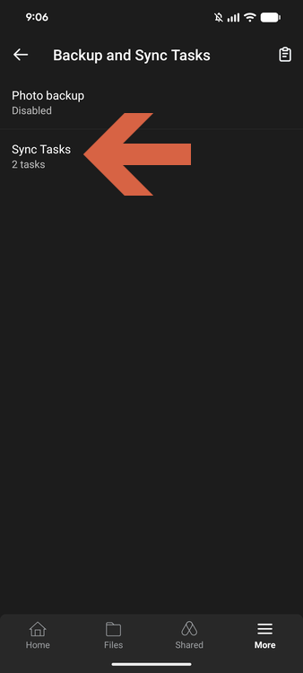

4. To create a new task, tap the **+** icon. To change an existing task, tap its **⋮** icon.

    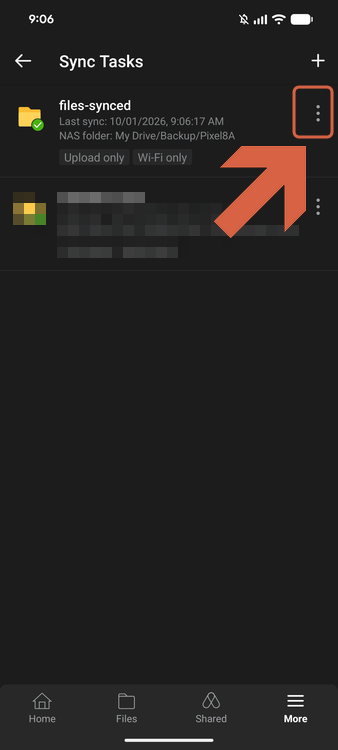

5. Tap **Edit task**.

    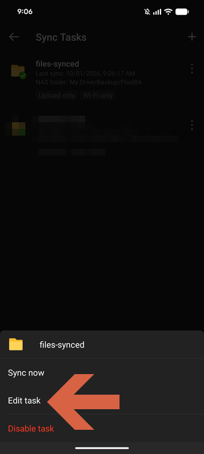

## Step 2: Configure the Sync Task

Set the following values on the **Edit task** screen:

| Setting | Value |
|---------|-------|
| **Remote path on the server** | A folder on your NAS, e.g., `My Drive/Backup/<YOUR-FOLDER>` |
| **Local path** | A folder on your phone, e.g., `Internal storage/Documents/<YOUR-FOLDER>` |
| **Mode** | **Upload only** |
| **Keep locally deleted files on the server** | On |

1. Tap **Mode**.

    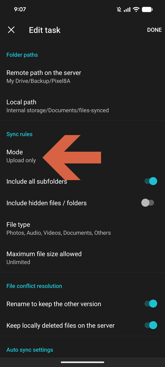

2. Select **Upload only**. Files go from the phone to the NAS, and changes on the NAS do not affect the phone.

    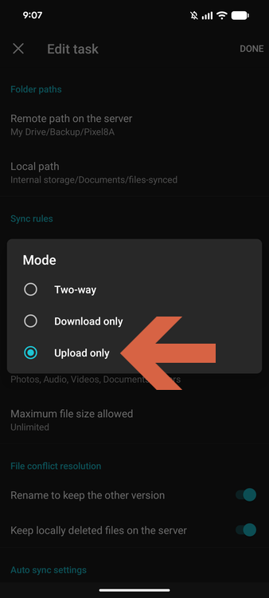

3. Under **File conflict resolution**, turn on **Keep locally deleted files on the server**. This setting keeps files on the NAS after you delete them from the phone.
4. Tap **DONE**.

> **Warning:** If **Keep locally deleted files on the server** is off, deleting a file from the phone may also delete it from the NAS.

## Step 3: Move Files into the Sync Folder

Only files inside the local path are uploaded. Move the files you want to back up into that folder.

1. Open the **Files** app and tap **Images** (or another category).

    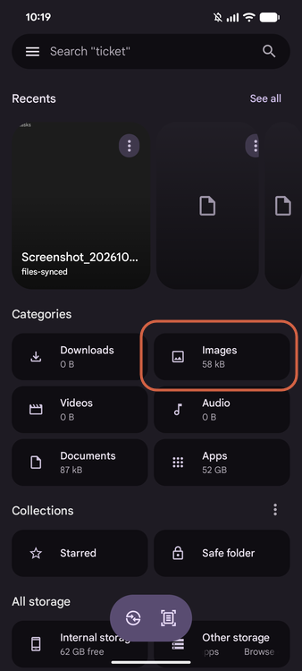

2. Select the files you want to back up.

    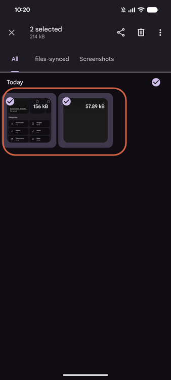

3. Tap **⋮** → **Move to**, then open **Documents**.

    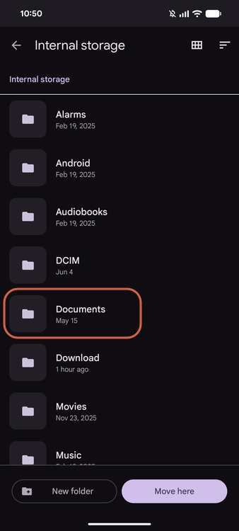

4. Open the sync folder.

    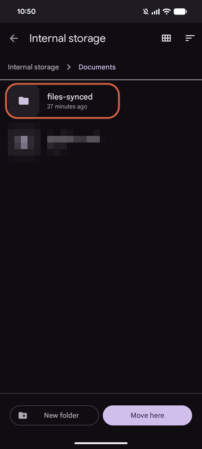

5. Tap **Move here**.

    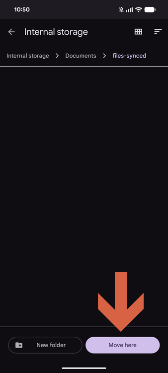

## Step 4: Run the Sync

The sync task runs automatically over Wi-Fi. To run it immediately, use either method:

- Tap the task's **⋮** icon, then tap **Sync now**.
- Use **Focused Backup and Sync** as described below.

### Using Focused Backup and Sync

1. Connect your phone to Wi-Fi and a charger.
2. Tap **More** → **Focused Backup and Sync**.

    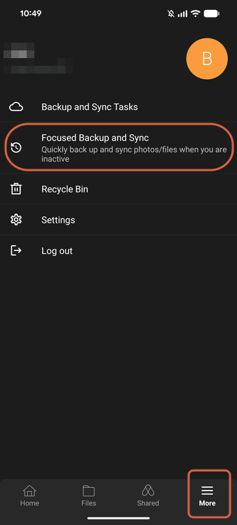

3. Tap **Enable**. Keep Synology Drive in the foreground until the sync finishes.

    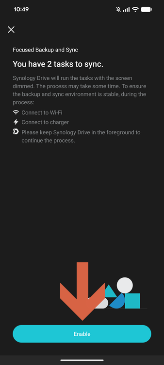

    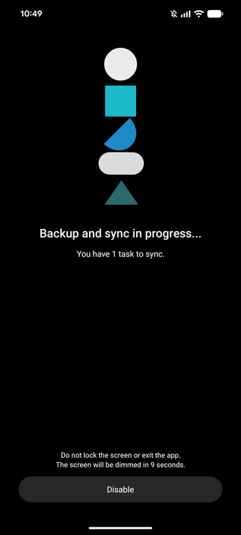

4. When **Backup and sync completed** appears, tap **Done**.

    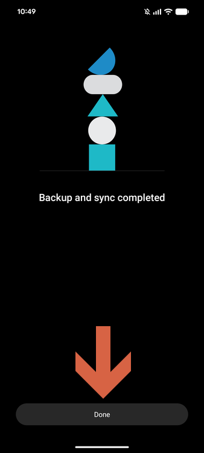

## Step 5: Delete the Originals from Your Phone

1. Confirm the files appear in the remote folder on your NAS.
2. In the **Files** app, select the original files in the sync folder and tap the trash icon.

    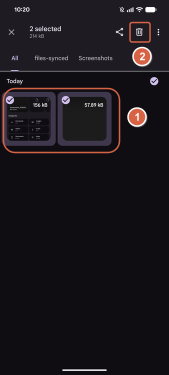

The files remain on the NAS.

> **Note:** Test with one or two files first. Sync them, delete them from the phone, sync again, and confirm they are still on the NAS.

## How It Works

| Action on Phone | Result on NAS |
|-----------------|---------------|
| Add file to the sync folder | Uploaded |
| Edit file | Updated |
| Delete file | Kept (when **Keep locally deleted files on the server** is on) |

## Best Practices

- Use a dedicated local folder for synced files so the sync behavior stays predictable.
- Use a dedicated NAS folder to avoid mixing with other files.
- Enable versioning on the NAS (Synology Drive Admin Console) to protect against accidental edits and file corruption.
- If the NAS holds your only copy, keep a second copy of it elsewhere, for example with Hyper Backup.
- Avoid editing the same files from multiple devices at the same time.
