# Backing Up Photos from Android with Synology Drive

> **Note:** This document was generated by Claude Code and has not been reviewed by a human. Please use it as a reference only.

Synology Drive on Android can back up camera photos and videos with its **Photo backup** feature, in addition to syncing other files. This lets you manage photos and documents in one app and one NAS location.

> **Note:** To back up documents and screenshots, see [Backing Up Documents and Screenshots from Android to Synology NAS](back-up-documents-android-synology-nas.md).

## Step 1: Open Photo Backup

1. Open **Synology Drive** on your phone.

    

2. Tap **More** → **Backup and Sync Tasks**.

    

3. Tap **Photo backup**. It shows **Disabled** until you turn it on.

    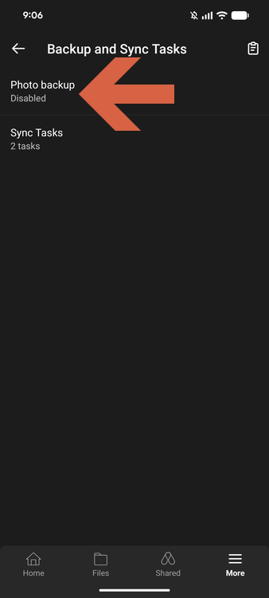

## Step 2: Configure Photo Backup

1. Turn on **Enabled**.
2. Under **Settings**, choose your options:

    | Setting | Description |
    |---------|-------------|
    | **Backup over Wi-Fi only** | Recommended. Avoids mobile data usage. |
    | **Backup when charging** | Optional. Backs up only while the phone charges. |
    | **Backup photos only** | Turn on to skip videos. |
    | **Create folder structure** | Sorts uploads into folders by date. |

3. Tap **Create folder structure** and choose how to organize uploads.

    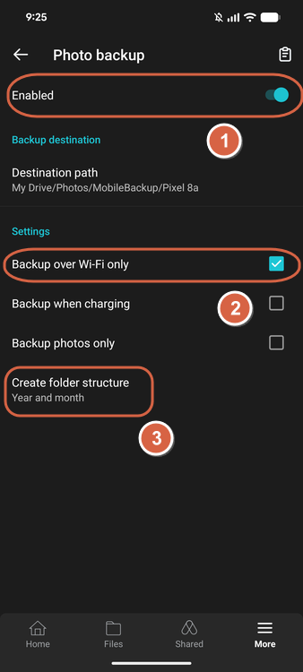

    | Option | Result |
    |--------|--------|
    | **None** | Files go straight into the destination path, keeping the phone's own folders (e.g., `DCIM/Camera`). |
    | **Year** | Files are grouped into one folder per year. |
    | **Year and month** | Files are grouped into one folder per year and month. |

    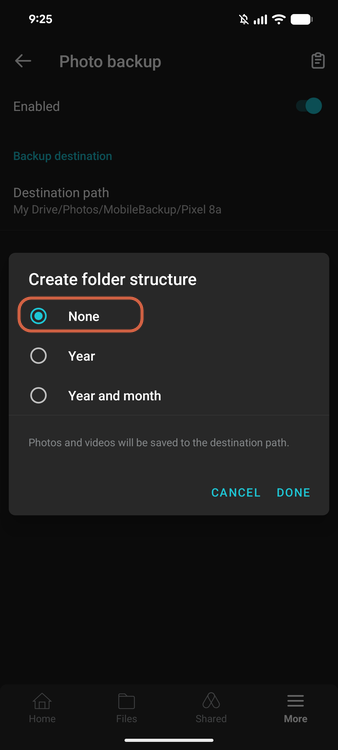

4. Tap **DONE**.

## Step 3: Check the Default Destination

By default, photos are saved to `My Drive/Photos/MobileBackup/<YOUR-DEVICE>`. To confirm that photos arrive, browse to that folder in the **Files** tab:

1. Tap **Files**, then open the **Photos** folder.

    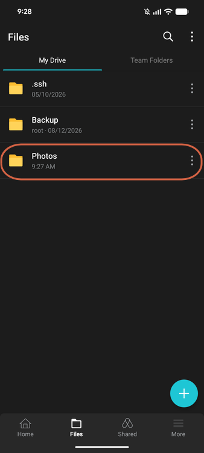

2. Open **MobileBackup**.

    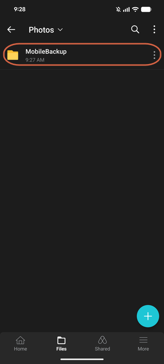

3. Open your device folder.

    

4. Open **DCIM**, then **Camera**.

    

    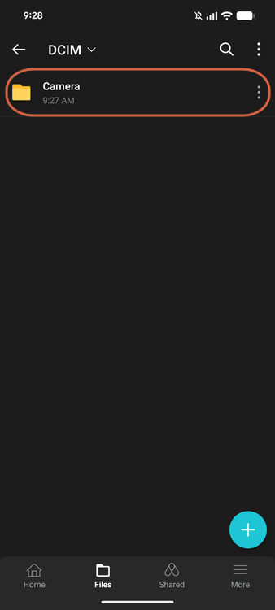

5. Confirm your photos are listed.

    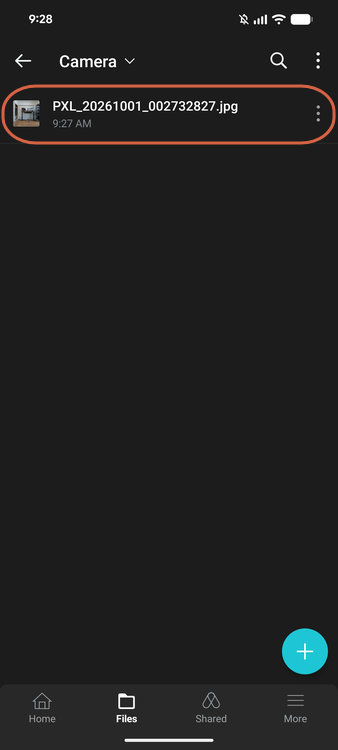

## Step 4: Change the Destination (Optional)

Change the destination to store photos in the same NAS folder as your synced documents and screenshots.

1. In **Photo backup**, tap **Destination path**.

    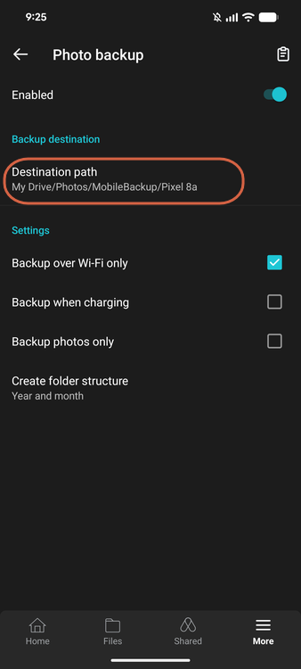

2. Select **Custom**.

    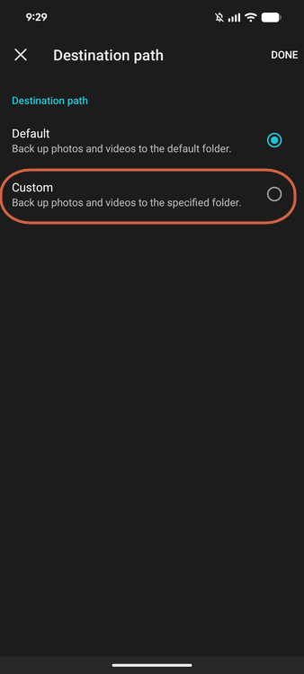

3. Open the folder you want to use as the destination, such as the folder of your sync task.

    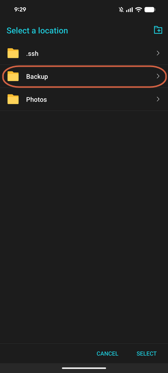

    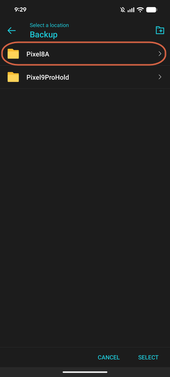

4. Tap **SELECT**.

    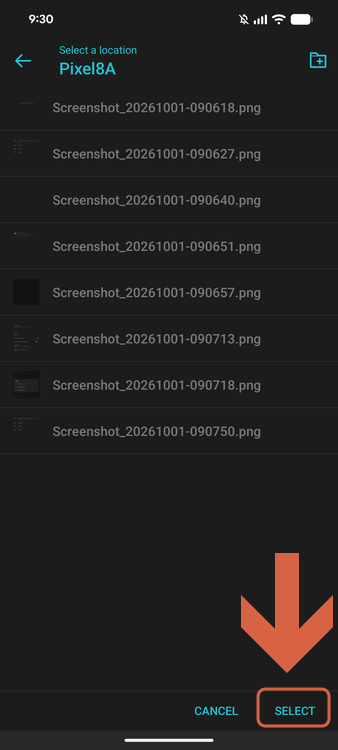

5. Confirm **Destination path** shows the new folder.

    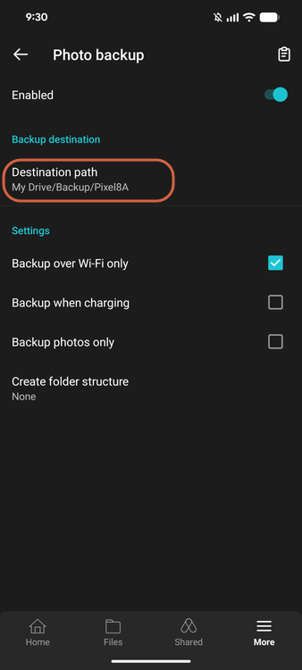

## Step 5: Verify the Upload

After the next backup, browse to the new destination in the **Files** tab. With **Create folder structure** set to **None**, the photos appear under `DCIM/Camera` inside the destination folder, next to your other synced files.

1. Tap **Files** → **Backup**.

    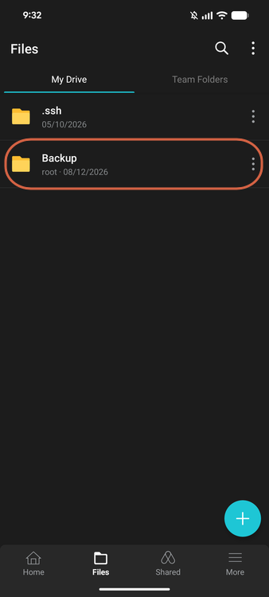

2. Open your device folder. The **DCIM** folder appears alongside your synced files.

    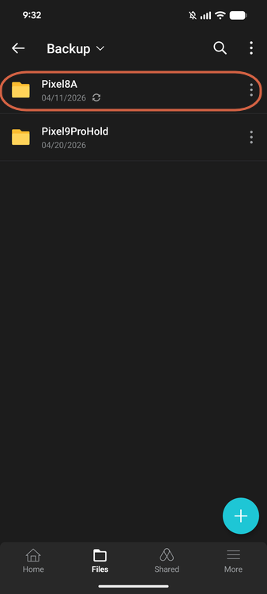

    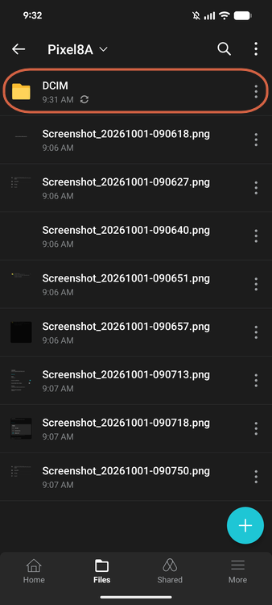

3. Open **Camera** and confirm the photos are listed.

    

    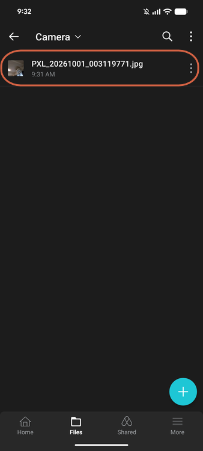

## Before You Delete Photos from Your Phone

> **Warning:** Confirm that a photo is on the NAS before you delete it from the phone. Test with one photo first: let it back up, delete it from the phone, and check that it is still on the NAS.

## Photo Backup vs. Sync Tasks

| | Photo backup | Sync task |
|---|---|---|
| Source | Camera photos and videos | Any folder you choose |
| Setup | Enable and choose a destination | Choose a local and remote path |
| Folder structure | None, Year, or Year and month | Mirrors the local folder |
