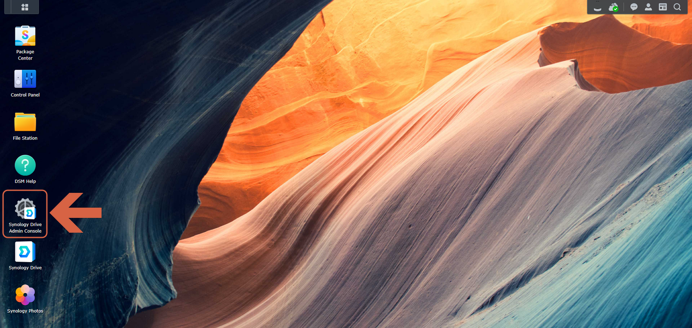
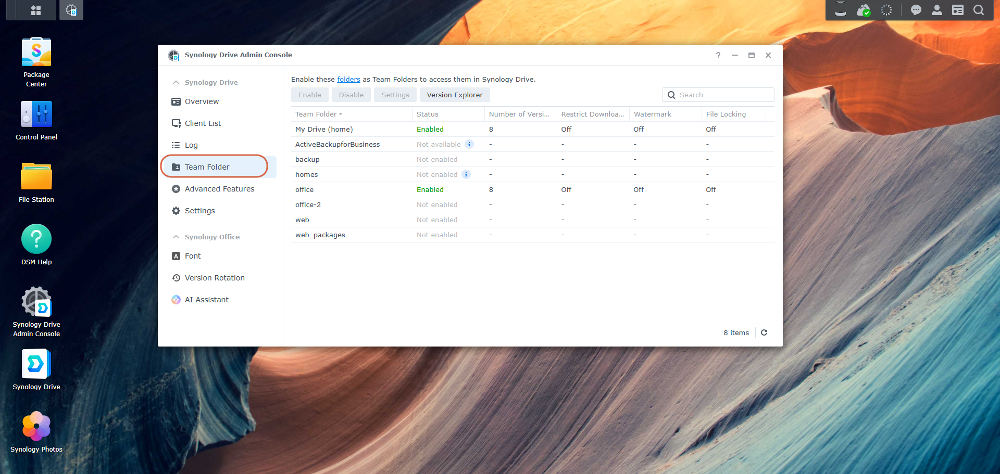
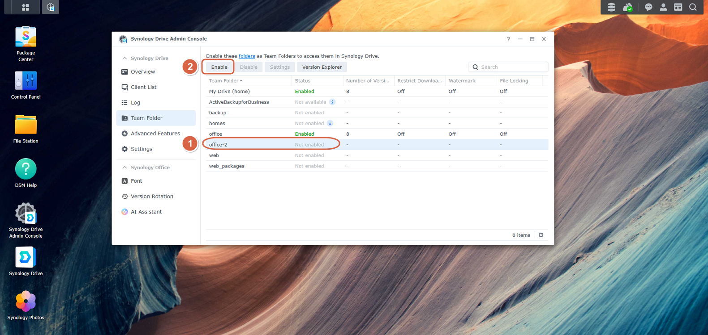
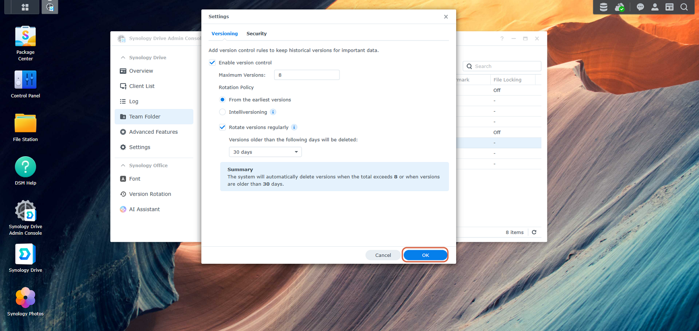
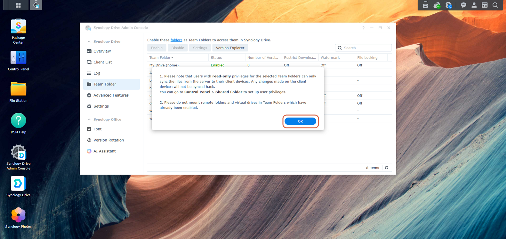
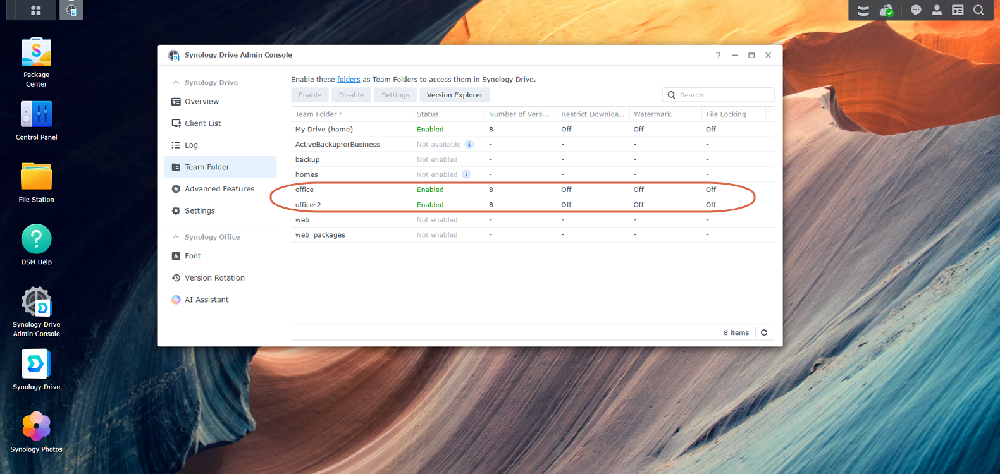
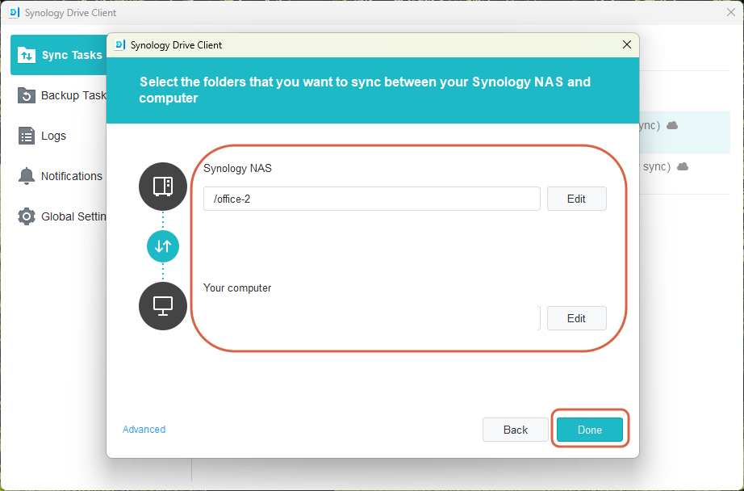
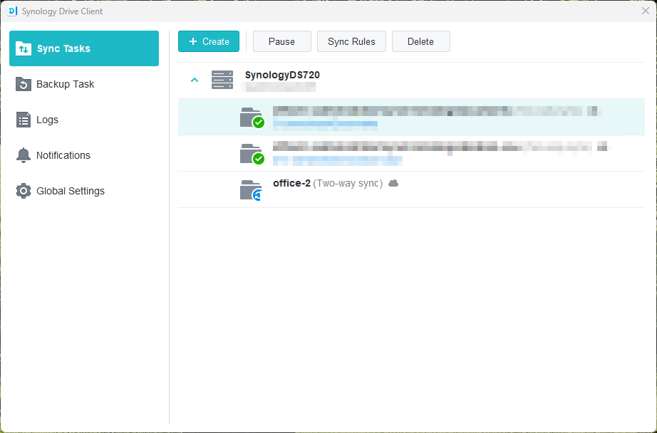

# Syncing a Folder to a Second Synology Volume

> **Note:** This document was generated by Claude Code and has not been reviewed by a human. Please use it as a reference only.

This guide covers syncing a folder on a Windows PC to a shared folder that lives on a **second, independent storage pool/volume** on a Synology NAS (e.g. a second SSD added to a DS720+), using Synology Drive.

## Scenario

- NAS: Synology DS720+.
- A second SSD was added and set up as its own independent storage pool and volume — not part of the existing RAID/volume.
- A shared folder named `office-2` was created on that new volume.
- Goal: two-way sync a folder on a Windows 11 PC with `office-2` on the NAS, using the Synology Drive Client.

## Why "office-2" Doesn't Show Up in Synology Drive Client Right Away

Synology Drive Client can only sync to **My Drive** or a **Team Folder** — not to an arbitrary shared folder. A shared folder created directly in **Control Panel** → **Shared Folder** (or when a new volume is set up) isn't automatically a Team Folder. That's why a plain shared folder like `office-2` is visible over the network (`\\<YOUR-NAS-IP>\office-2`) but doesn't appear as an option when creating a sync task in Synology Drive Client — it first needs to be enabled as a Team Folder.

---

## Step 1: Open Synology Drive Admin Console

On the NAS desktop (DSM), open **Synology Drive Admin Console** — the server-side admin app, not the Drive Client app used on your PC.

---

## Step 2: Go to Team Folder

In the left-hand menu, click **Team Folder**. You'll see a list of shared folders and their Drive status. Existing shared folders that haven't been enabled for Drive show as **Not enabled** — in this case, `office-2` sits alongside `web` and `backup` as not enabled, while `office` is already **Enabled**.

---

## Step 3: Enable "office-2" as a Team Folder

Select the `office-2` row, then click **Enable**.

---

## Step 4: Configure Versioning Settings

Enabling a folder for Drive prompts a **Settings** dialog on the **Versioning** tab. This controls how many historical file versions are kept and how long they're retained before automatic cleanup. The defaults — version control on, up to 8 versions, rotating out anything older than 30 days — are a sensible starting point. A **Security** tab sits alongside it for restricting access at the Team Folder level if needed.

Click **OK** to accept.

---

## Step 5: Acknowledge the Enable Notice

A confirmation dialog appears with two notes:

1. Users with **read-only** privileges on the Team Folder can only sync files *from* the server to their devices — changes made locally won't sync back. Privileges are managed in **Control Panel** → **Shared Folder**.
2. Don't mount remote folders or virtual drives inside Team Folders that are already enabled.

Click **OK** to finish enabling the folder.

---

## Step 6: Confirm "office-2" Is Enabled

Back in the Team Folder list, `office-2` should now show **Enabled**, matching `office`.

> **Note:** If `office-2` still doesn't show up as a sync option afterward, check **Control Panel** → **Shared Folder** → `office-2` → **Permissions** to confirm your user account has Read/Write access, and **Control Panel** → **User & Group** → your account → **Applications** to confirm Synology Drive isn't blocked for that account.

---

## Step 7: Create the Sync Task in Synology Drive Client

On the Windows PC, open **Synology Drive Client** and create a new sync task:

- **Synology NAS** side: `/office-2` (or a subfolder of it, if you only want to sync part of it).
- **Your computer** side: the local folder to sync, e.g. `D:\<YOUR-FOLDER>`.
- Sync direction: **Two-way sync** (the default) — changes on either side propagate to the other. One-way (download-only or upload-only) is also available under **Advanced** if you just want a mirror/backup.

Click **Done**.

---

## Step 8: Confirm the Sync Task Is Running

The new task appears in **Sync Tasks**, listed as `office-2 (Two-way sync)` paired with the local path. A blue circular-arrows icon means the initial sync pass is still running; it changes to a green checkmark once the task catches up and settles into steady-state syncing.

---

## Tips

- Because this is a **two-way sync**, deleting a file on either side deletes it on the other. The Team Folder's version history (configured in Step 4) and the shared folder's Recycle Bin (if enabled) are the safety nets for recovering an accidentally deleted or overwritten file.
- Sync progress and recent transfer logs are available by clicking the sync task, or from the Synology Drive Client icon in the Windows system tray.
- Sync exclusions (file types, subfolders) and bandwidth limits can be set per task under **Sync Rules** / **Advanced** in the task creation dialog.
