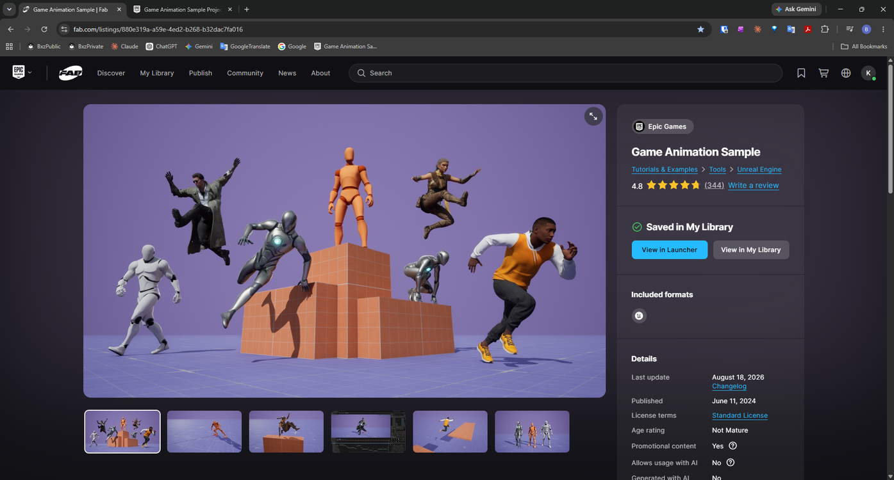
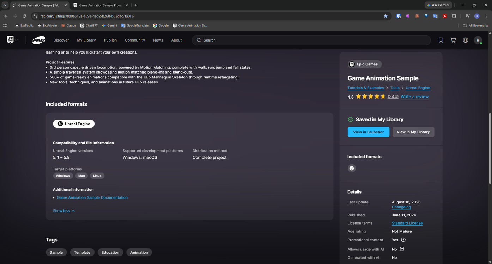
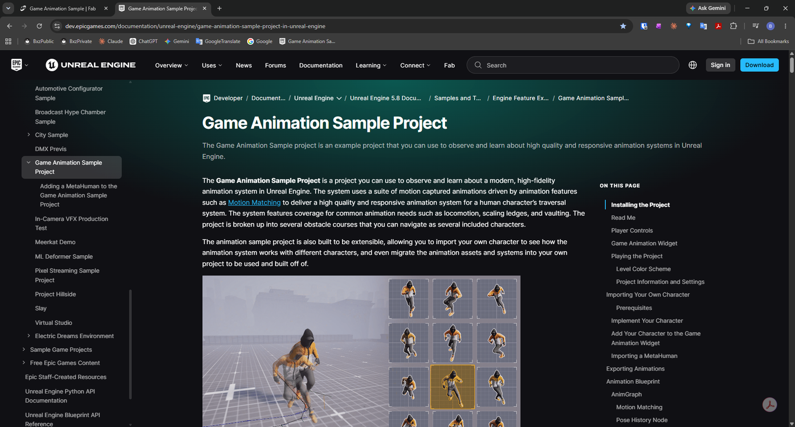

# Accessing the Game Animation Sample Documentation on Fab

> **Note:** This document was generated by Claude Code and has not been reviewed by a human. Please use it as a reference only.

Epic's official documentation for **Game Animation Sample** is linked directly from its download listing on Fab.

## Step 1: Open the Game Animation Sample Listing on Fab

Go to the **Game Animation Sample** listing on [Fab](https://www.fab.com).

## Step 2: Scroll to Additional Information

Scroll down to **Included formats** → **Additional information**, where the listing links to the **Game Animation Sample Documentation**.

## Step 3: Open the Documentation

Click **Game Animation Sample Documentation** to open Epic's official documentation page for the project in your browser.

