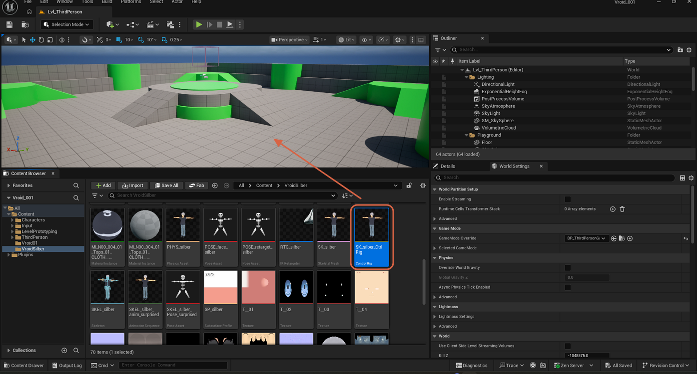
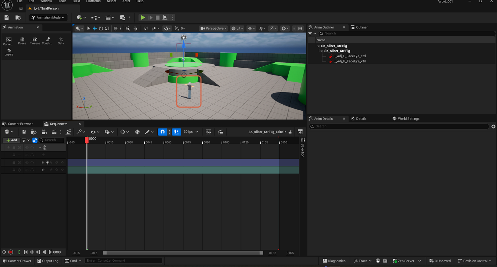
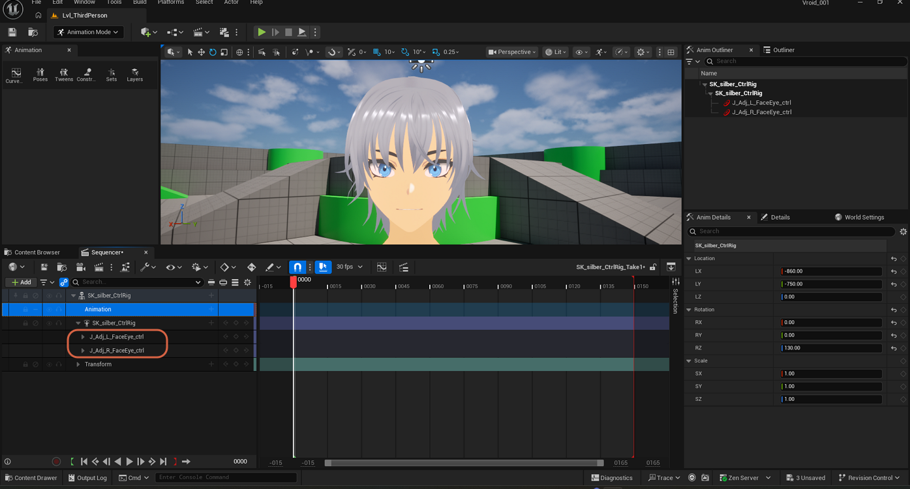
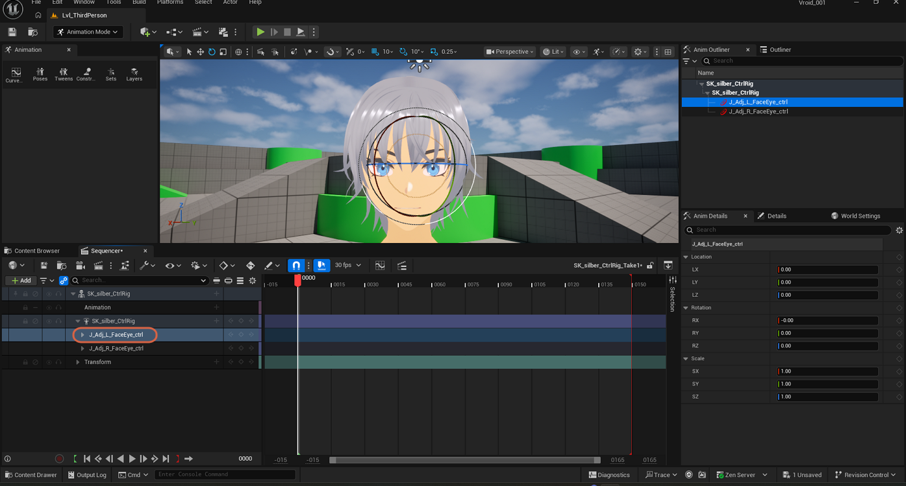
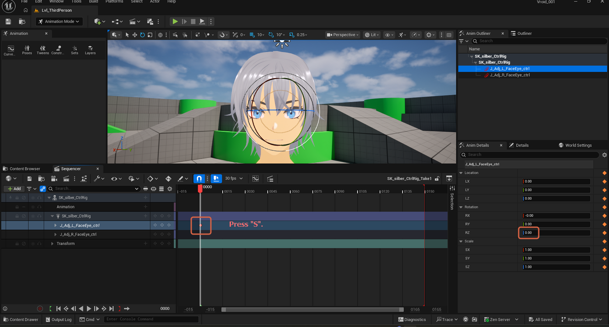
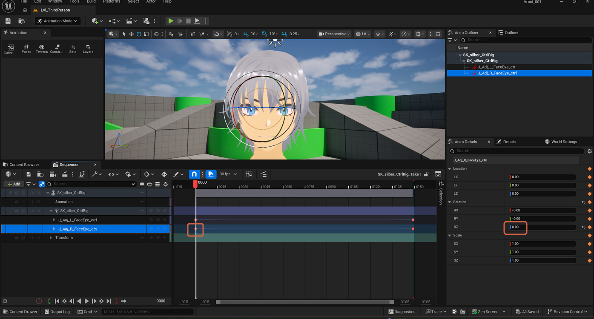
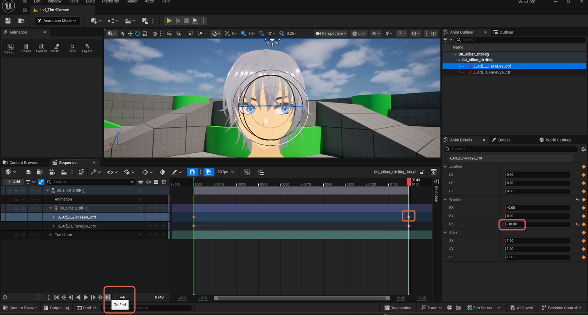
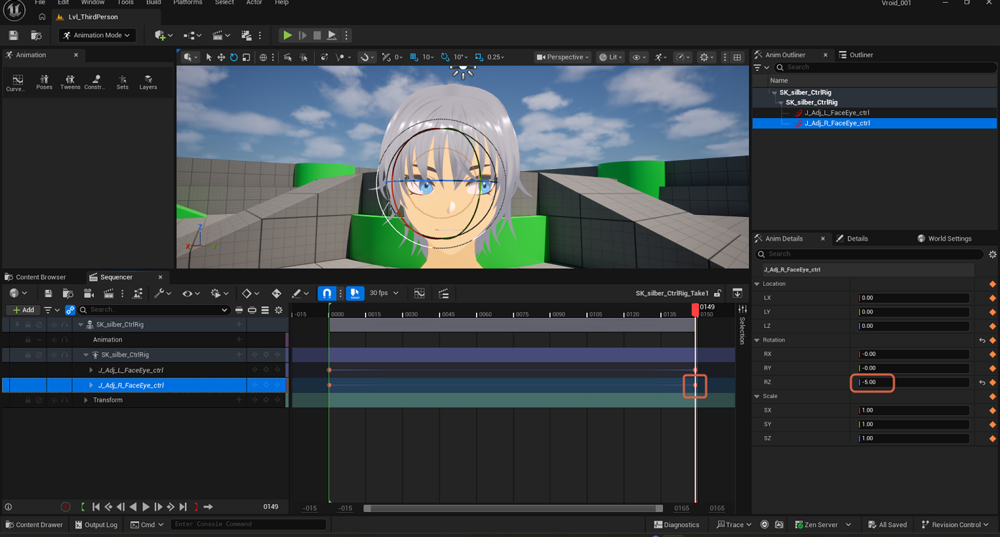
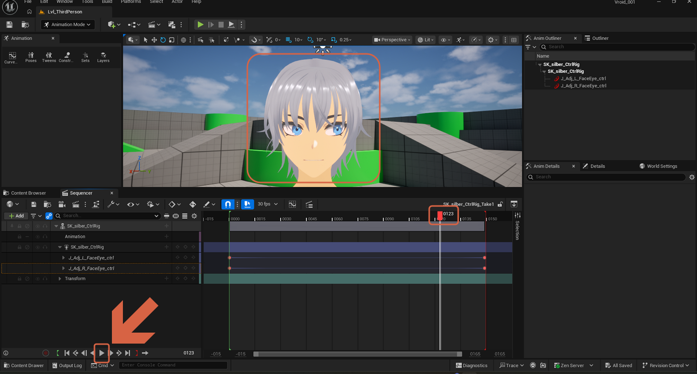

# Animating a Control Rig in Sequencer

> **Note:** This document was generated by Claude Code and has not been reviewed by a human. Please use it as a reference only.

Once a `Control Rig` asset has custom bone controls wired up and tested, it can drive a real animation in **Sequencer** — Unreal's cinematic/level-sequence timeline — by keyframing the controls directly, instead of editing curves inside a single Animation Sequence asset. This example animates both of `silber`'s eye controls (`J_Adj_L_FaceEye_ctrl` and `J_Adj_R_FaceEye_ctrl`) from a neutral pose at the start of the sequence to a rotated pose at the end.

> **Note:** This page assumes the Control Rig already exists and its controls are wired to drive the matching bones. See [Creating a Control Rig](create-control-rig.md) for that prerequisite workflow.

## Adding the Control Rig to the Level

### Step 1: Drag the Control Rig Into the Level

In the Content Browser, drag the `SK_silber_Ctrl Rig` (`Control Rig` asset) into the level viewport.

### Step 2: Confirm the Actor and Sequencer

Dropping the Control Rig into the level adds the character actor and opens a Sequencer panel for it. In the **Anim Outliner**, the tree shows `SK_silber_CtrlRig` containing `J_Adj_L_FaceEye_ctrl` and `J_Adj_R_FaceEye_ctrl`. Sequencer's own track list, below, is still collapsed at this point.

## Exposing the Control Tracks

### Step 1: Expand the Track Hierarchy

In the Sequencer panel, expand the `SK_silber_CtrlRig` track and its child track to reveal `J_Adj_L_FaceEye_ctrl` and `J_Adj_R_FaceEye_ctrl` as separate, keyable sub-tracks, alongside a `Transform` track for the actor as a whole.

## Keyframing the Left Eye

### Step 1: Select the Left Eye Control Track

Click the `J_Adj_L_FaceEye_ctrl` track to select it. Its Details panel shows the control's own Location, Rotation, and Scale, separate from the actor's.

### Step 2: Key the Start Frame

With the playhead at the start of the sequence (frame `0000`) and `J_Adj_L_FaceEye_ctrl` still selected, press `S` to add a keyframe at the current playhead position. A diamond keyframe marker appears on the track at the start.

## Keyframing the Right Eye

### Step 1: Select the Right Eye Control Track and Key the Start Frame

Select `J_Adj_R_FaceEye_ctrl` and press `S` at the same start frame. Both tracks now show a keyframe marker at frame `0000`.

## Keying the End Frame

### Step 1: Move the Playhead to the End and Key the Left Eye

Click the transport bar's **To End** button to jump the playhead to the end of the sequence (frame `0149`). Select `J_Adj_L_FaceEye_ctrl`, change its Rotator **Z** value (here, to `-10.00`), and press `S` to add a second keyframe.

### Step 2: Key the Right Eye at the End

Select `J_Adj_R_FaceEye_ctrl`, change its Rotator **Z** value (here, to `-5.00`), and press `S` to key it at the same end frame. Both tracks now hold two keyframes each — one at the start, one at the end.

## Confirming the Animation

### Step 1: Play the Sequence

Move the playhead back into the middle of the timeline and click **Play** in the transport bar. The `SK_silber_CtrlRig` track shows both `J_Adj_L_FaceEye_ctrl` and `J_Adj_R_FaceEye_ctrl` sub-tracks with two keyframes each, visible at the start and end of the timeline. The viewport shows the character's face in close-up with the eyes visibly shifted mid-playback, confirming the keyframed animation plays correctly.

