# Applying an Animation to a Chaos Cloth Simulation

> **Note:** This document was generated by Claude Code and has not been reviewed by a human. Please use it as a reference only.

By default, a Chaos Cloth Asset simulates against a static reference pose. To preview how a garment behaves during actual movement, export a retargeted animation from your character's IK Retargeter and assign it to the cloth asset's **Animation Asset** property.

## Before You Start

This guide assumes you already have:

- A character retargeted into the project through `ABP_GenericRetarget`'s **Retargeter Maps**, with its own IK Retargeter asset (for example `RTG_UEFN_VroidBoyBlue001`) — see [Retargeting a VRM Character to Game Animation Sample](retarget-character-game-animation-sample.md).
- A Chaos Cloth Asset built for that character (for example `CA_VroidBoyShirt`) — see [Creating a Chaos Cloth Asset](create-chaos-cloth-asset.md) and [Applying Chaos Cloth Simulation](apply-chaos-cloth.md).

## Step 1: Open the IK Retargeter Behind Your Character's Retarget Tag

1. In the Content Browser, navigate to **Content** → **Blueprints** → **RetargetedCharacters** and select `ABP_GenericRetarget`.

    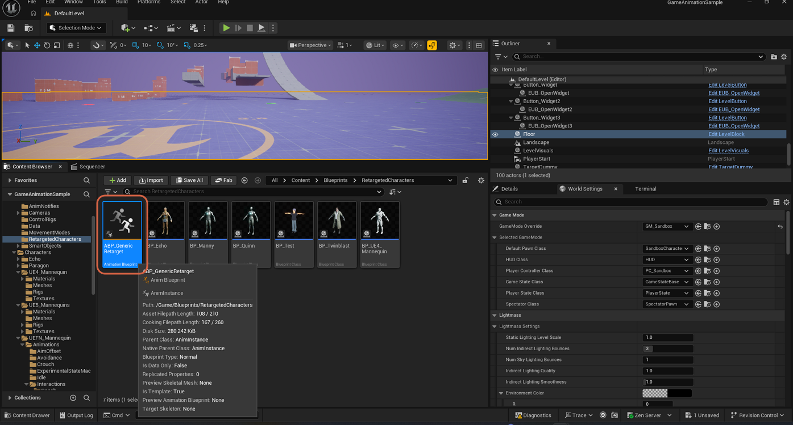

2. Open it, and in its **Class Defaults**, find the **Retargeter Maps** entry for your character's tag. Note the IK Retargeter asset in the **Value** column — for example, the entry mapped to `RTG_UEFN_VroidBoyBlue001`.

    > **Note:** Setting up this array entry is covered in [Retargeting a VRM Character to Game Animation Sample](retarget-character-game-animation-sample.md). This step just locates the IK Retargeter asset it already points to.

    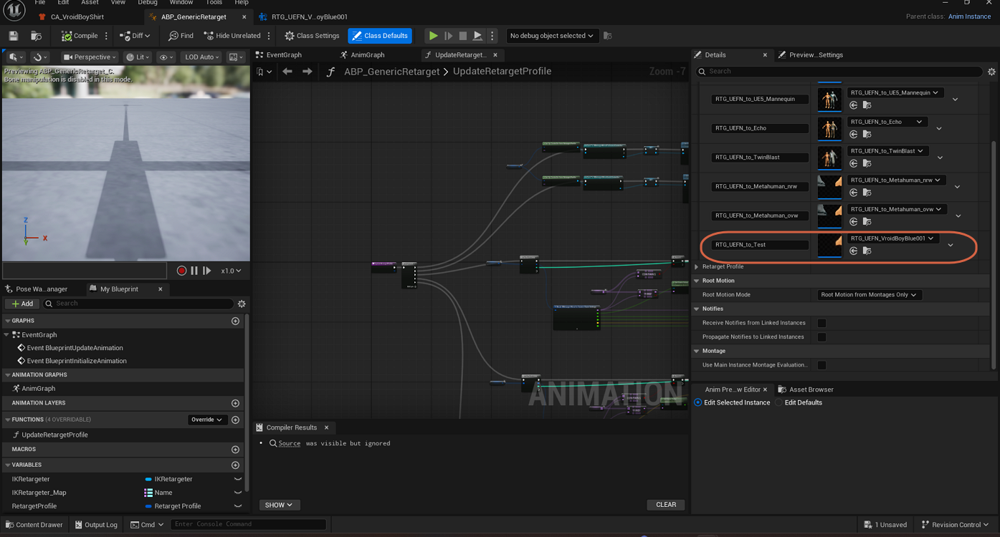

3. Locate that asset in the Content Browser (in this project, under **Vroid** → **Rigs**) and open it.

    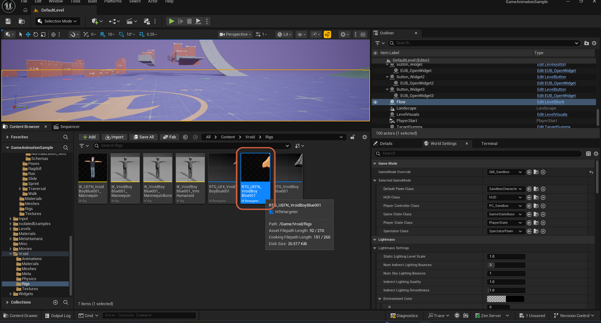

## Step 2: Preview and Export a Retargeted Animation

1. In the IK Retargeter editor, open the **Asset Browser** tab. It lists the source animation sequences available to preview through the retarget.

    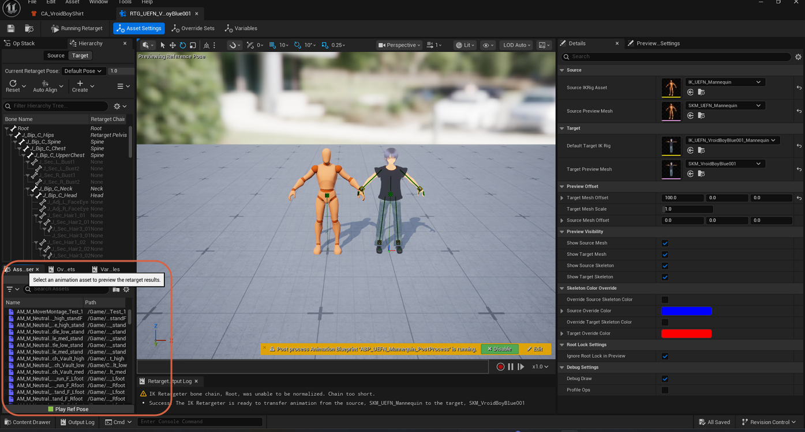

2. Select an animation to preview it on both the source skeleton and your retargeted character in the viewport. Once you've found the one you want, click **Export Selected Animations**.

    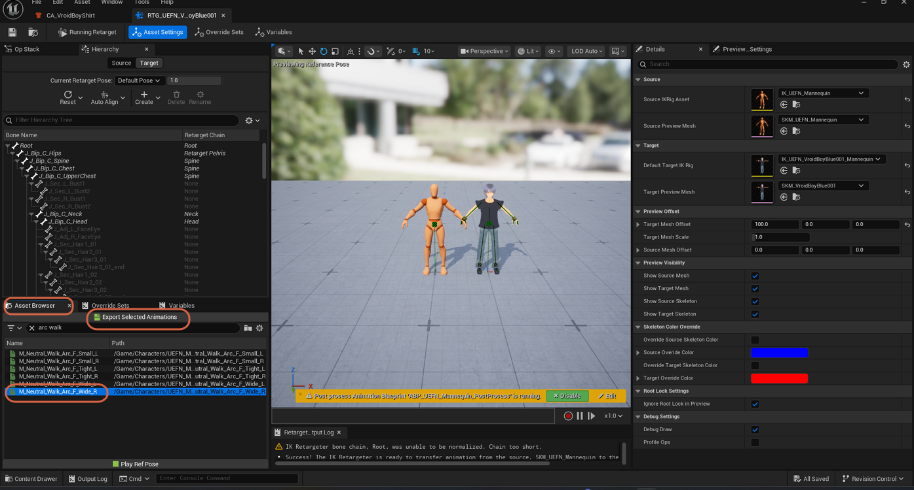

3. In the **Export Animations** dialog, select a destination folder (for example `Animations`), set a **Prefix** under **Rename New Assets** (for example `Vroid`), then click **Export**.

    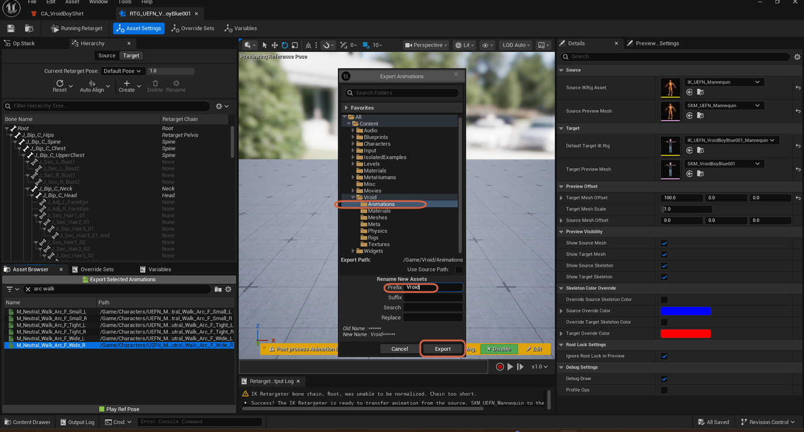

## Step 3: Assign the Exported Animation to the Cloth Asset

1. Open your Chaos Cloth Asset (for example `CA_VroidBoyShirt`).
2. In its **Asset Details** panel, under **Blueprint Variables**, set **Animation Asset** to the animation you just exported.

The Simulation Viewport now plays that animation instead of a static reference pose, so you can see how the cloth reacts to actual movement.

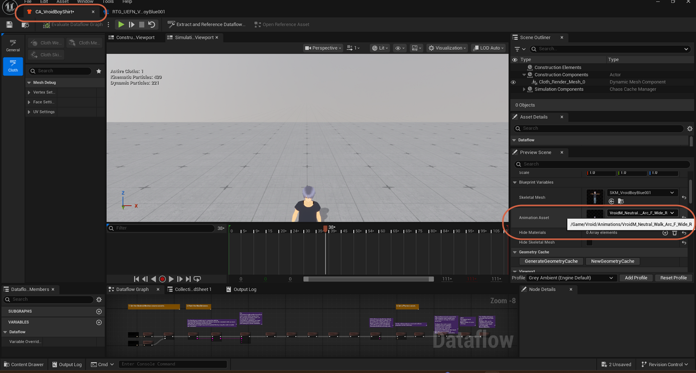

## Troubleshooting: Lower Body Sinks Into the Ground

If the character's legs appear to sink below the floor while the animation plays in the Cloth Asset Editor's preview, work through these checks in order.

### Checking the Retarget Chain Assignments

Back in the IK Retargeter editor's **Target** tab, filter the hierarchy for `leg` and check the **Retarget Chain** column for the leg bones — each should map to `LeftLeg` or `RightLeg` as expected.

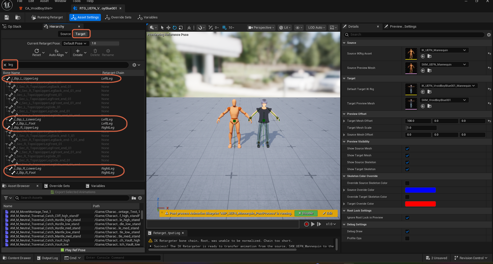

Select any of these entries to highlight the actual rig chain on the target character in the viewport, confirming it lines up with the source.

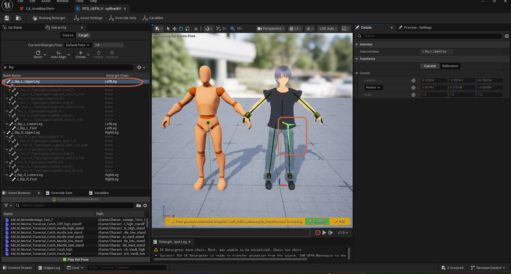

If the leg chains are mapped correctly, move to the next check.

### Checking the Default Target IK Rig

1. Still on the **Target** tab, note the asset under **Default Target IK Rig** (for example `IK_UEFN_VroidBoyBlue001_Mannequin`).

    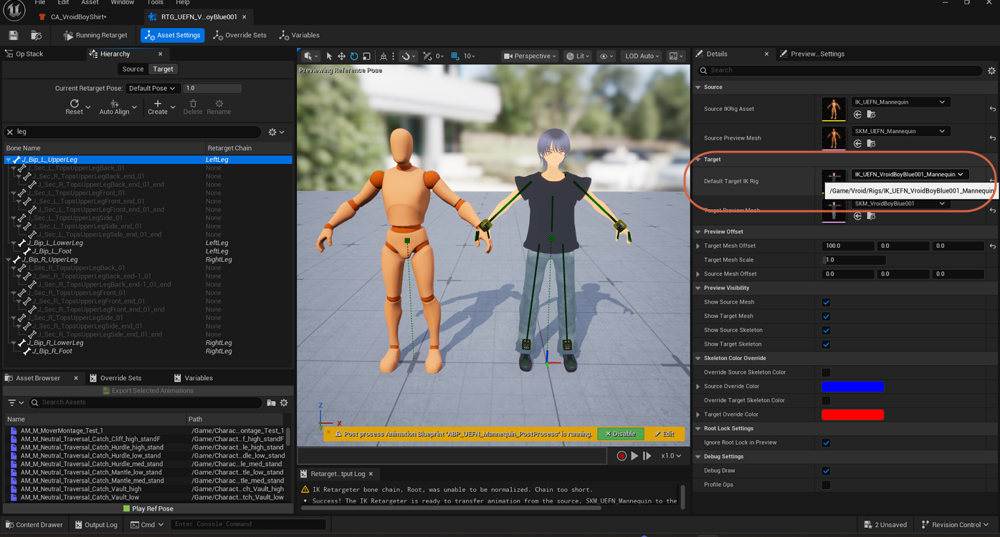

2. Locate and open that IK Rig asset.

    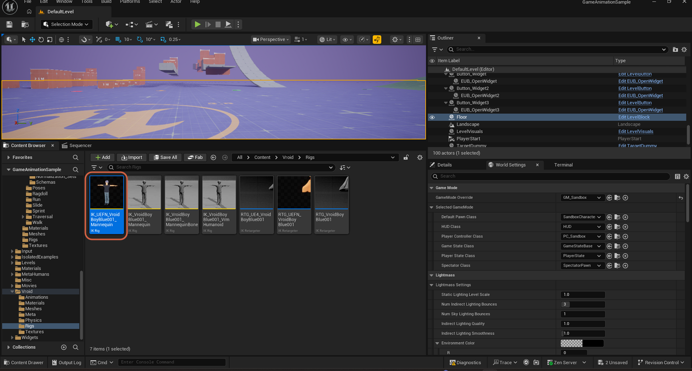

3. In the viewport, confirm there's an IK goal at both wrists and both ankles. In the **Solver Stack** panel, confirm a Full Body IK solver is present (`1 - Full Body IK`).

    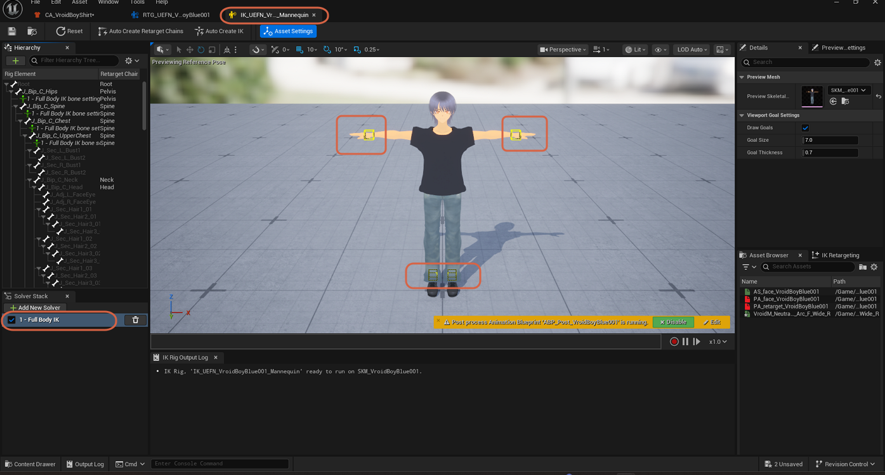

If the goals and solver are both present and correct, move to the next check.

### Setting Root Behavior to Free and Re-Exporting

1. With the Full Body IK solver selected in the **Solver Stack**, find **Root Behavior** under **Full Body IK Settings** and set it to **Free**.

    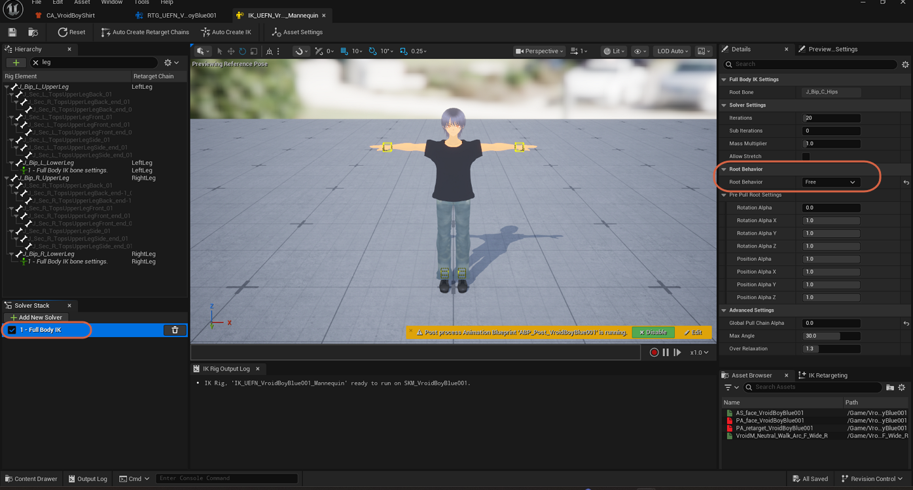

2. Go back to the IK Retargeter's **Asset Browser** and export the animation again (same process as [Step 2](#step-2-preview-and-export-a-retargeted-animation)), using a different prefix so you don't overwrite the original export — for example, a second export in this workflow used the prefix `Vroid2`.
3. Assign the newly exported animation to the Cloth Asset's **Animation Asset** property, as in [Step 3](#step-3-assign-the-exported-animation-to-the-cloth-asset).

### Ruling Out a Floor-Clipping Illusion

If the character still appears low or sunk after re-exporting with **Root Behavior** set to **Free**, the retargeting settings are most likely fine — this can be a rendering or preview quirk rather than an actual retargeting problem.

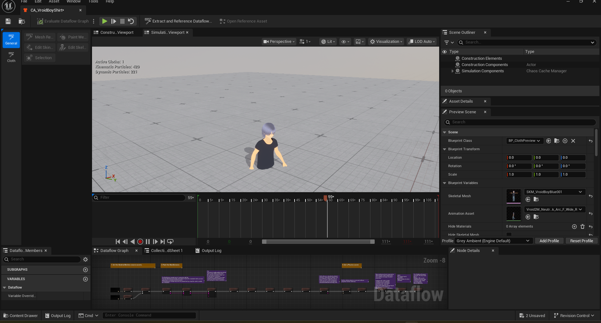

To check, open the Cloth Asset Editor's **Preview Scene** settings and disable **Show Floor** to hide the floor mesh.

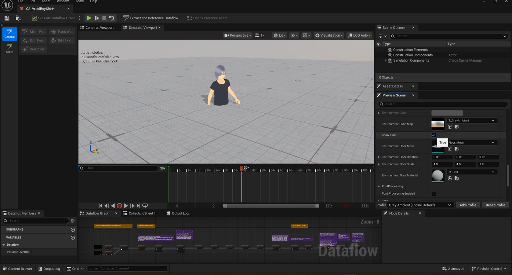

> **Note:** If the legs read correctly once the floor mesh is out of the way, the floor was visually clipping into the character rather than the animation actually sinking below it. Re-enable **Show Floor** once you've confirmed this — the walk cycle below plays with the shirt simulating naturally and the legs clearly on the ground.

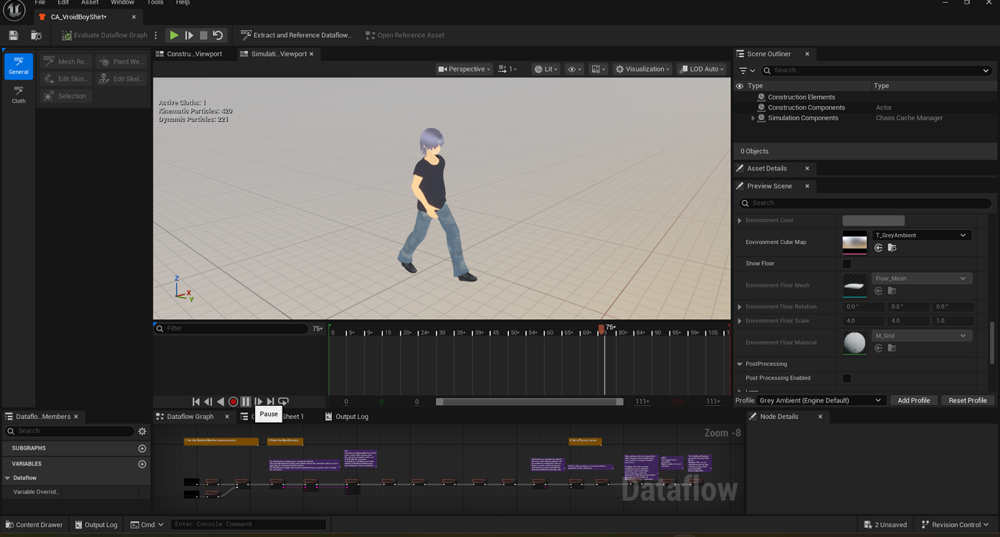
