# Applying Chaos Cloth Simulation

> **Note:** This document was generated by Claude Code and has not been reviewed by a human. Please use it as a reference only.

This guide covers the weight-painting and physical-parameter-tuning phase of **Chaos Cloth** simulation in Unreal Engine 5 — painting the Max Distance weight map, tuning the Dataflow graph's simulation nodes, wiring up collision, and testing the result in Play mode.

> **Reference Video:** [How to Create Cloth Simulation Easily with Chaos Cloth in Unreal Engine 5](http://www.youtube.com/watch?v=nhth5mI4l7A) by *Dream Recompile*

## Before You Start

This guide assumes you already have:

- A Chaos Cloth data asset created from your garment's mesh section (for example `CA_VroidBoyShirt`), with its Dataflow graph extracting that section from the base skeletal mesh — see [Creating a Chaos Cloth Asset](create-chaos-cloth-asset.md).
- A [physics asset](create-physics-asset.md) for your character, used later for cloth collision.
- Any bone adjustments the garment needs already made.

## Step 1: Enable the Chaos Cloth Plugins

1. Open **Edit** → **Plugins**.
2. Search for `chaos` and enable **Chaos Cloth** and **Chaos Cloth Asset**.
3. Restart the editor if prompted.

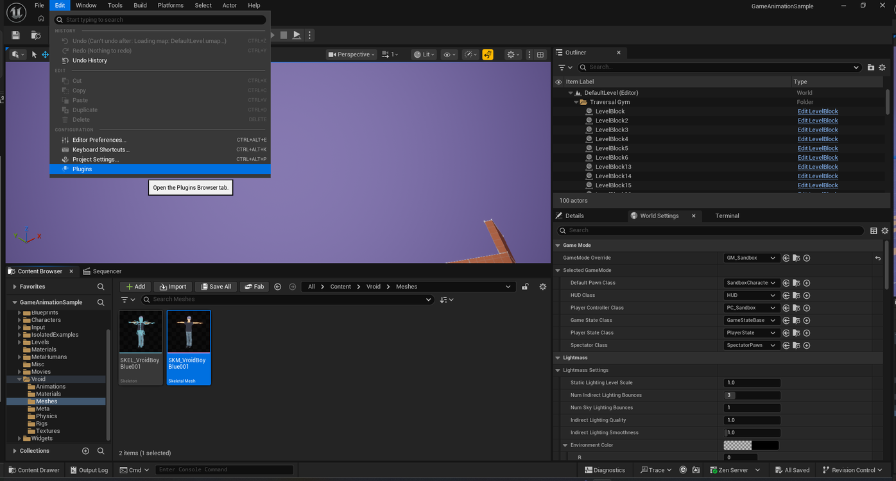

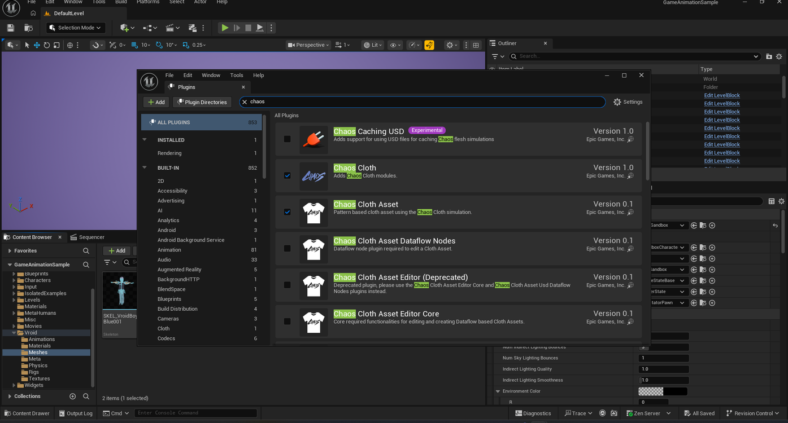

> **Note:** Leave **Cloth Asset Editor (Deprecated)** unchecked — it belongs to the older, pre-Dataflow clothing tool and is not needed for this workflow.

## Step 2: Paint the Max Distance Weight Map

Proper weight painting keeps the fabric anchored where it should stay rigid and lets it move freely everywhere else.

1. In the Cloth Asset Editor, switch to the **Cloth** tab and select the `WeightMap_MaxDistance` node in the Dataflow graph.
2. Click **Paint We...** (Paint Weight Maps) in the toolbar. The garment's flattened front and back pattern appears in the 2D preview, fully unpainted.
3. In the brush panel, set **Radius** and **Value** (0.0–1.0), and adjust **Falloff** for a softer edge.
4. Paint anchor points — the collar, shoulder seams, and hem — down toward `0.0` so they stay pinned to the body. Leave the rest of the garment near `1.0` so it simulates freely.
5. Click **Accept** to commit the weight map.

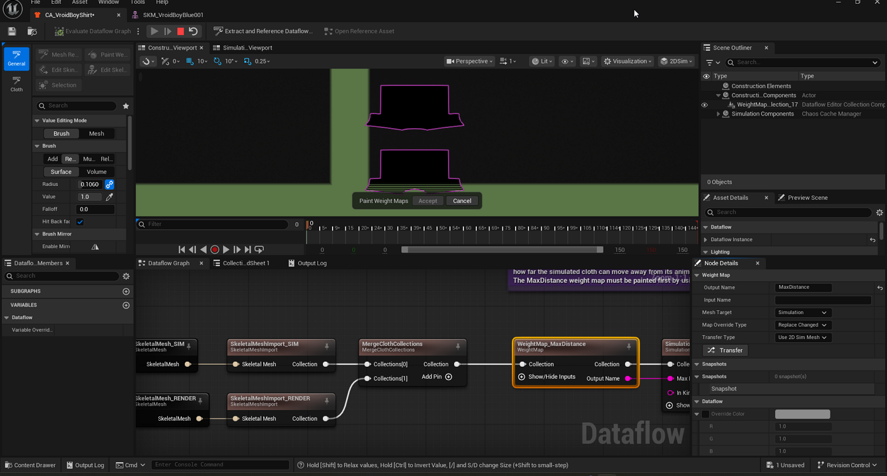

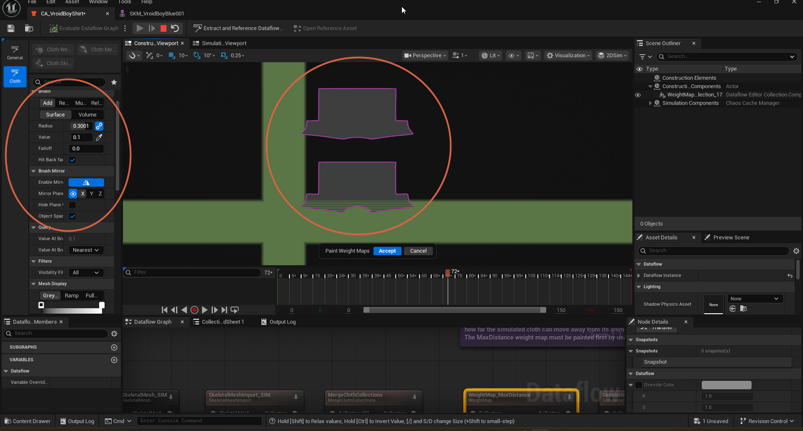

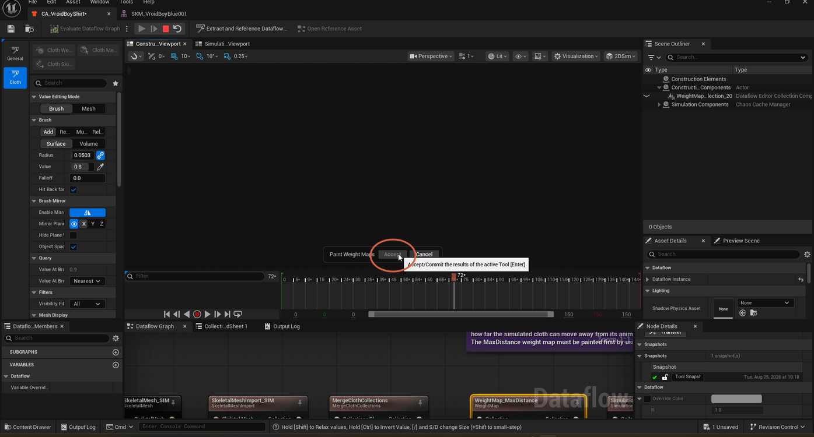

> **Note:** The paint tool's default **Mesh Display** mode shows weight as grayscale — `0.0` (black) is fully fixed, `1.0` (white) is fully simulated. Switching the display to **Ramp** shows the same values as a color gradient instead.

## Step 3: Set the Max Distance and Attachment Range

1. Select the `SimulationMaxDistanceConfig` node. Its **Hi** value (in centimeters) scales the weight map you just painted into an actual distance the cloth can move away from the base mesh — lower it to keep the fabric close to the body, raise it to allow more drape.
2. Select the `SimulationLongRangeAttachmentConfig` node. **Tether Stiffness** and **Tether Scale** govern how far the simulated vertices can stretch away from their pinned anchors before the tether pulls them back.

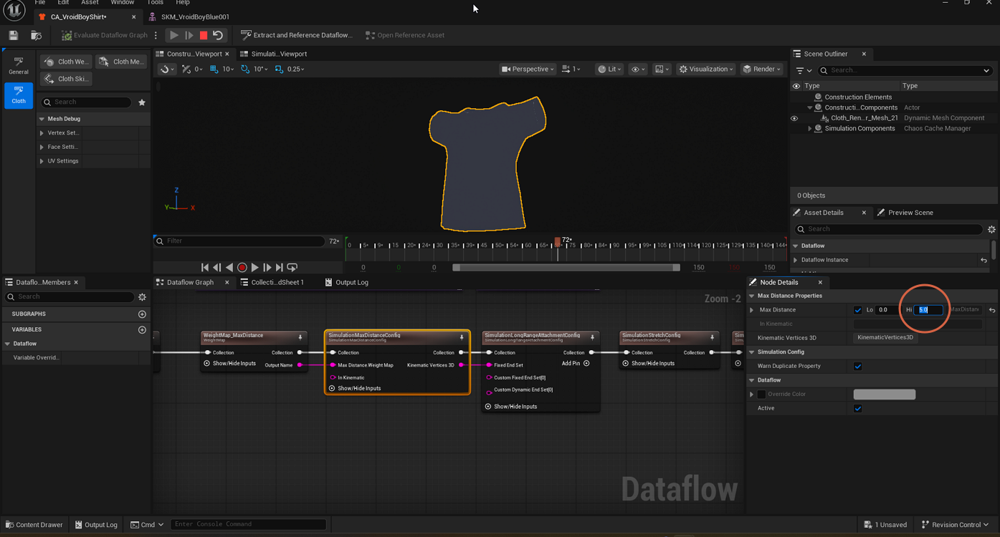

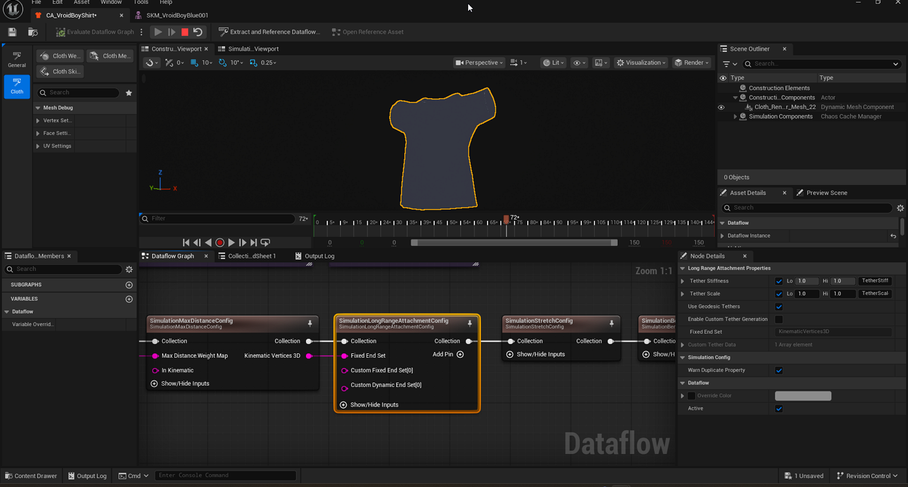

> **Warning:** If the cloth stretches away from the body indefinitely during simulation, raise **Tether Stiffness** first before touching anything else — see [Troubleshooting](#troubleshooting-common-issues) below.

## Step 4: Tune Bending, Mass, and Aerodynamics

Select each of the following nodes in the Dataflow graph and adjust their values on the **Node Details** panel:

- `SimulationBendingConfig` — **Bending Stiffness** (split into Warp, Weft, and Bias, matching the fabric's weave axes) controls how easily the cloth folds and creases. **Buckling Stiffness** controls how sharply it creases once bending exceeds a threshold, instead of folding smoothly.
- `SimulationMassConfig` — with **Mass Mode** set to `Density`, the **Density** range controls the fabric's overall weight. Heavier density moves more slowly; lighter density moves quickly and floats.
- `SimulationAerodynamicsConfig` — **Drag** and **Lift** control air resistance and the aerodynamic lift pushing up under the fabric. **Wind Velocity** and **Fluid Density** simulate ambient wind.

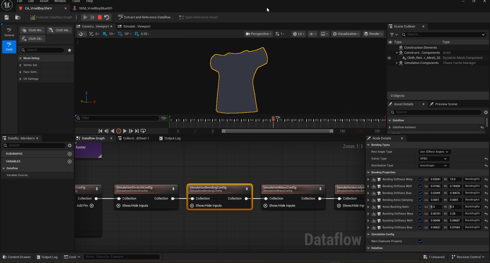

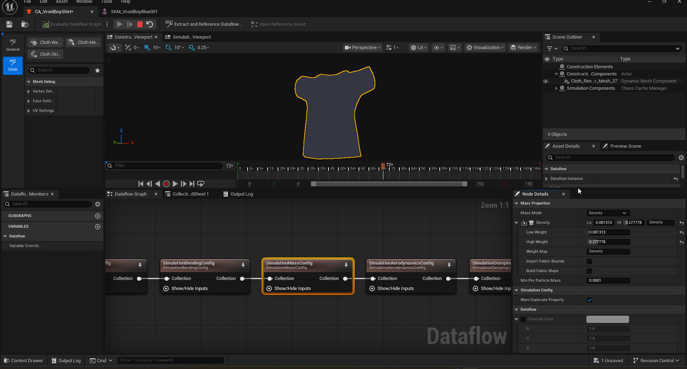

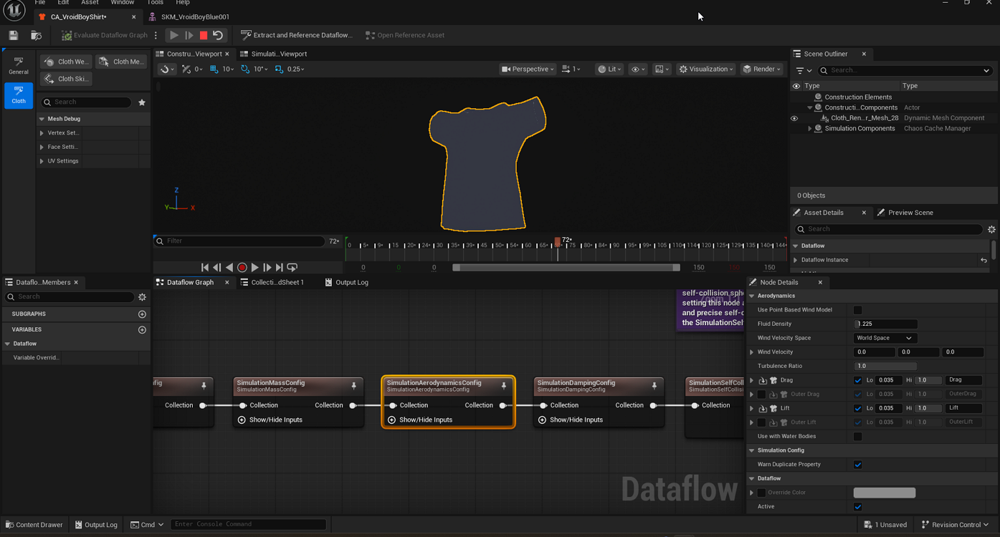

> **Note:** A `SimulationDampingConfig` node also sits in the graph between Aerodynamics and Self-Collision. Increasing its value suppresses jitter at the cost of energetic, fluttering motion — see [Troubleshooting](#troubleshooting-common-issues).

## Step 5: Assign Collision

1. Select the `SetPhysicsAsset` node and assign your character's physics asset (from [Before You Start](#before-you-start)) — this is what the simulated cloth collides against.
2. Select the `SimulationCollisionConfig` node and set **Friction Coefficient** and **Collision Thickness** for how the cloth slides against the body.
3. `SimulationSelfCollisionSpheresConfig`, earlier in the graph, controls collision between different parts of the cloth itself (for example, a sleeve against the torso).

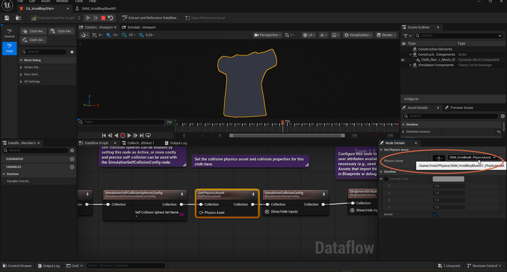

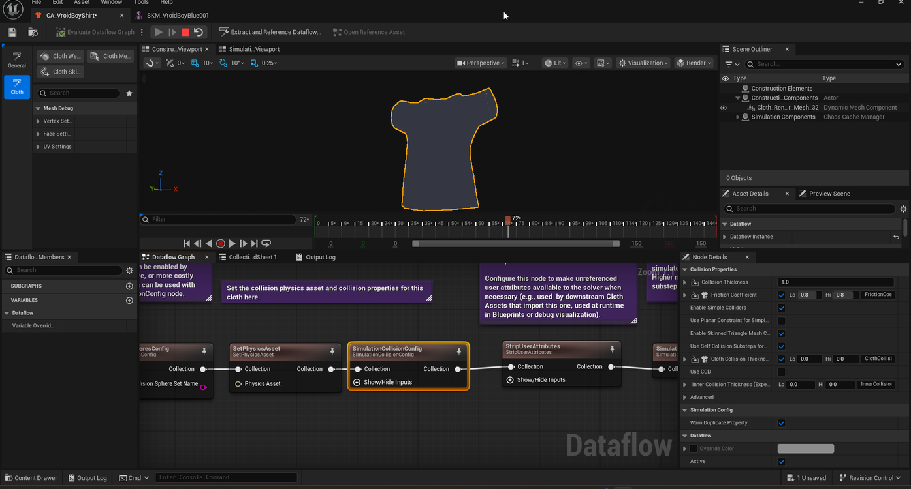

## Step 6: Evaluate and Preview the Simulation

1. Click **Evaluate Dataflow Graph** (or press `F5`) to rebuild the cloth with your new settings.
2. Switch to the **Simulation Viewport** tab and click **Play** to run a live simulation preview.
3. Watch the overlay stats — **Active Cloths**, **Dynamic Particles**, **Iterations**, **Substeps**, and **Simulation Time** — and check that the garment settles naturally instead of exploding or jittering.

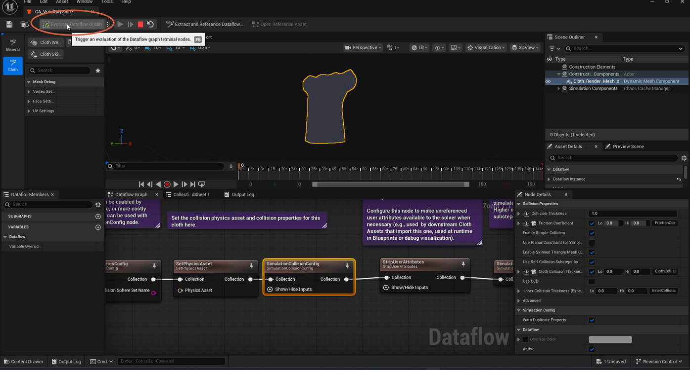

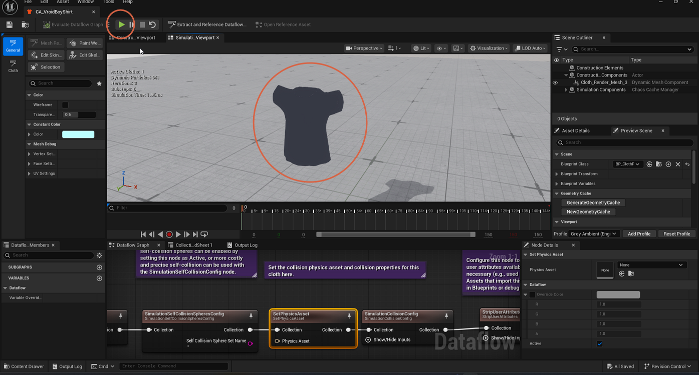

> **Note:** To see the collision bodies the cloth is colliding against, drawn directly on the mesh, see [Displaying Collisions in the Skeletal Mesh Editor](display-collisions-skeletal-mesh-editor.md).

## Step 7: Fix Clipping by Refining Collision

If part of the body pokes through the simulated cloth, the physics asset's collision shapes usually need adjusting rather than the cloth parameters themselves.

1. Open your character's physics asset, right-click the bone where clipping occurs, and choose **Add Primitive** → **Add Capsule** (or **Add Sphere**) to cover the gap.
2. Back in the Cloth Asset Editor, point the `SetPhysicsAsset` node at the updated physics asset.
3. Evaluate the graph again and re-run the simulation preview to confirm the clipping is gone.

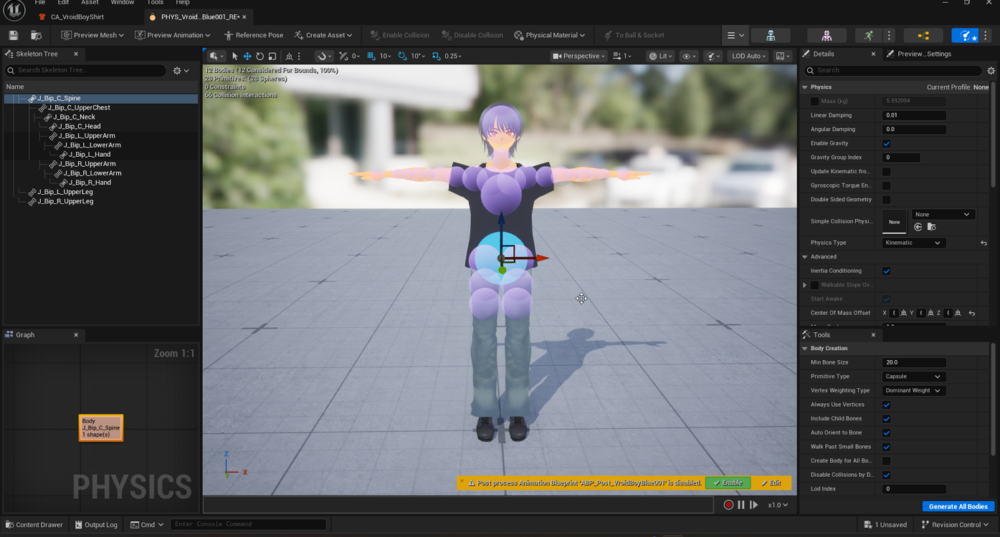

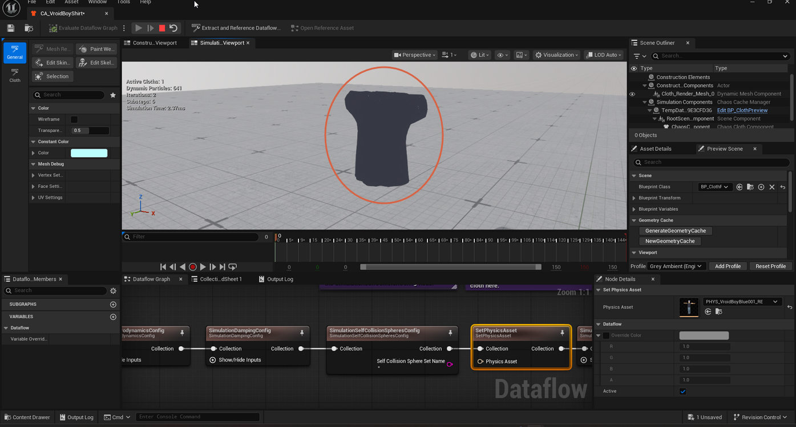

> **Warning:** Save a duplicate of the physics asset before adding new collision primitives (as shown above) — new capsules or spheres can affect ragdoll and collision behavior elsewhere if the asset is shared.

## Step 8: Attach the Cloth to a Test Character

A Chaos Cloth data asset renders as its own actor, separate from the base skeletal mesh, so it needs to be attached and kept in sync through a Blueprint rather than picked from a simple dropdown.

1. Duplicate an existing Blueprint that already attaches a simulated component to the base mesh — the example here duplicates a template from **Content** → **Blueprints** → **RetargetedCharacters** into a new test Blueprint (`BP_Test`).
2. Add your Chaos Cloth data asset as a component under the base mesh component.
3. Reuse the existing **Get Attach Parent** → **Get Child Component** → **Add Tick Prerequisite Component** logic (copied from another component-attachment Blueprint in the project) so the cloth component follows the base mesh and simulates only after it updates each frame.
4. Compile and save.

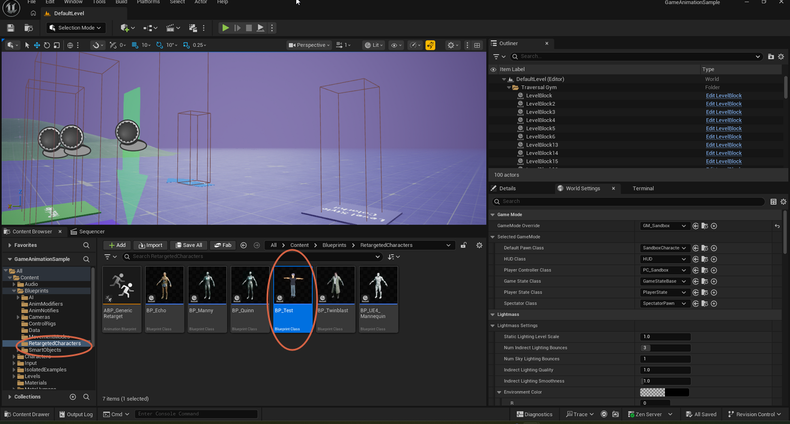

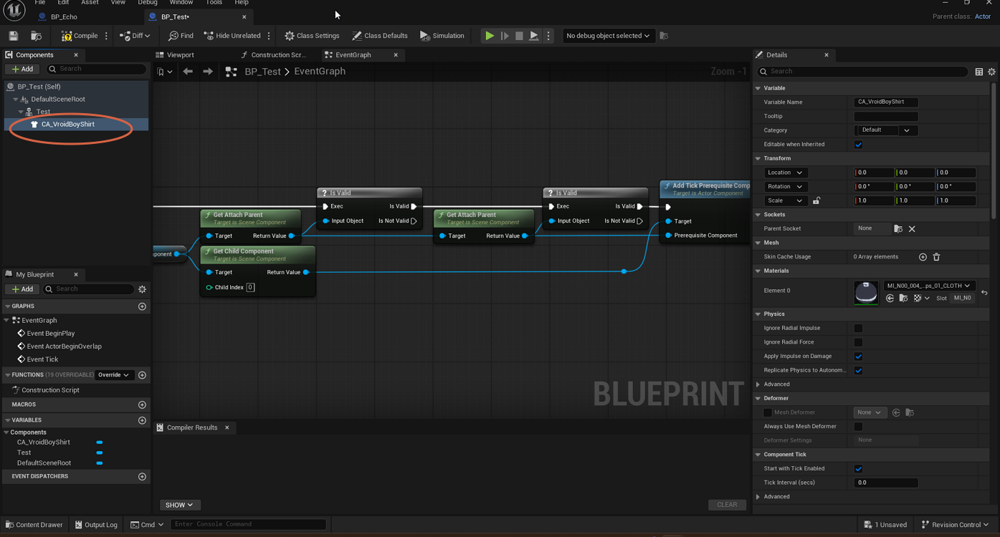

## Step 9: Hide the Original Garment Section

With the simulated cloth now rendering as its own mesh, the static garment section on the base skeletal mesh would otherwise render underneath it and clip through.

1. Open the base skeletal mesh editor and expand **LOD 0** → **Sections**.
2. Find the section matching your garment's material (for example, a `_CLOTH` material slot) and disable it so only the simulated cloth renders.

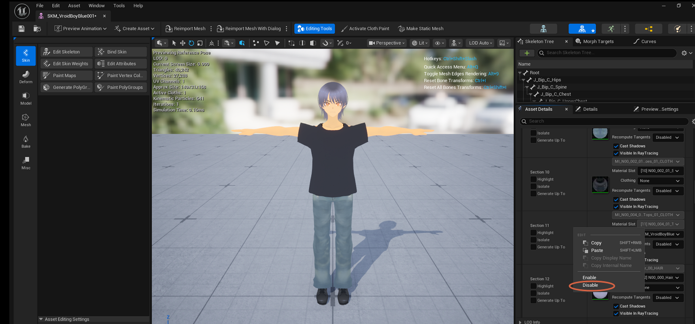

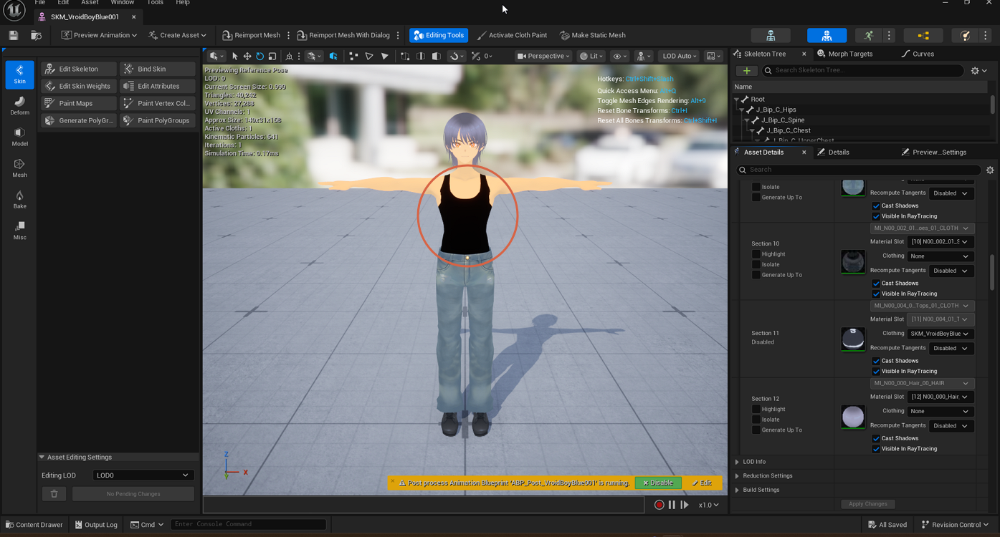

## Step 10: Test in Play Mode

Press **Play** and move the character around the level. Confirm the cloth reacts to motion smoothly, without exploding, clipping through the body, or jittering excessively.

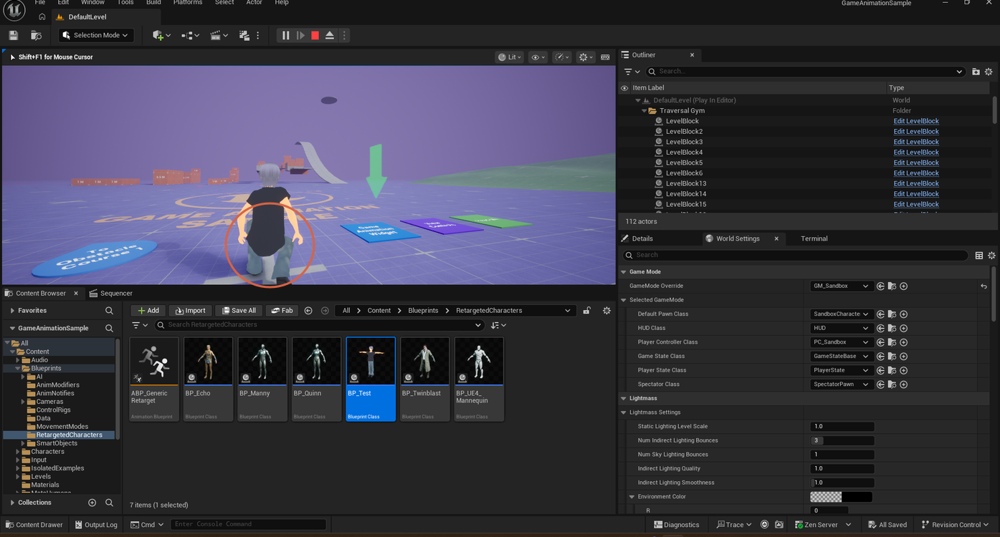

## Tuning Parameters

Each classic Chaos Cloth parameter lives on a specific node in the Dataflow graph:

| Parameter | Dataflow Node | Effect |
| --- | --- | --- |
| Max Distance | `SimulationMaxDistanceConfig` (fed by the painted `WeightMap_MaxDistance`) | Scales the weight map into the actual distance, in centimeters, cloth vertices may move from the base mesh. |
| Tether Stiffness / Tether Scale | `SimulationLongRangeAttachmentConfig` | How tightly simulated vertices are pulled back toward their pinned anchors. Raise if the cloth stretches too far from the body. |
| Bending Stiffness (Warp / Weft / Bias) | `SimulationBendingConfig` | How easily the cloth folds and creases. High values give a stiffer material with fewer wrinkles; low values give a soft, heavily creased material. |
| Buckling Stiffness | `SimulationBendingConfig` | How sharply the cloth creases once it bends past a threshold, instead of folding smoothly. |
| Density | `SimulationMassConfig` | Overall weight of the fabric. High density moves slowly (leather, heavy wool); low density moves quickly and floats (silk, satin). |
| Drag / Lift | `SimulationAerodynamicsConfig` | Air resistance slowing the cloth down, and aerodynamic pressure lifting it. Raise for flowing capes or fluttering fabric. |
| Damping | `SimulationDampingConfig` | Resistance to motion that suppresses jitter. High damping gives smooth, viscous movement; low damping gives energetic, chaotic movement. |
| Friction Coefficient / Collision Thickness | `SimulationCollisionConfig` | Sliding resistance and collision margin against the character's physics asset. |
| Self-Collision Sphere Radius / Stiffness | `SimulationSelfCollisionSpheresConfig` | Collision between different parts of the cloth itself, such as a sleeve against the torso. |

### Fabric Presets by Material Type

Use these as starting points, then adjust the Lo/Hi ranges on each node to taste:

| Material Type | Density | Bending Stiffness | Damping / Drag |
| --- | --- | --- | --- |
| Heavy Leather | High (1.5+) | High (0.7–0.9) | Moderate |
| Cotton / Linen | Medium (1.0) | Low (0.2–0.4) | Low / Moderate |
| Flowing Cape | Medium-Low | Low (0.1–0.3) | High Drag |
| Silk / Satin | Low (< 0.5) | Very Low (< 0.2) | Moderate Lift |

## Troubleshooting Common Issues

### Mesh Exploding or Infinite Stretching

> **Warning:** This is the most common failure mode and can make the simulation unusable if left unchecked.

- Raise **Tether Stiffness** on `SimulationLongRangeAttachmentConfig`.
- Check your weight paint: boundary vertices directly against static geometry (collar, waistband) must be fully pinned (`0.0`).

### Body Clipping

- Add or adjust collision primitives on the character's physics asset — see [Step 7](#step-7-fix-clipping-by-refining-collision) above for a worked example.
- Slightly raise **Friction Coefficient**, or adjust **Collision Thickness**, on `SimulationCollisionConfig`.

### Excessive Jittering

- Slightly raise **Damping** on `SimulationDampingConfig` to stabilize the motion.
