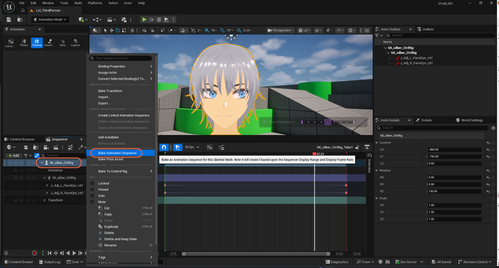
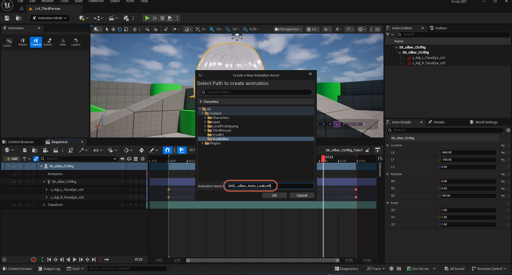
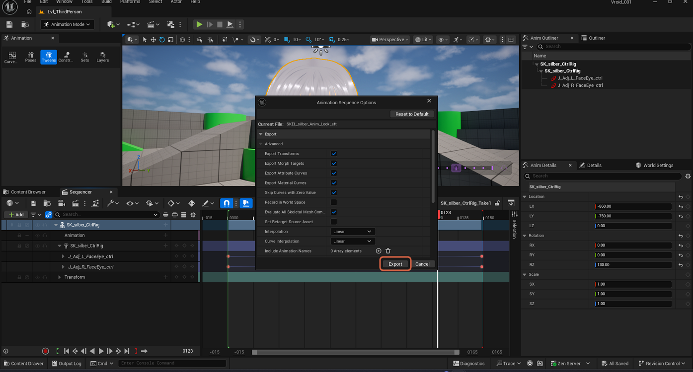
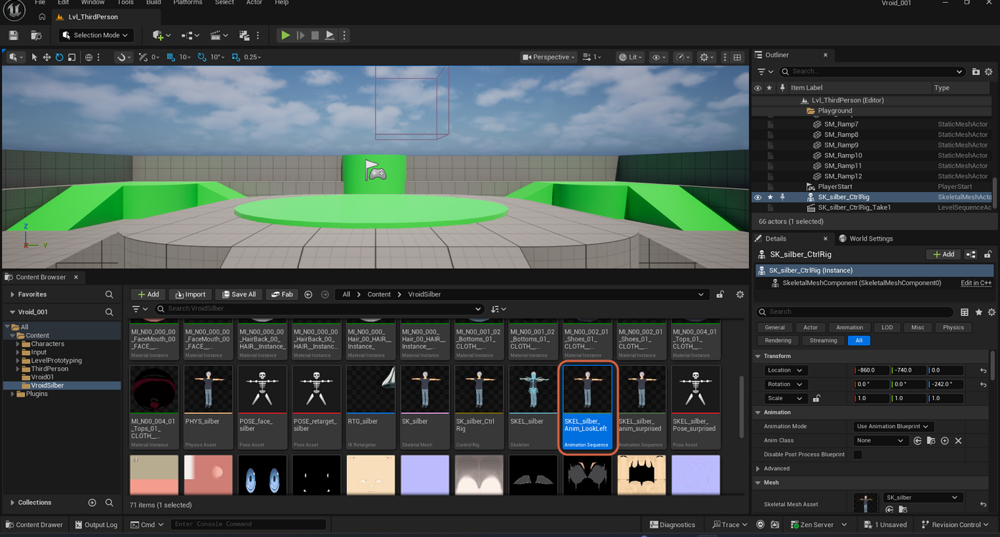
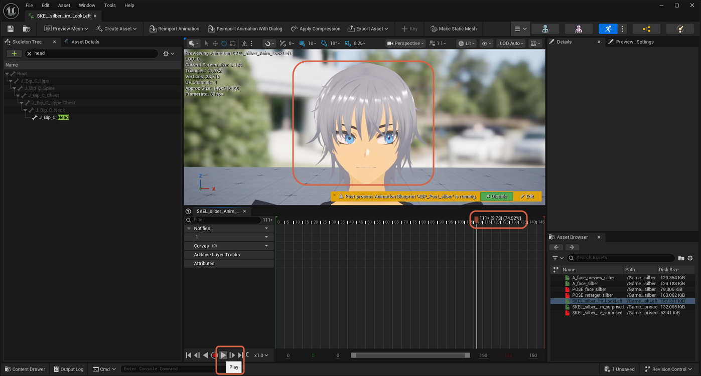

# Baking a Control Rig Animation

> **Note:** This document was generated by Claude Code and has not been reviewed by a human. Please use it as a reference only.

Once a Control Rig animation is keyframed in Sequencer, bake it into a standalone `Animation Sequence` asset so it can be used outside that sequence — for example, [creating a Pose Asset from it](create-pose-asset-from-animation.md).

> **Note:** This continues from [Animating a Control Rig in Sequencer](animate-control-rig-in-sequencer.md).

## Step 1: Bake the Animation Sequence

In Sequencer, right-click the `SK_silber_CtrlRig` skeletal mesh track. Under **Create Animation Assets**, select **Bake Animation Sequence**.

## Step 2: Name the Animation Asset

A **Create a New Animation Asset** dialog opens. Select a destination folder and enter a name — for example, `SKEL_silber_Anim_LookLeft`.

## Step 3: Export

An **Animation Sequence Options** dialog opens, showing export settings (Export Transforms, Export Morph Targets, Interpolation, and so on). The defaults work for most cases. Click **Export**.

## Step 4: Confirm the New Animation Sequence

The new `Animation Sequence` asset appears in the Content Browser alongside the character's other assets.

## Step 5: Check the Animation

Open the new asset and play it back to confirm the baked animation matches what was keyframed in Sequencer.

