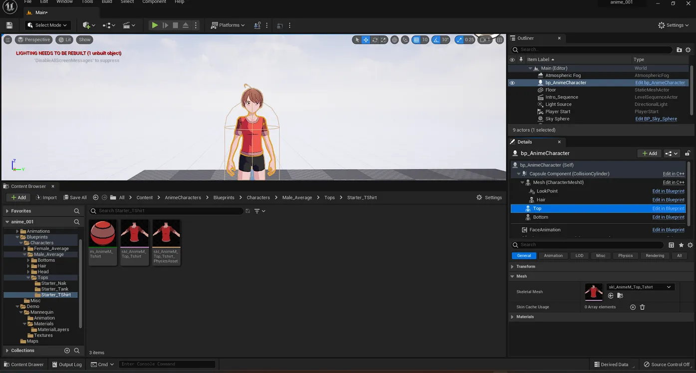
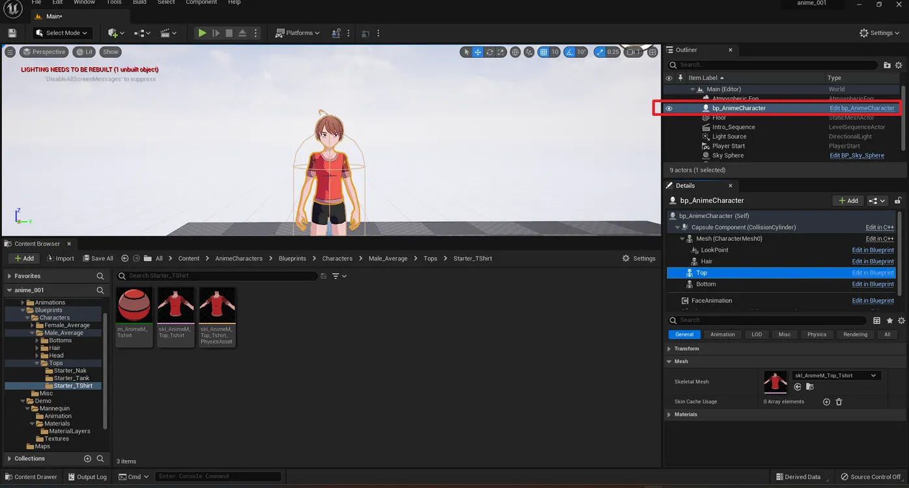
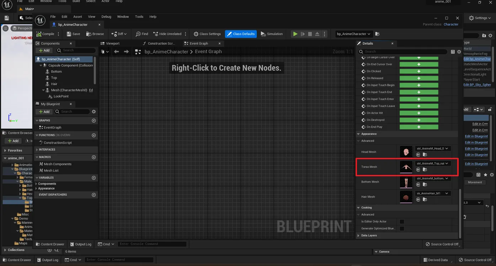
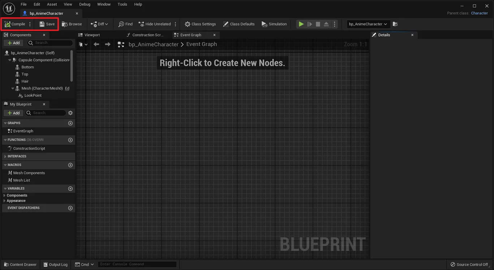

# Changing Clothing in Anime Character Pack (Legacy)

> **Note:** This document was generated by Claude Code and has not been reviewed by a human. Please use it as a reference only.

This guide explains how to swap the torso clothing on the male anime character in the **Anime Character Pack (Legacy)** by Studio SyndiCat. The pack uses a Construction Script inside the character Blueprint to apply meshes — so the correct method is through **Class Defaults**, not by editing mesh components directly.

## Available Tops for Male Characters

The pack includes three top options, located at:
`Content > AnimeCharacters > Blueprints > Characters > Male_Average > Tops`

| Folder | Mesh Name | Description |
|--------|-----------|-------------|
| `Starter_TShirt` | `skl_AnimeM_Top_Tshirt` | Red t-shirt |
| `Starter_Tank` | `skl_AnimeM_Top_tank` | Black tank top |
| `Starter_Nak` | `skl_AnimeM_Top_nak` | No top (naked body mesh) |

## Why Not Edit the Component Directly?

The Blueprint's **Construction Script** sets the character's mesh components programmatically at runtime using variables from the **Appearance** category. If you change the Skeletal Mesh on the `Top` component directly — either in the Blueprint editor or as a level instance override — the Construction Script will override it back to the variable value. You must change the variable, not the component.

## Step 1: Open the Character Blueprint

In the **Outliner**, find `bp_AnimeCharacter` and click the **Edit bp_AnimeCharacter** link next to it to open the Blueprint editor.

## Step 2: Open Class Defaults and Find the Appearance Section

In the Blueprint editor toolbar, click **Class Defaults**. In the **Details** panel on the right, scroll down to find the **Appearance** section. You will see four mesh variables:

- **Head Mesh**
- **Torso Mesh**
- **Bottom Mesh**
- **Hair Mesh**

## Step 3: Change the Torso Mesh

Click the dropdown next to **Torso Mesh** (currently `skl_AnimeM_Top_nak`) and select the clothing mesh you want — for example, `skl_AnimeM_Top_Tshirt` for the red t-shirt.

## Step 4: Compile and Save

Click **Compile** then **Save** in the Blueprint editor toolbar.

## Step 5: Return to the Main Viewport

Close the Blueprint editor. The character in the viewport will now be wearing the selected top.

## Notes

- This change applies to **all instances** of `bp_AnimeCharacter` in the level, because it modifies the Blueprint's class defaults.
- The same Appearance section contains **Bottom Mesh** and **Hair Mesh** — use the same method to change pants or hairstyle.
