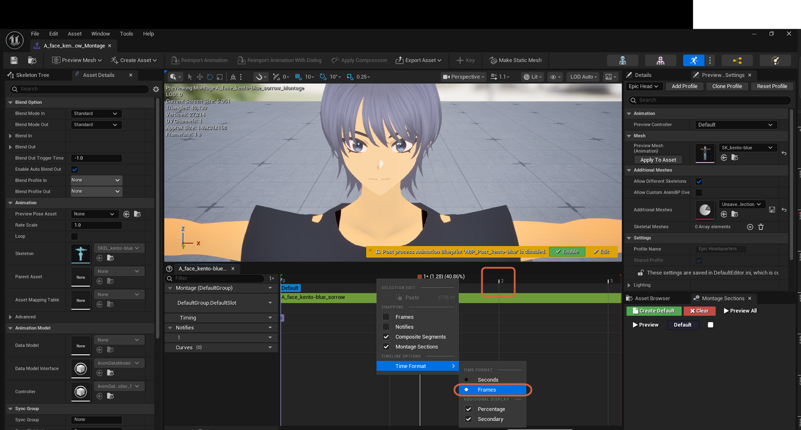

# Changing the Timeline's Time Format

> **Note:** This document was generated by Claude Code and has not been reviewed by a human. Please use it as a reference only.

An Animation Sequence or Anim Montage's timeline can display positions as frame numbers or as seconds.

## Step 1: Open the Timeline Context Menu

Right-click the time ruler above the track list. Under **Timeline Options**, open the **Time Format** submenu.

## Step 2: Choose Frames or Seconds

Select **Frames** to show whole frame numbers (for example, `2`), or **Seconds** to show elapsed time (for example, `2.00`).

> **Note:** The same menu has **Additional Display** options — **Percentage** and **Secondary** — for showing extra position info alongside the main format.

> **Note:** This is the same time display shown in the playhead tooltip covered in [Moving the Playhead](move-playhead.md).
