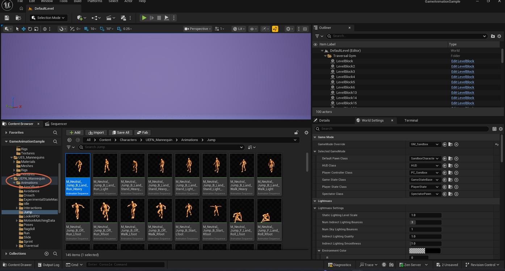
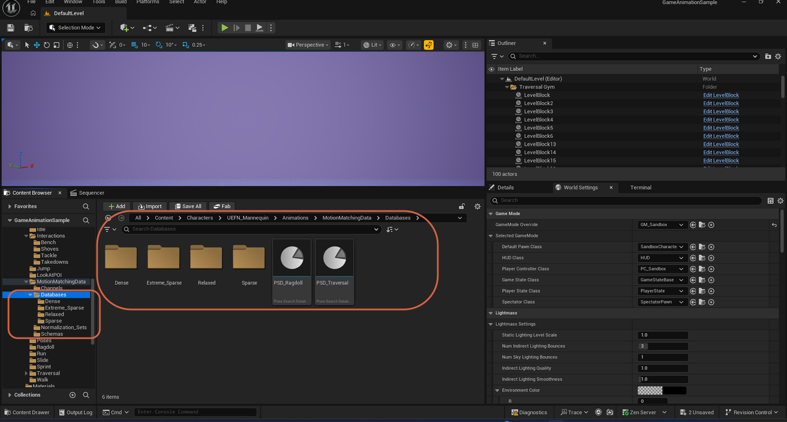

# Checking Available Animation Sets

> **Note:** This document was generated by Claude Code and has not been reviewed by a human. Please use it as a reference only.

The **Game Animation Sample** project ships with a large library of animation sequences, organized by category under the `UEFN_Mannequin` character, plus a set of motion-matching databases used to search that library at runtime. Use this guide to browse what's already included before retargeting or exporting new animations.

## Step 1: Browse Animation Sequences by Category

In the Content Browser, navigate to **Content** → **Characters** → `UEFN_Mannequin` → **Animations**. This folder splits the included animation sequences into category subfolders — for example `Jump`, alongside others such as `Idle`, `Interactions`, and `Run`.

Open a category folder to see its animation sequences as a thumbnail grid, each with a live preview of the pose. For example, the `Jump` folder contains sequences like `M_Neutral_Jump_B_Land_Run_Heavy`, covering different jump heights, landing types, and directions.

## Step 2: Check the Motion Matching Database

Under the same **Animations** folder, open `MotionMatchingData` → **Databases**. This folder holds subfolders grouping animations by density (`Dense`, `Extreme_Sparse`, `Relaxed`, `Sparse`) alongside two assets of type **Pose Search Database**: `PSD_Ragdoll` and `PSD_Traversal`.

A Pose Search Database is the asset type that Motion Matching searches against at runtime to pick the best-matching pose from the library. This project's Content Browser view doesn't expose much more detail than the asset type and name — open one directly in its own editor if you need to inspect its contents further.

> **Note:** The source notes for this workflow referred to these as "PDS files," but the asset type shown in the editor is **Pose Search Database**, abbreviated `PSD_` in the asset name.
