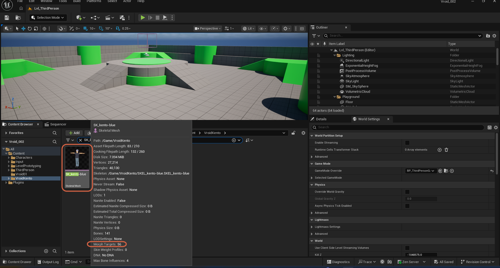
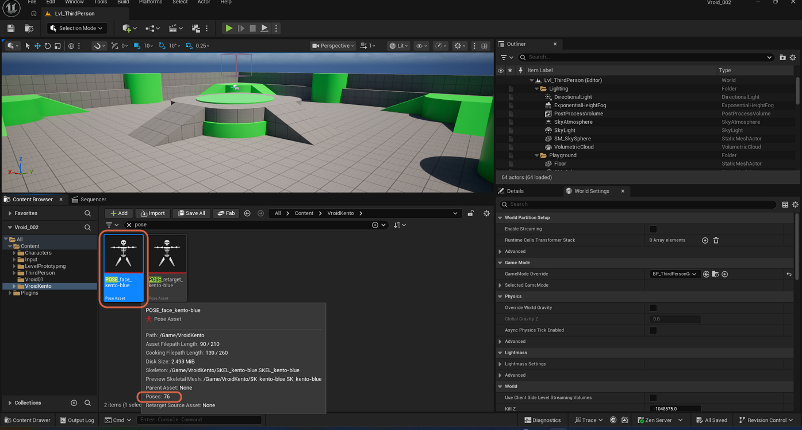

# Checking Morph Target and Pose Counts

> **Note:** This document was generated by Claude Code and has not been reviewed by a human. Please use it as a reference only.

The Content Browser's asset info tooltip shows how many morph targets a Skeletal Mesh has, or how many poses a Pose Asset holds, without opening the asset itself.

## Checking a Skeletal Mesh's Morph Target Count

Select a Skeletal Mesh in the Content Browser. Its info tooltip shows a **Morph Targets** count — confirming, for example, that a VRM import brought in its blendshapes successfully.

> **Note:** After [importing a VRM character](import-vrm-character.md), checking this count confirms its face animation blendshapes came through.

## Checking a Pose Asset's Pose Count

Select a Pose Asset in the Content Browser. Its info tooltip shows a **Poses** count instead.

> **Note:** A Pose Asset created from an animation gets one pose per sampled frame — a count this high usually means it needs cleanup. See [Isolating a Single Pose in a Pose Asset](isolate-single-pose.md).
