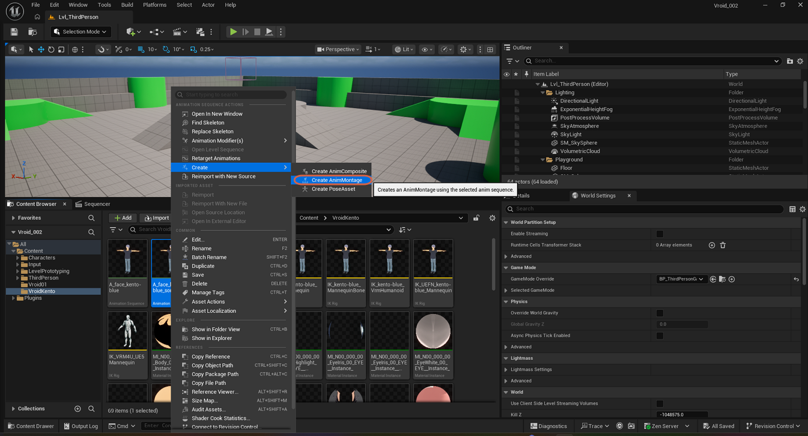
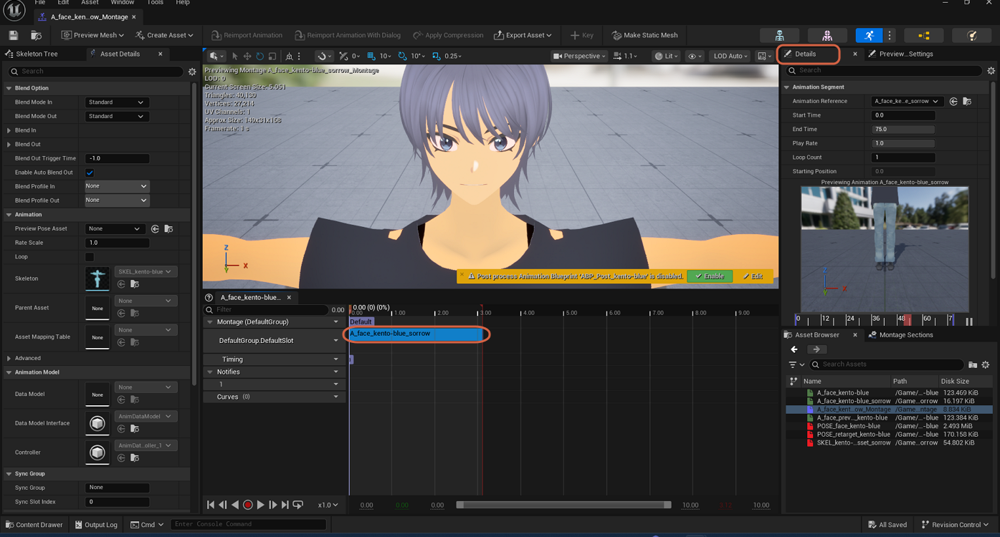
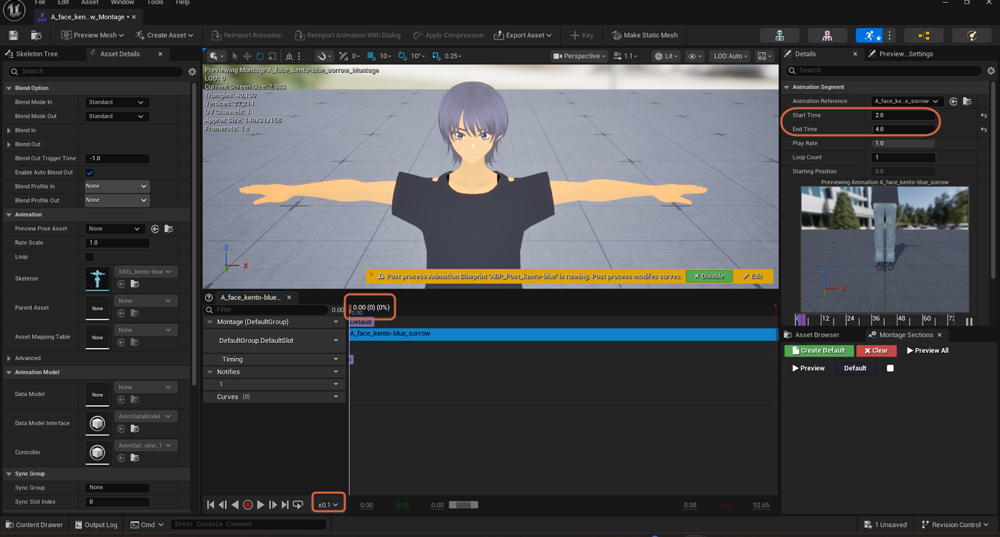
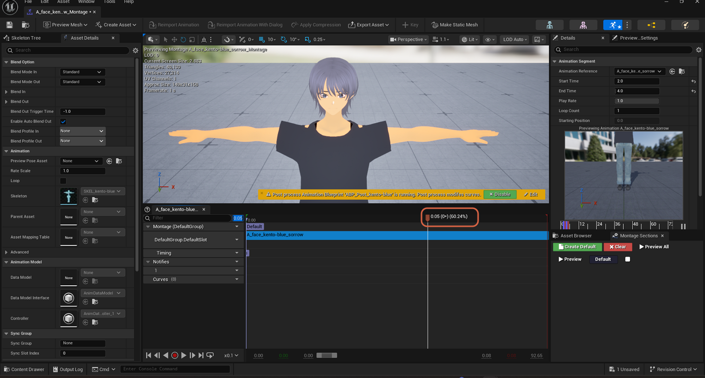

# Clipping an Animation with an Anim Montage

> **Note:** This document was generated by Claude Code and has not been reviewed by a human. Please use it as a reference only.

An Animation Sequence's own length can't be trimmed directly (see [Understanding the Number of Sampled Frames Limit](understand-sampled-frames-limit.md)). To play back just part of one — for example, isolating the single peak frame of a fast facial expression — wrap it in an Anim Montage and set a start/end range on the segment instead.

## Step 1: Create the Anim Montage

In the Content Browser, right-click the Animation Sequence (for example `A_face_kento-blue_sorrow`). Under **Create**, select **Create AnimMontage**.

## Step 2: Find the Animation Segment's Start and End Time

Open the new Montage and select its animation segment. The **Details** panel's **Animation Segment** section shows **Start Time** and **End Time**, defaulting to the full length of the source animation (`0.0` to `75.0` frames in this example).

## Step 3: Set the Range You Want

Change **Start Time** and **End Time** to bracket the part you want to isolate. Here, the expression's peak was at frame 3, so **Start Time** is set to `2.0` and **End Time** to `4.0`. Move the playhead back to the start, and lower the playback speed dropdown — for example to `x0.1` — if the clipped range plays too fast to see clearly.

## Step 4: Scrub Through the Slowed Playback

Scrub or play through the slowed-down range to find the exact moment you want.

