# Creating an Animation from a Pose

> **Note:** This document was generated by Claude Code and has not been reviewed by a human. Please use it as a reference only.

This walkthrough builds a single-expression `Animation Sequence` from scratch by keyframing one facial curve, starting from an existing pose-holding asset. The example uses `A_face_silber`, an Animation Sequence belonging to the `silber` VRM character (folder `VroidSilber`), and creates a new expression animation named `SKEL_silber_anim_surprised` around the `Fcl_ALL_Surprised` curve.

> **Note:** See [Creating a Pose Asset from an Animation Sequence](create-pose-asset-from-animation.md) for the reverse workflow — turning an animation like the one built here back into a Pose Asset.

## Adding Start and End Keys

### Step 1: Open the Source Animation

In the Content Browser, open the `VroidSilber` folder and double-click `A_face_silber` (an `Animation Sequence`) to open it.

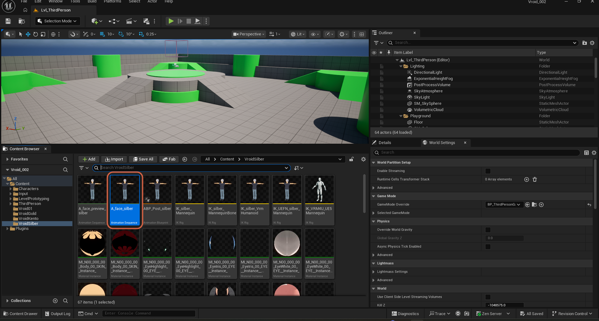

### Step 2: Create an Animation from the Current Pose

With `A_face_silber` open, click **Create Asset** → **Create Animation**, then select **Current Pose**.

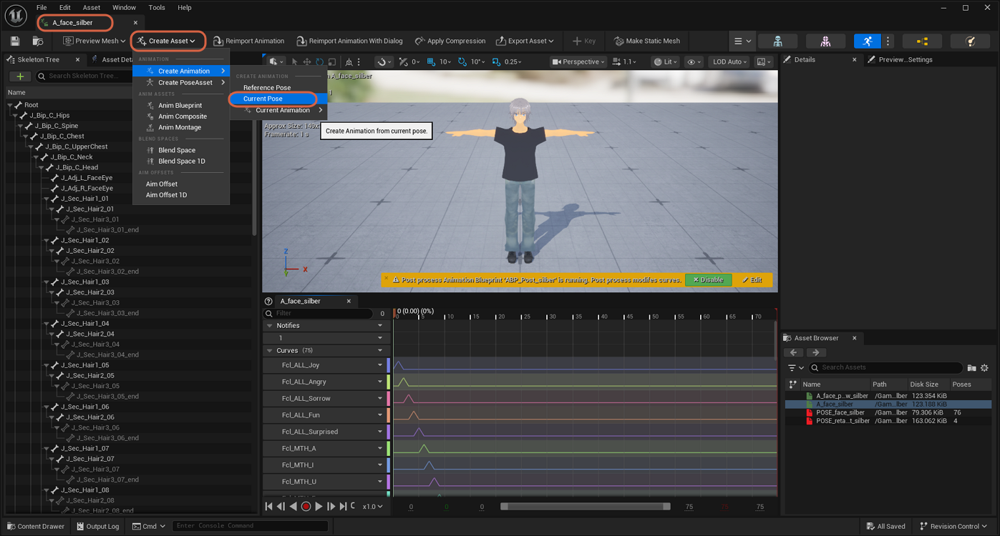

> **Note:** **Current Pose** captures only the single frame the playhead is currently on, producing a fresh one-frame Animation Sequence. This is the opposite choice from [Creating a Pose Asset from an Animation Sequence](create-pose-asset-from-animation.md), which uses **Current Animation** to capture an entire existing clip.

### Step 3: Name the New Animation Asset

A **Create a New Animation Asset** dialog opens. Confirm the destination folder and the animation's name. The screenshot shows the `VroidSilber` folder selected and the **Animation Name** field pre-filled as `SKEL_silber_anim_surprised`.

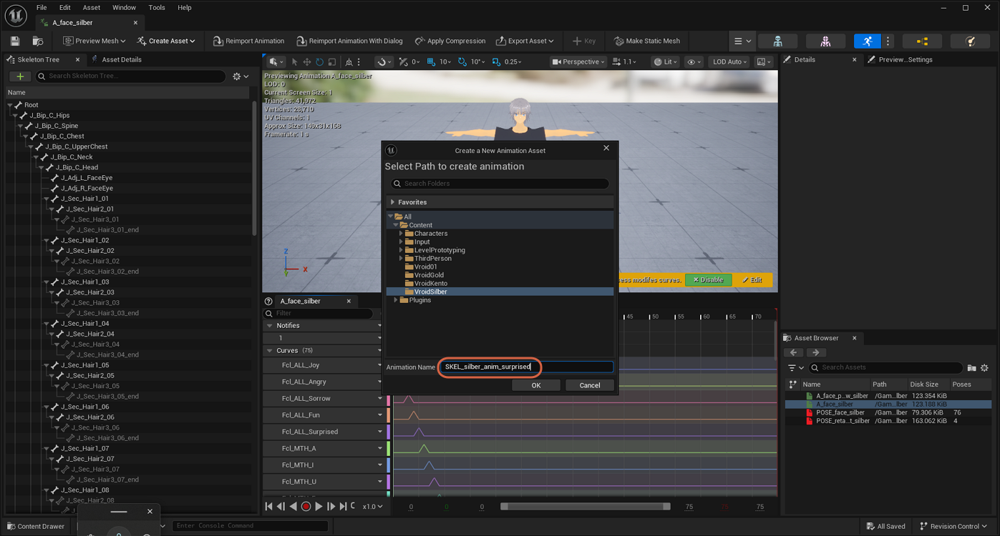

Click **OK** to create the file.

### Step 4: Confirm the Animation Opens Automatically

The new animation asset opens in its own editor tab automatically. At this point its **Curves** section is empty (`Curves (0)`).

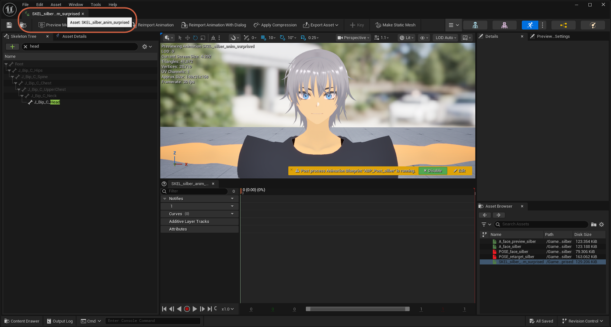

### Step 5: Open the Add Curve Menu

Next to **Curves**, open the dropdown and select **Add Curve...**. This opens a **Create Curve** panel listing every available curve name on the skeleton, in alphabetical order.

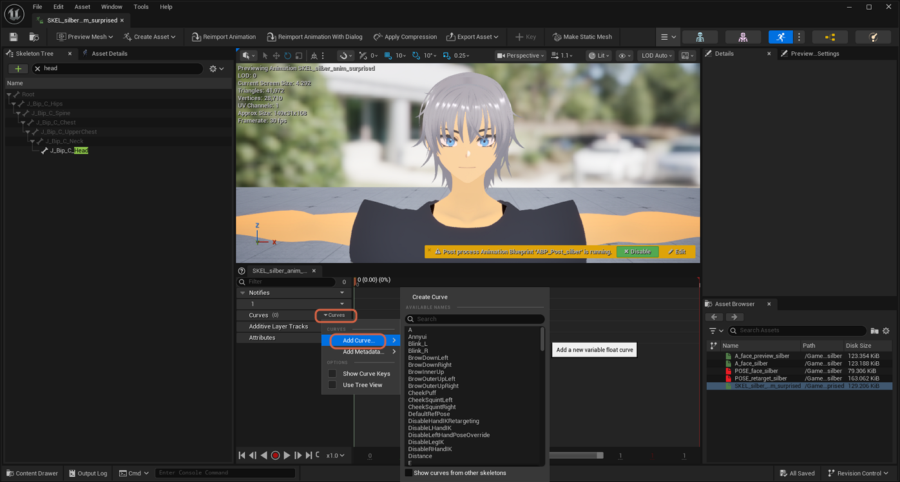

### Step 6: Select the Curve

Type into the **Create Curve** search box to filter the list. Searching `sur` narrows the list to the `Surprised` family of curves — `Face.M_F00_Fcl_ALL_Surprised`, `Fcl_BRW_Surprised`, `Fcl_EYE_Surprised`, and `Fcl_MTH_Surprised`. Select `Fcl_ALL_Surprised`.

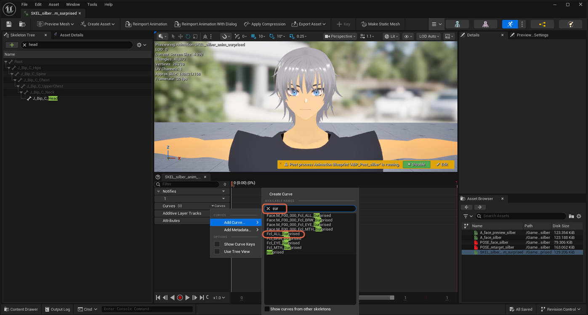

> **Note:** The narrower `BRW` (brow), `EYE`, and `MTH` (mouth) curves drive only one part of the face each. `ALL` drives the combined expression across all three at once, which is why it's the one picked for a single-expression animation.

### Step 7: Open the Curve Editor

The `Fcl_ALL_Surprised` curve now appears under **Curves**. Open its row's dropdown and select **Edit Curve** to open the Curve Editor tab.

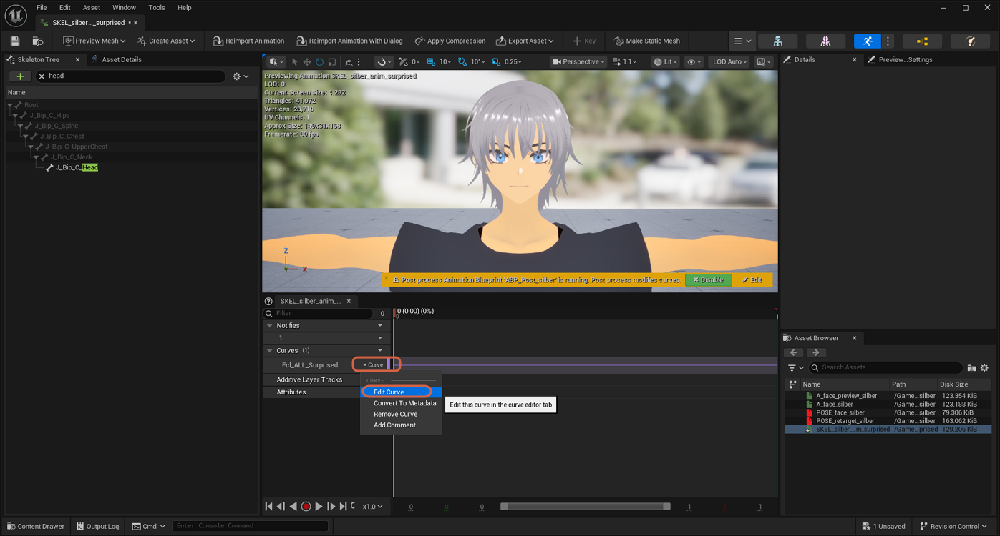

### Step 8: Add a Key at the Start

In the Curve Editor, right-click the empty graph area and select **Add Key**. A key is added at the playhead's current position — the animation's starting point, with a value of `0`.

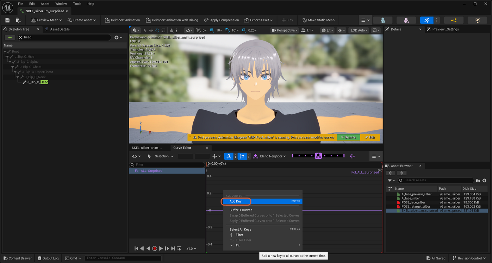

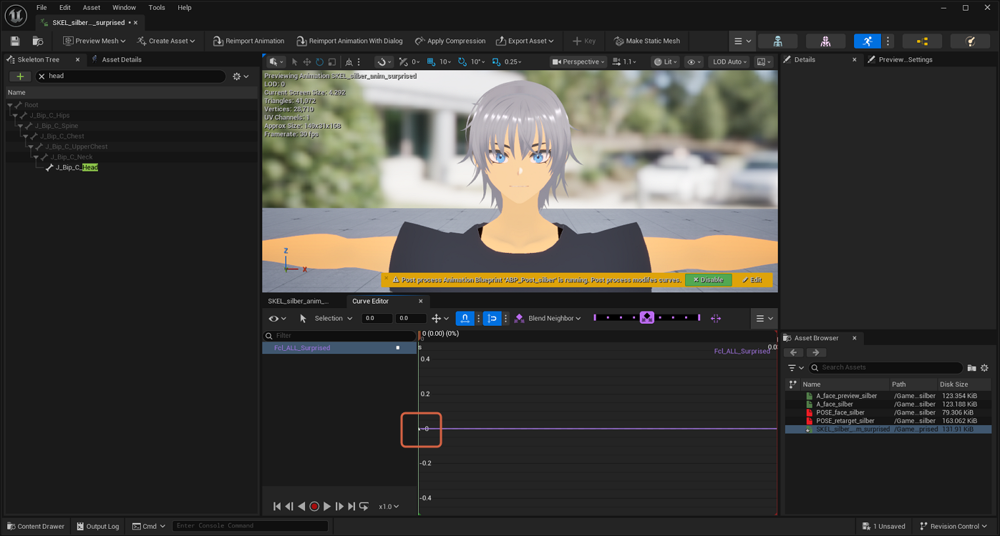

### Step 9: Move the Playhead Toward the End

Drag the playhead across the timeline toward the animation's end point.

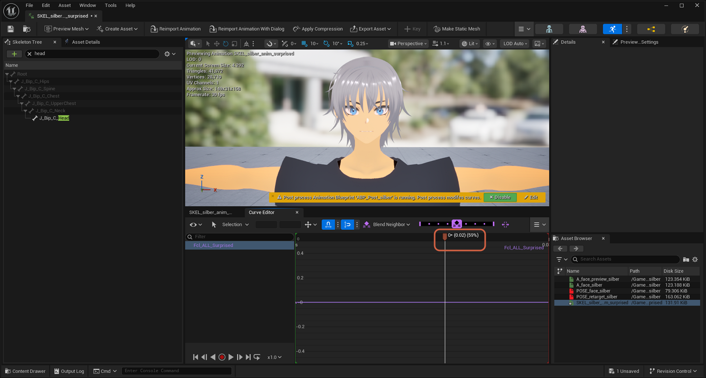

> **Note:** See [Moving the Playhead](move-playhead.md) for the two ways to position the playhead precisely — dragging the ruler, or typing an exact frame number.

### Step 10: Add a Key at the End

Right-click the graph again and select **Add Key**. A second key is added at this new playhead position.

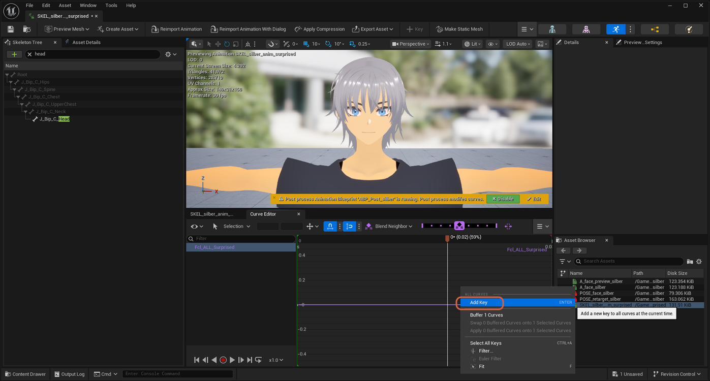

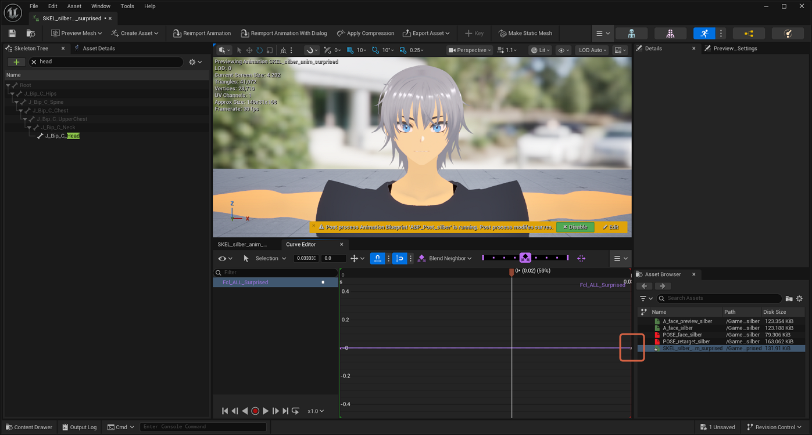

### Step 11: Raise the End Key to `1`

With the new key selected, edit its value field and set it to `1`. The curve now draws as a rising diagonal line from `0` to `1` — the single-expression animation is complete.

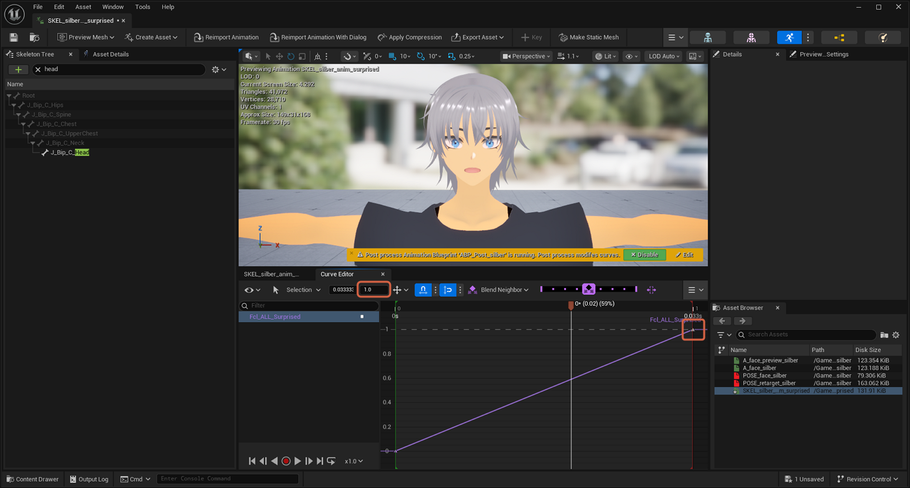

## Checking the Created Animation

### Step 1: Disable Looping

In the transport bar below the preview, click the loop-mode button until its tooltip reads `No Looping`. This prevents the playback from repeating.

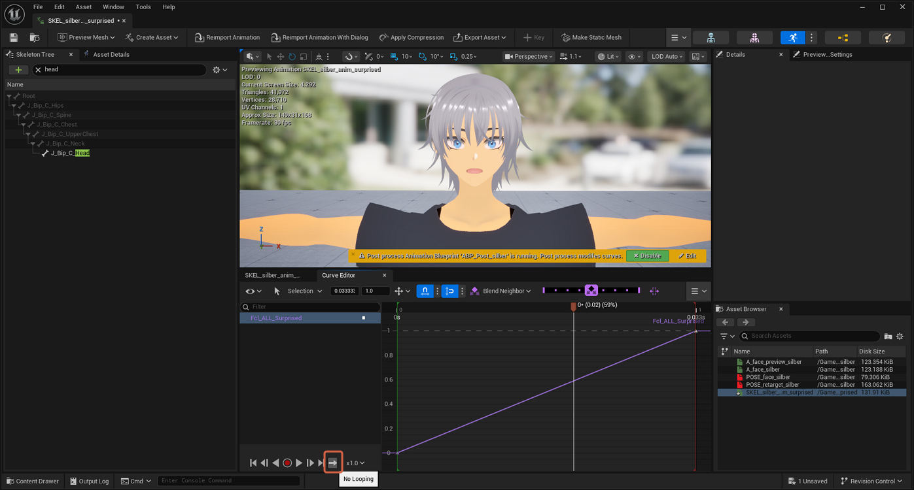

### Step 2: Return the Playhead to the Start

Click the jump-to-start button in the transport bar to move the playhead back to frame `0`.

### Step 3: Slow Down Playback

Open the playback speed dropdown and select `x0.1`. At full speed, a one-second animation plays too fast to evaluate frame by frame.

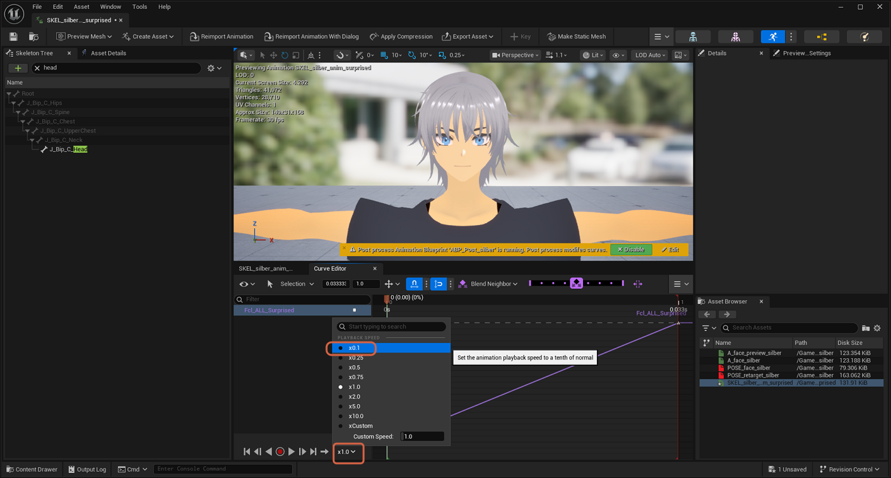

### Step 4: Play the Animation

Click **Play**. The silber character's expression rises smoothly into the surprised pose — mouth open, eyes widened — confirming the curve works as expected.

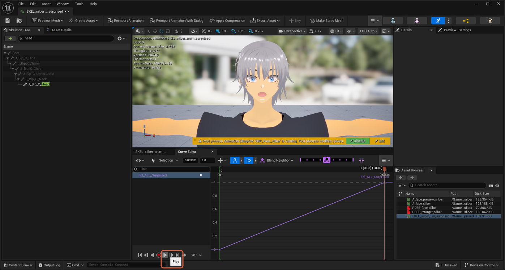

## Increasing the Play Duration

A newly created single-pose animation defaults to a very short play duration (one frame's worth of time). To stretch it out:

### Step 1: Right-Click the Time Row and Append Frames

Right-click the time row (the ruler above the curve graph) and select **Append frames at end of sequence**.

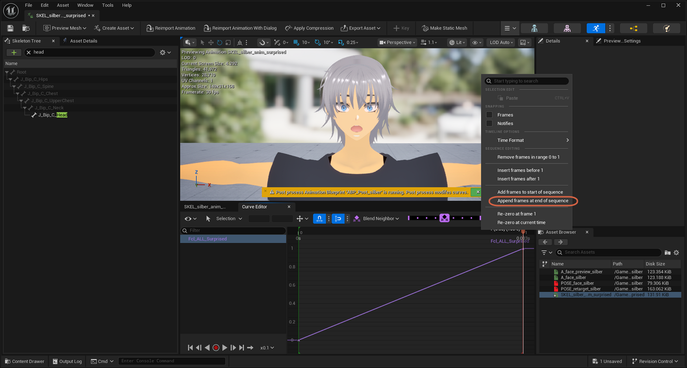

### Step 2: Set the Number of Frames to Add

A **Number of Frames to Add** field appears. Enter `1` and confirm.

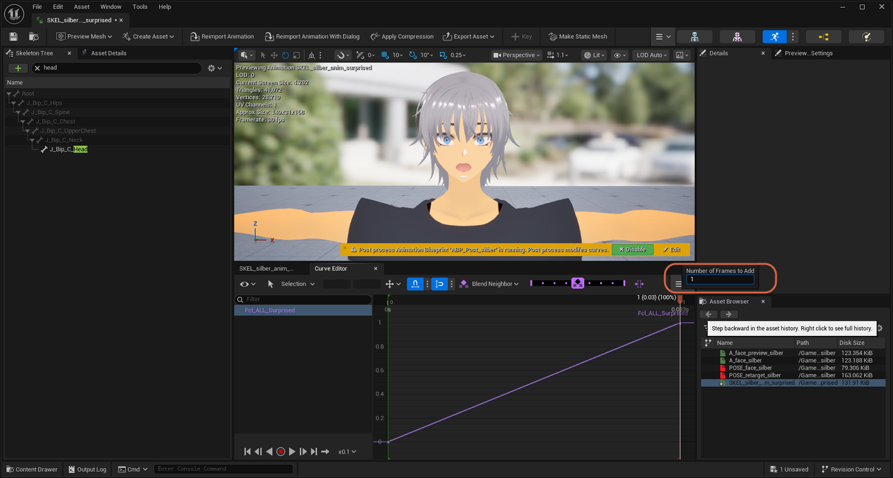

### Step 3: Locate the Shifted Key

Appending a frame doubles the total sequence length. The key that used to sit at the animation's end (100%) now reads as sitting at the sequence's midpoint.

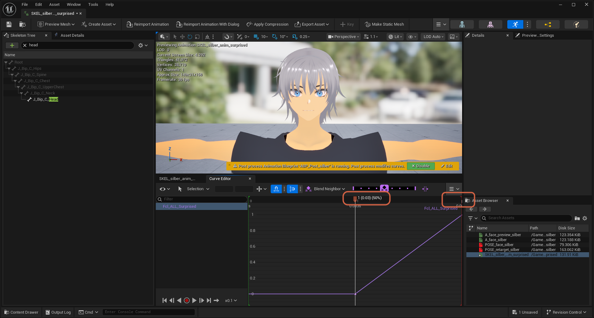

### Step 4: Disable Time Snapping

Select that key, then click the **Toggle Time Snapping** icon in the Curve Editor toolbar to turn snapping off. This is required to move the key to an exact time rather than the nearest whole frame.

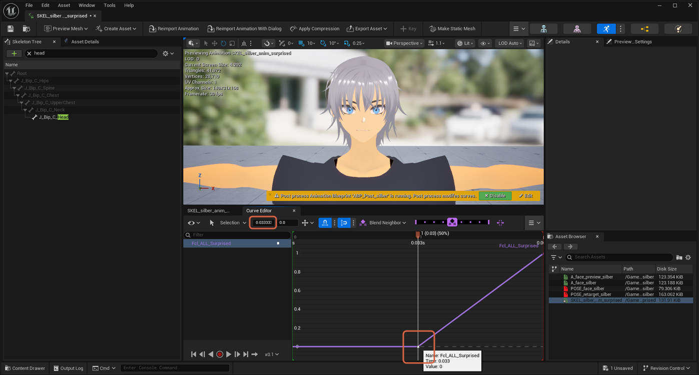

### Step 5: Move the Key Back to the Start

With snapping disabled, edit the selected key's time field and set it to `0`.

> **Note:** The source memo describes this move as necessary to "play the same animation in 2 seconds," but neither the memo nor the screenshots fully explain the resulting curve shape after the key is relocated — the numeric field changes are confirmed here, but the underlying reasoning isn't independently verified in this session. Treat this step as documented technique rather than a fully explained mechanism.

> **Note:** See [Understanding the Number of Sampled Frames Limit](understand-sampled-frames-limit.md) for background on **Append Frames at End of Sequence** and why an Animation Sequence's frame count can't be edited directly in the Details panel.

### Step 6: Play the Extended Animation

Click **Play** again. The same expression now plays out across the extended, two-frame timeline.

## Decreasing the Play Duration

To shrink the play duration back down — for example, from two seconds back to one:

### Step 1: Move the Playhead to the New End Point

Use the transport bar's step-back button (or drag the ruler) to move the playhead to the frame where you want the animation to end — in this case, the `1` second mark.

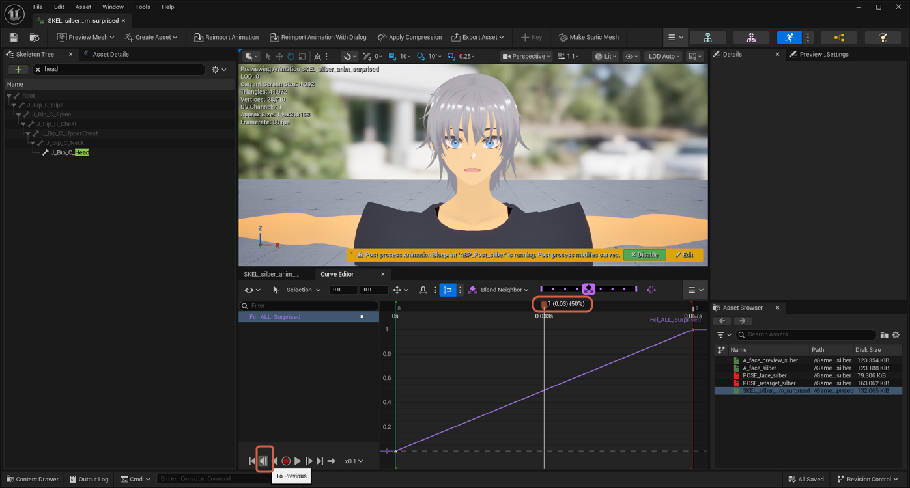

### Step 2: Remove the Frames After That Point

Right-click the time row and select **Remove frames in range 2 to 2**.

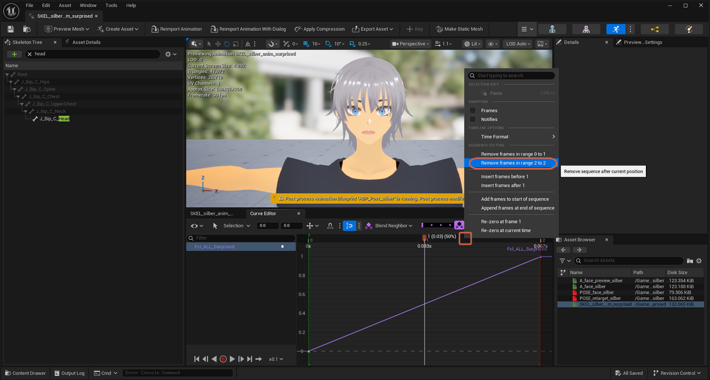

> **Warning:** Removing frames trims the sequence permanently. Undo (`Ctrl+Z`) recovers it within the same editing session, but there's no separate confirmation step before the frames are cut.

The sequence's total length drops back to `1`.

### Step 3: Select the Key at the End Point

Because the sequence's total length was cut in half, the key that used to sit at the very end now evaluates partway through the shortened curve — its value tooltip reads `0.5` instead of `1`.

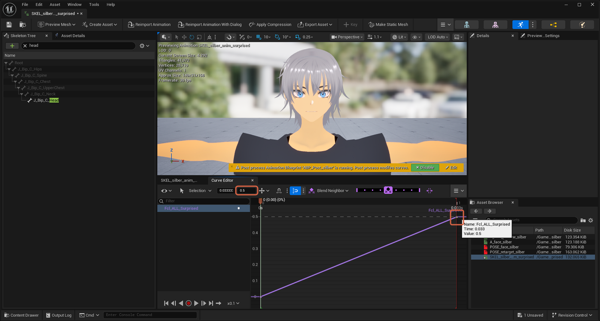

### Step 4: Set the Value Back to `1`

Edit the key's value field and set it back to `1`, restoring the full expression at the new end point.

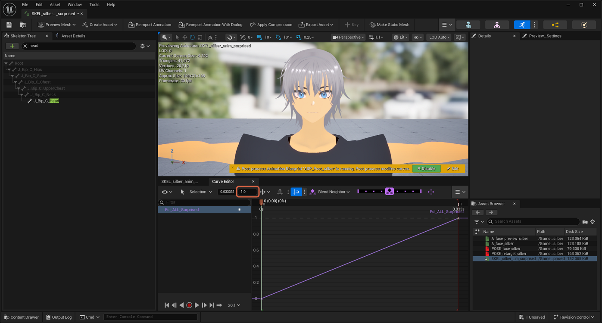

### Step 5: Play the Restored Animation

Click **Play** to confirm the animation now plays the full expression across the shortened, one-second timeline again.

## Next Steps

Once a single-expression animation like this one exists, it becomes source material for other tools:

- [Creating a Pose Asset from an Animation Sequence](create-pose-asset-from-animation.md) — feed this animation back into **Create Asset** → **Create PoseAsset** to extract its poses.
- [Understanding the Number of Sampled Frames Limit](understand-sampled-frames-limit.md) — more on the **Append Frames at End of Sequence** command used above.
- [Moving the Playhead](move-playhead.md) — the two ways to position the playhead precisely while keyframing.
