# Creating a Chaos Cloth Asset

> **Note:** This document was generated by Claude Code and has not been reviewed by a human. Please use it as a reference only.

This covers the modern **Dataflow**-based Chaos Cloth workflow. It builds a `ClothAsset` from a garment section that already exists on a skinned character mesh — for example a shirt imported as its own material section through VRM4U — and prepares it for weight painting.

> **Note:** This is not the deprecated "Clothing" panel workflow (right-click a skeletal mesh section → **Create Clothing Data from Section**). That system is being phased out. Follow this guide instead, and leave **Cloth Asset Editor (Deprecated)** unchecked wherever it appears.

## Before You Start

You need a skinned character mesh where the garment is already its own material section (not merged with skin or hair). This guide uses `SKM_VroidBoyBlue001`, whose shirt lives in its own section, as the example.

## Step 1: Create the Cloth Asset

In the Content Browser, right-click inside your character's mesh folder and open the **Create** menu. Under the **Chaos Cloth** category, select **ClothAsset** ("Cloth asset for pattern based simulation").

Name the new asset after the garment, for example `CA_VroidBoyShirt`. Unreal applies the `CA_` prefix automatically as part of its Cloth Asset naming convention.

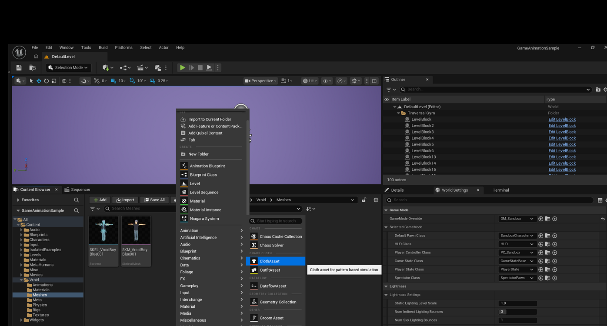

## Step 2: Choose the Dataflow Graph Template

Unreal immediately opens the **Choose Dataflow Setup** dialog, offering four templates: **Empty Dataflow**, **Static Mesh Cloth**, **Skeletal Mesh Cloth**, and **USD Cloth**.

Select **Skeletal Mesh Cloth** ("Add a Dataflow graph that builds a Cloth Asset from Skeletal Meshes. Requires the ChaosClothAssetDataflowNodes plug-in.") and click **OK**.

> **Note:** Clicking **No Dataflow** instead continues without attaching a graph, leaving you to build the whole node network by hand. The **Skeletal Mesh Cloth** template pre-wires the nodes this guide uses, so there's no reason to skip it.

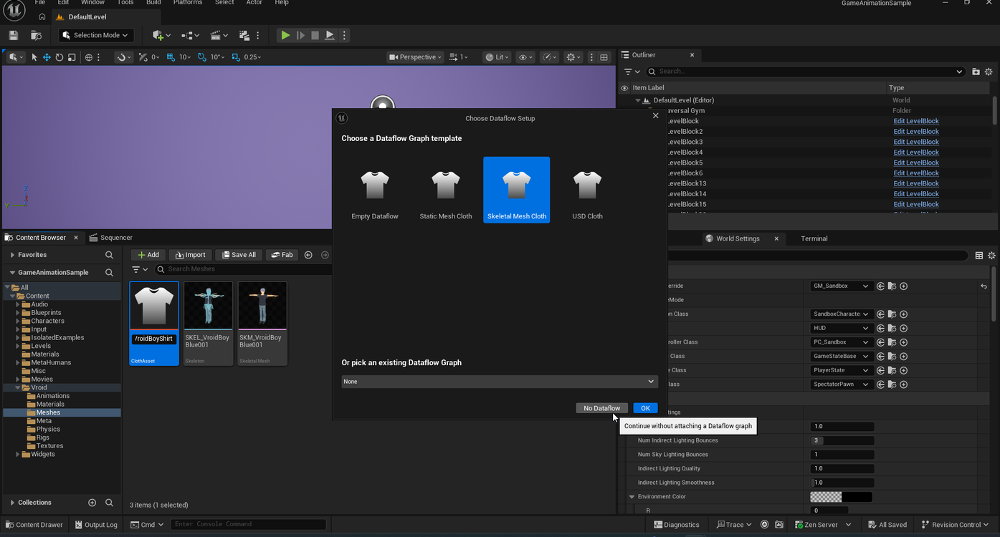

## Step 3: Open the Cloth Asset Editor

The new `CA_VroidBoyShirt` asset appears in the Content Browser. Double-click it to open the Cloth Asset Editor.

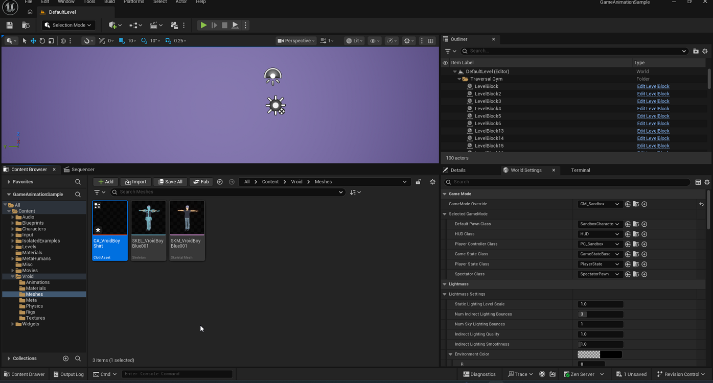

The **Construction** tab's **Dataflow Graph** panel already contains a template graph: a `SkeletalMesh_SIM` → `SkeletalMeshImport_SIM` chain and a `SkeletalMesh_RENDER` → `SkeletalMeshImport_RENDER` chain, both feeding into a `MergeClothCollections` node, followed by further nodes for weight maps and a physics asset. The template's own comment boxes number these as steps — this guide covers steps 1 through the merge; weight-map painting (step 3 onward) is covered in the next guide.

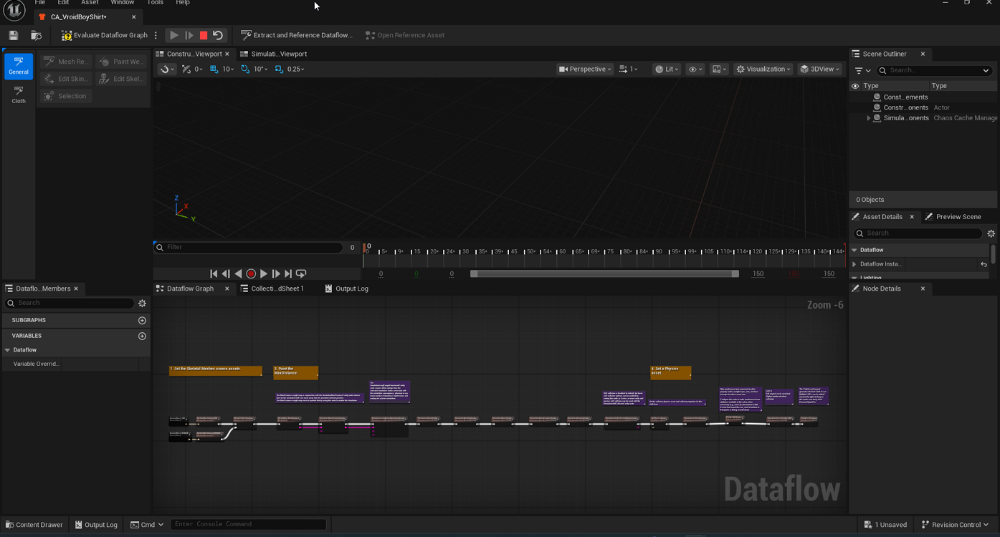

## Step 4: Assign the Source Skeletal Mesh

Select the `SkeletalMesh_SIM` node and set its **Skeletal Mesh** property to your character's mesh, for example `SKM_VroidBoyBlue001`.

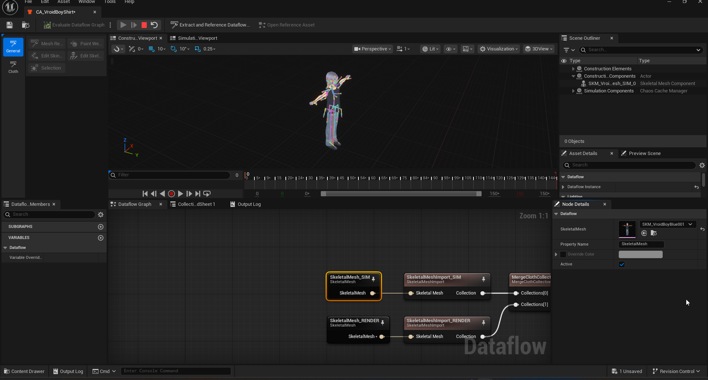

Repeat for the `SkeletalMesh_RENDER` node, assigning the same mesh.

> **Note:** `SIM` drives the simulation mesh — the flattened pattern used for weight painting and cloth physics. `RENDER` drives the mesh actually drawn on screen. Both need the same source mesh so the section you extract next lines up between them.

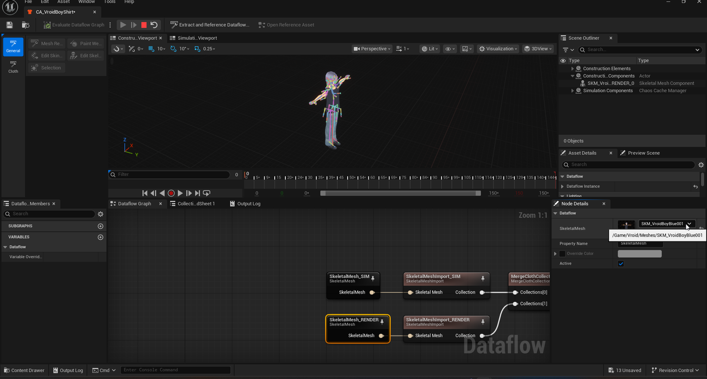

## Step 5: Find the Garment's Section Index

The `SkeletalMeshImport` nodes extract a single material section from the source mesh by index. Find the right index by opening the source mesh itself: double-click `SKM_VroidBoyBlue001` to open it in the Skeletal Mesh Editor, then check its material element list.

Locate the element whose material corresponds to the garment — in this example, `Element 11` uses `MI_N00_004_0_Tops_01_CLOTH`, so the shirt's section index is `11`.

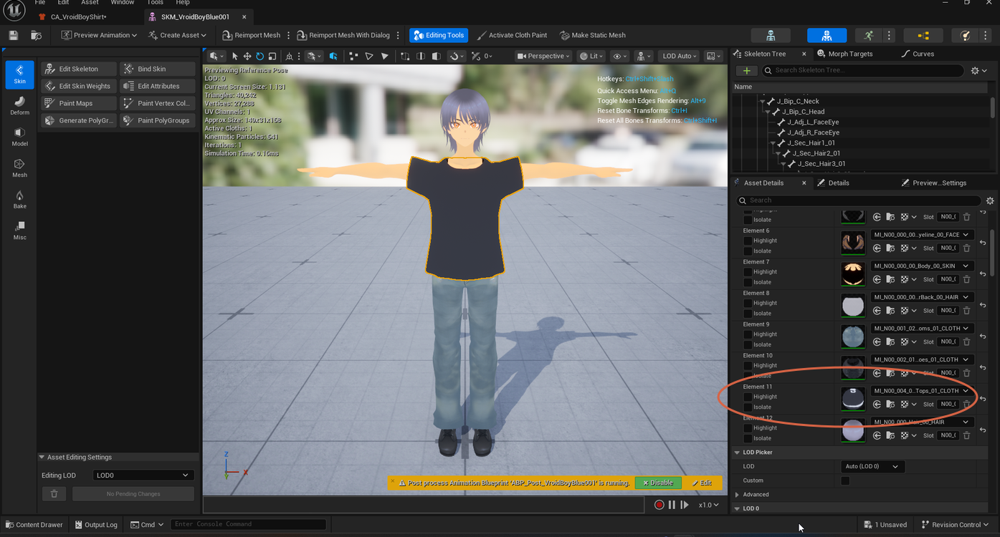

## Step 6: Extract the Section into SIM

Back in the Cloth Asset Editor, select the `SkeletalMeshImport_SIM` node. In its Node Details, check **Import Single Section** and set **Section Index** to the value you found — `11` in this example.

The **2D View** tab updates to show the extracted, flattened cloth pattern (front and back panels), which the next guide uses for weight painting.

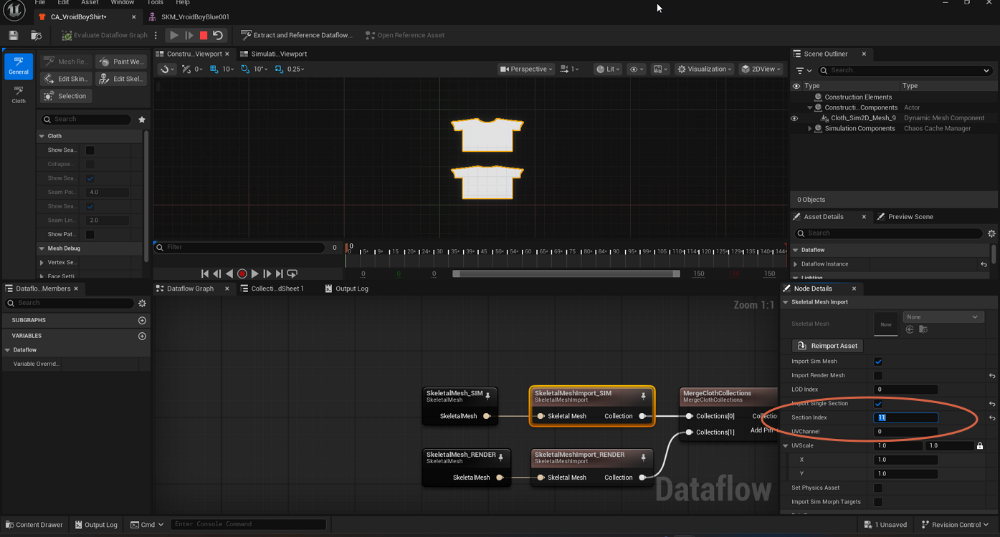

## Step 7: Extract the Section into RENDER

Select the `SkeletalMeshImport_RENDER` node. By default, **Import Single Section** is unchecked, so the node imports the entire body mesh — visible as the full character outline in the Construction viewport.

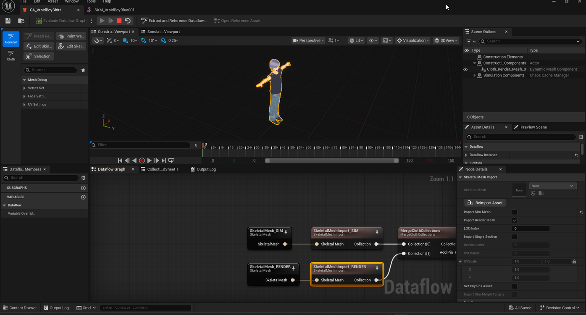

Check **Import Single Section**. With **Section Index** still at its default of `0`, the viewport now shows the wrong, tiny section.

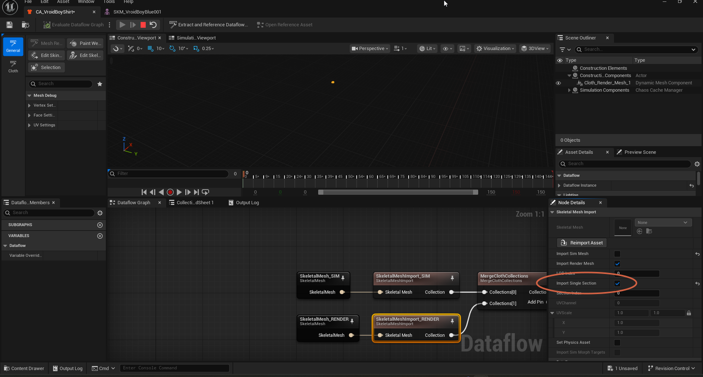

Set **Section Index** to the same value used for SIM (`11`).

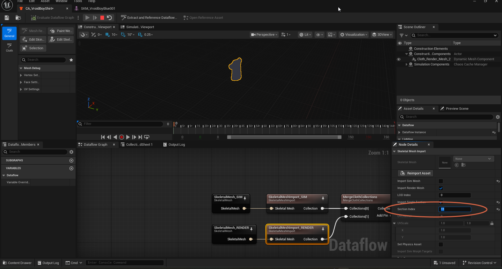

## Step 8: Evaluate the Dataflow Graph

Property changes don't refresh the preview automatically. Click **Evaluate Dataflow Graph** in the toolbar (or press `F8`) to trigger an evaluation of the graph's terminal nodes.

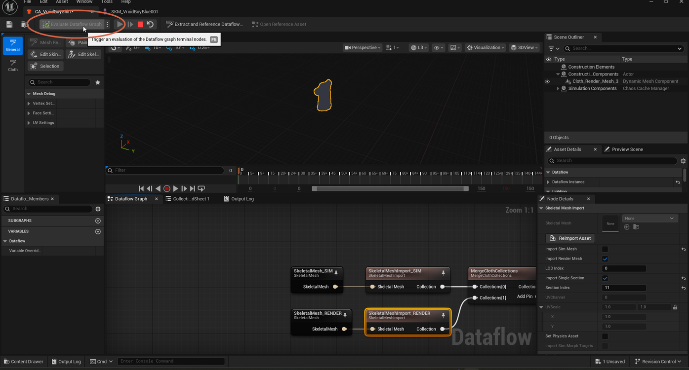

The Construction viewport now shows the correctly extracted shirt shape for the render mesh. Use the viewport's display-mode dropdown to switch between **3DView** and **Render** to confirm both look correct.

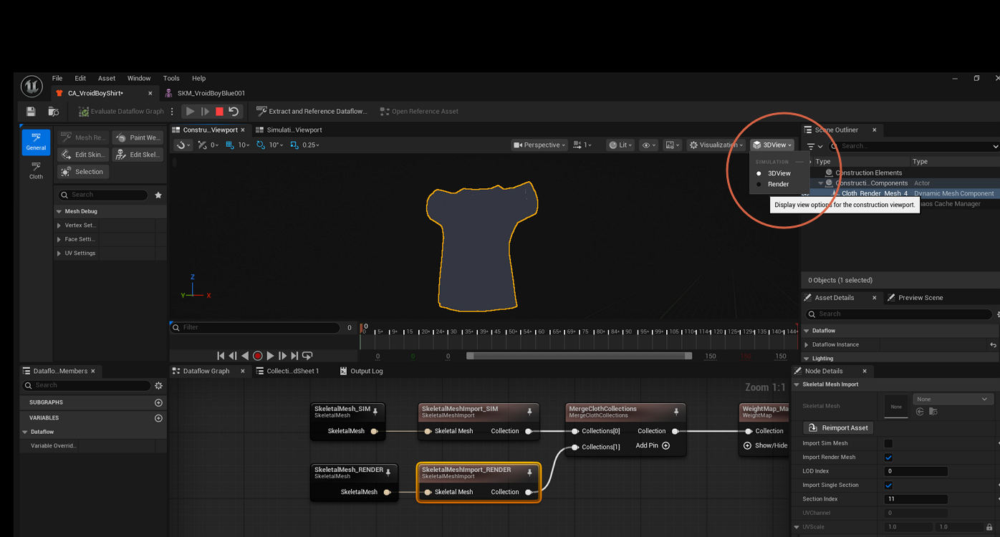

## Step 9: Confirm the Merge

Select the `MergeClothCollections` node. It combines the SIM and RENDER collections into a single cloth collection, which downstream nodes consume — including the `WeightMap_MaxDistance` node, whose tooltip notes that the MaxDistance weight map must be painted before simulating.

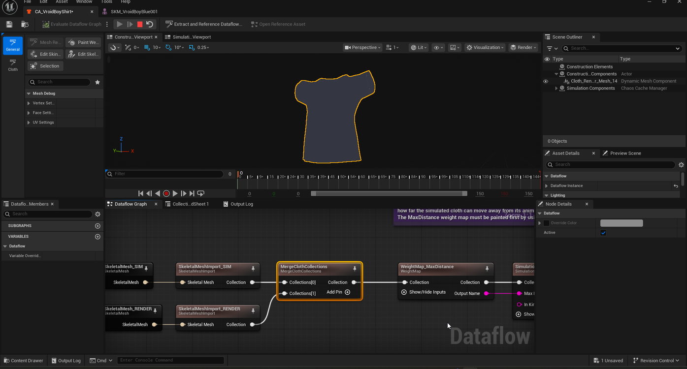

Save the asset (`Ctrl+S`). `CA_VroidBoyShirt` now has a merged cloth collection ready for weight painting.

Weight-painting this asset and tuning its simulation parameters are covered in [Applying Chaos Cloth Simulation](apply-chaos-cloth.md).
