# Creating a Control Rig

> **Note:** This document was generated by Claude Code and has not been reviewed by a human. Please use it as a reference only.

This walkthrough builds a `Control Rig` asset from scratch for the `silber` VRM character's base skeletal mesh, `SK_silber`. Unlike the Animation Sequence / Curve Editor workflow used for facial expression curves, a Control Rig adds custom bone controls wired through a node graph (the `Forwards Solve` graph), so the controls can drive bones directly and later be keyframed in Sequencer. This example wires up two controls — one for each eye bone — and tests that moving each control rotates the matching eye.

> **Note:** See [Animating a Control Rig in Sequencer](animate-control-rig-in-sequencer.md) for the follow-up workflow that uses the rig built here to keyframe an animation.

## Creating the Control Rig Asset

### Step 1: Select the Skeletal Mesh

In the Content Browser, open the `VroidSilber` folder and select `SK_silber`, the character's `Skeletal Mesh`.

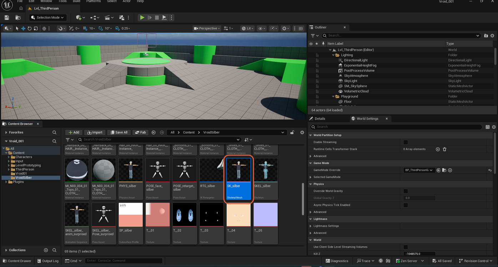

### Step 2: Create the Control Rig

Right-click `SK_silber` and select **Create** → **Control Rig**.

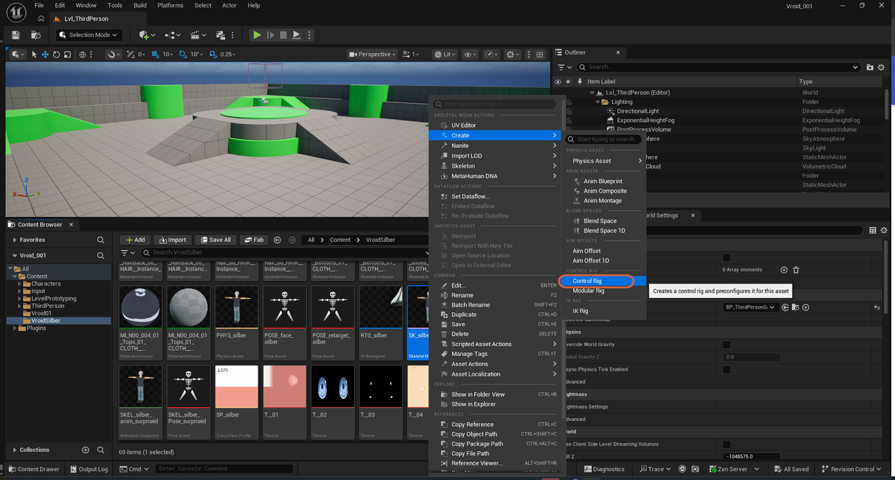

### Step 3: Open the New Control Rig Asset

A new `SK_silber_CtrlRig` asset (type `Control Rig`) appears in the Content Browser. Double-click it to open the Control Rig editor.

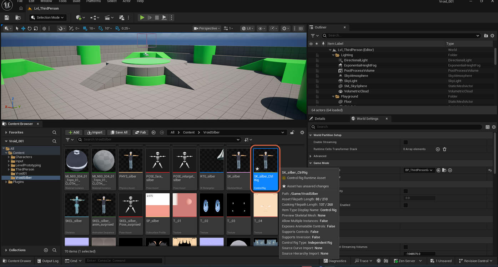

## Adding Eye Controls in the Rig Hierarchy

### Step 1: Open the Rig Hierarchy Tab

The Control Rig editor opens with an empty `Forwards Solve` graph containing only the `Forwards Solve` event node and its `Execute` pin. Open the **Rig Hierarchy** tab (bottom-left panel) to see the skeleton's bone tree.

### Step 2: Find the Eye Bones

Type `eye` into the Rig Hierarchy's search box to filter the bone tree down to `J_Adj_L_FaceEye` and `J_Adj_R_FaceEye`, the left and right eye adjustment bones.

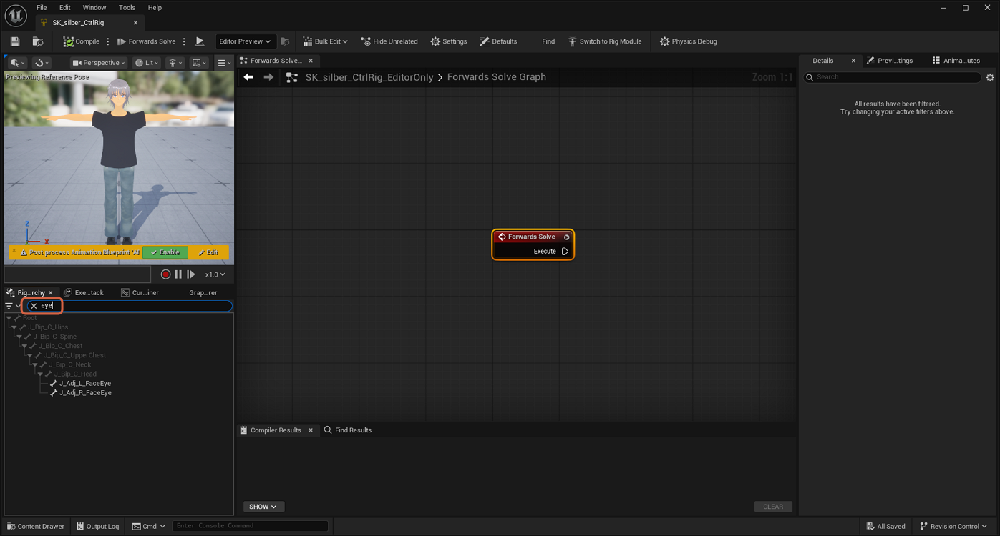

### Step 3: Create a Control for the Left Eye

Right-click `J_Adj_L_FaceEye` and select **New Element** → **New Control**. A new control, `J_Adj_L_FaceEye_ctrl`, is added. Its Details panel shows **Animation Type**: `Animation Control` and **Value Type**: `Euler Transform`.

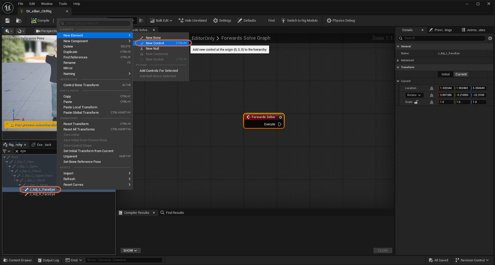

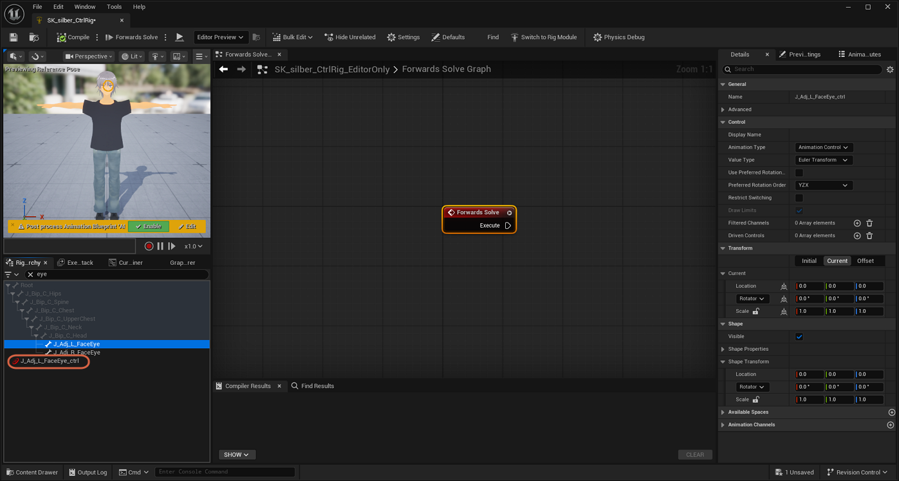

### Step 4: Create a Control for the Right Eye

Repeat the same right-click → **New Element** → **New Control** on `J_Adj_R_FaceEye`, creating `J_Adj_R_FaceEye_ctrl`.

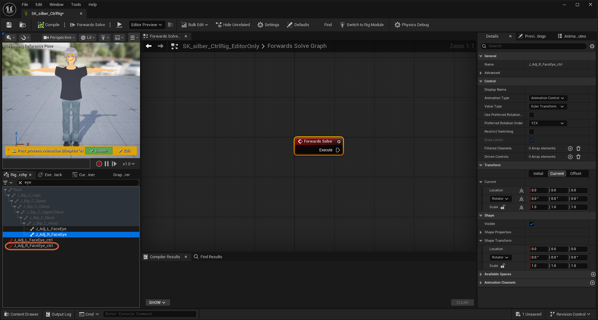

### Step 5: Move Both Controls Under Their Bones

Drag each `_ctrl` item onto its matching bone in the tree so it becomes nested underneath — `J_Adj_L_FaceEye_ctrl` under `J_Adj_L_FaceEye`, and `J_Adj_R_FaceEye_ctrl` under `J_Adj_R_FaceEye`. The preview viewport now shows colored gizmo rings around both eyes.

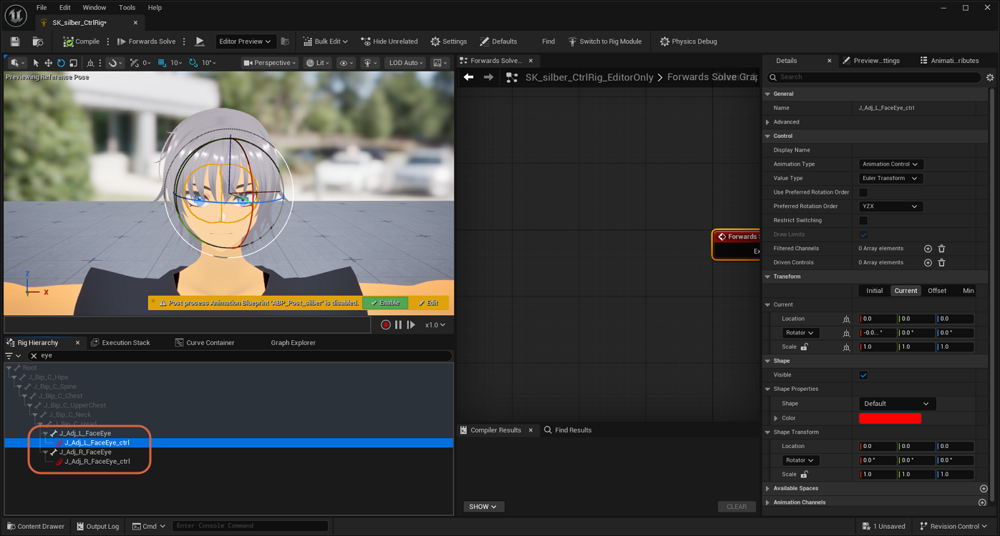

> **Note:** Immediately after creation (Step 3 and Step 4 above), each new control appears at the root of the hierarchy rather than nested under its bone — the drag-to-nest shown here is a separate, deliberate step.

## Wiring the Left Eye Control

### Step 1: Drag the Control Into the Graph

Drag `J_Adj_L_FaceEye_ctrl` from the Rig Hierarchy into the `Forwards Solve` graph and release. From the menu that appears, select **Get Control**.

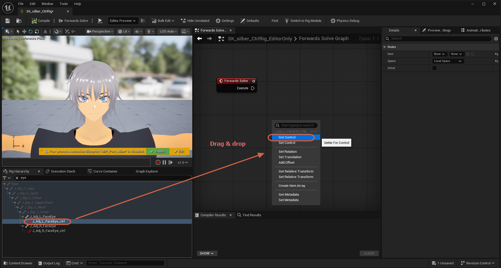

### Step 2: Get Transform Node Added

A `Get Transform - Control` node is added, preconfigured with **Type**: `Control` and **Name**: `J_Adj_L_FaceEye_ctrl`, exposing a `Transform` output pin.

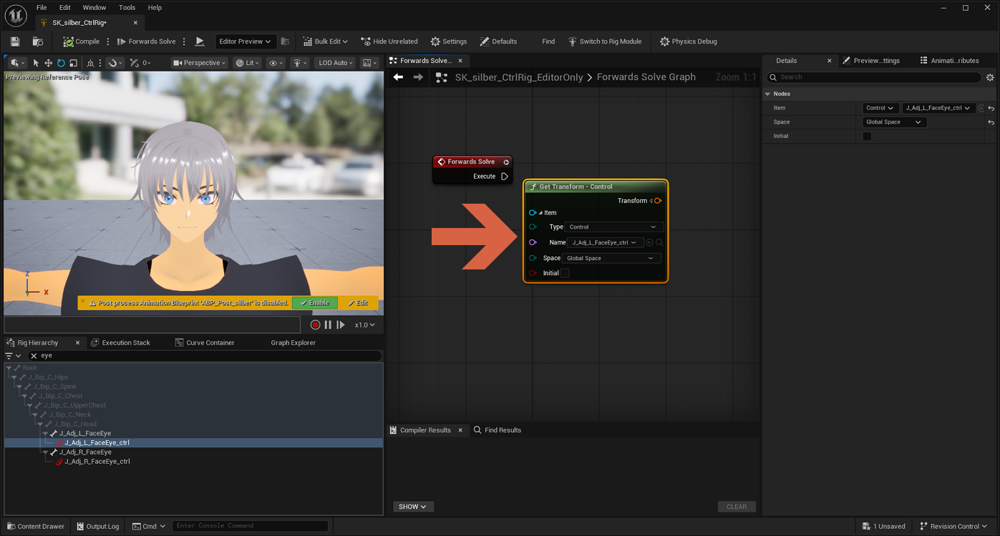

### Step 3: Drag the Bone Into the Graph

Drag `J_Adj_L_FaceEye` (the bone itself, not the control) from the Rig Hierarchy into the graph. From the menu, select **Set Bone**.

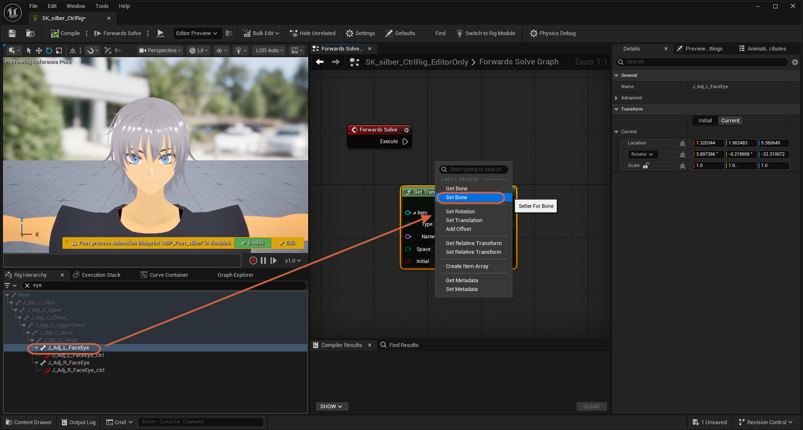

### Step 4: Set Transform Node Added

A `Set Transform - Bone` node is added, with pins for `Execute`, `Item`, `Space`, `Initial`, `Value`, `Weight`, and `Propagate to Children`.

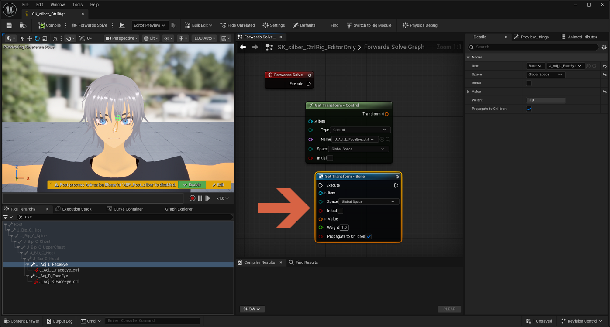

### Step 5: Connect Transform to Value

Drag a wire from the `Get Transform - Control` node's `Transform` output pin to the `Set Transform - Bone` node's `Value` input pin.

### Step 6: Connect Execute to Execute

Drag a wire from the `Forwards Solve` event node's `Execute` output pin to the `Set Transform - Bone` node's `Execute` input pin, so the bone update actually runs each frame. The screenshot above already shows this connection made, alongside the Transform-to-Value wire from Step 5.

### Step 7: Test the Left Eye

With the wiring in place, select `J_Adj_L_FaceEye_ctrl` and change its Rotator **Z** value (for example, to `-9.0`) in the Details panel. The left eye moves in the preview viewport, confirming the control drives the bone.

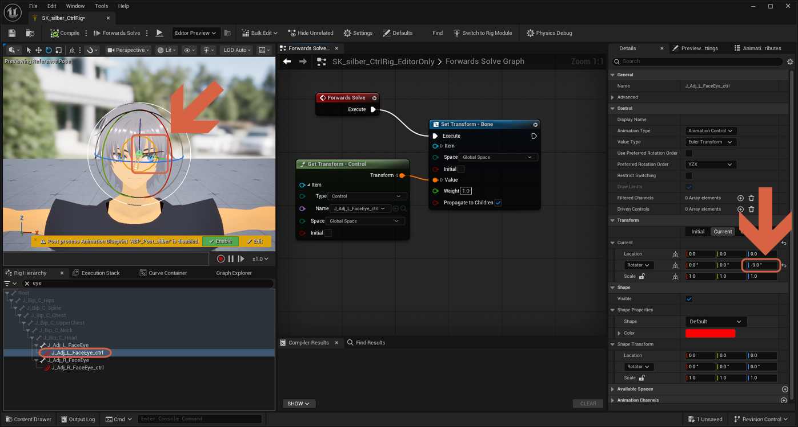

## Wiring the Right Eye Control

### Step 1: Repeat Get/Set for the Right Eye

Repeat Steps 1–4 from the previous section for the right eye: drag `J_Adj_R_FaceEye_ctrl` into the graph and select **Get Control**, then drag `J_Adj_R_FaceEye` and select **Set Bone**. This adds a second `Get Transform - Control` node (**Name**: `J_Adj_R_FaceEye_ctrl`) and a second `Set Transform - Bone` node.

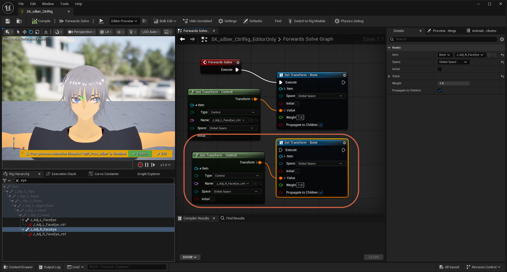

### Step 2: Confirm the Full Graph

Wire the right eye's `Get Transform - Control` → `Transform` output to its `Set Transform - Bone` → `Value` input, the same as for the left eye. Connect its `Execute` input from the left eye's `Set Transform - Bone` node's `Execute` output pin, chaining the two bone updates after the `Forwards Solve` event. The full graph now shows: `Forwards Solve` → left eye `Set Transform - Bone` → right eye `Set Transform - Bone`, with each `Get Transform - Control` node feeding its matching `Set Transform - Bone` node's `Value` pin.

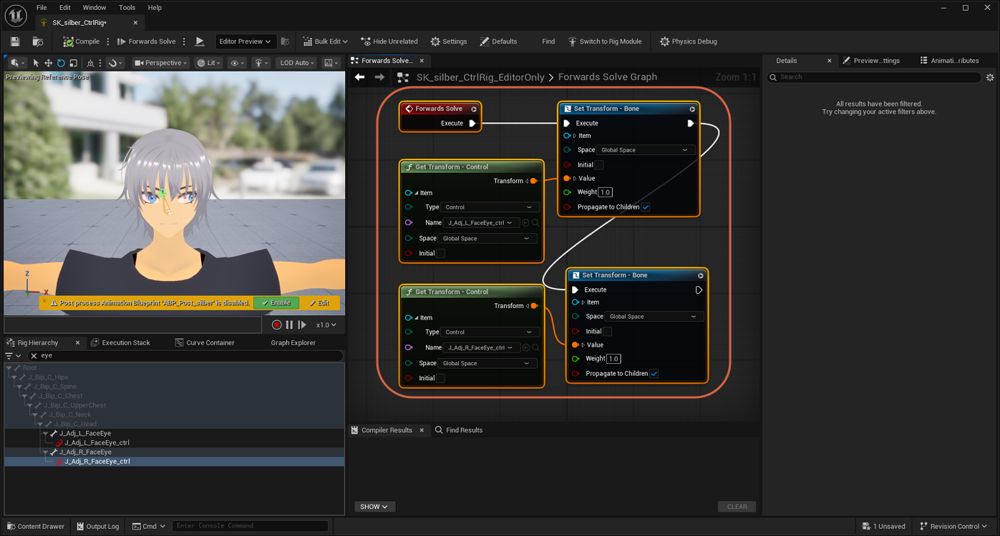

### Step 3: Test the Right Eye

Select `J_Adj_R_FaceEye_ctrl` and change its Rotator **Z** value (for example, to `-9.0`). The right eye moves independently of the left.

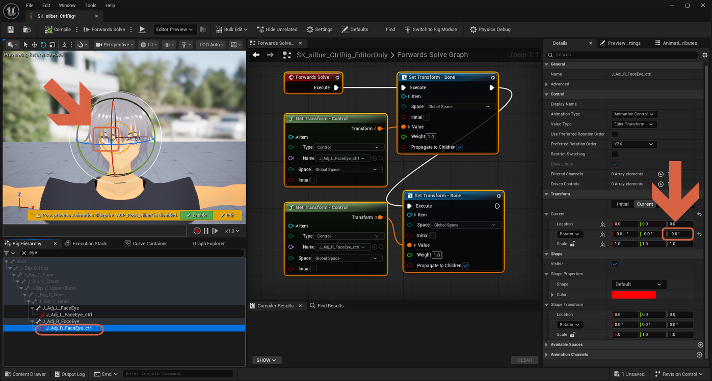

### Step 4: Confirm Both Eyes Move Correctly

With both controls wired, both eyes rotate independently when their respective values change. The Control Rig is complete.

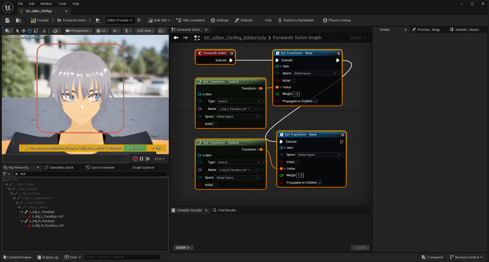

## Next Steps

With the Control Rig wired and tested, it's ready to drive an actual animation:

- [Animating a Control Rig in Sequencer](animate-control-rig-in-sequencer.md) — drag this Control Rig into the level and keyframe its eye controls in Sequencer.
