# Creating a Custom MetaHuman Character

> **Note:** This document was generated by Claude Code and has not been reviewed by a human. Please use it as a reference only.

Build an original character with MetaHuman Creator. Tested with Unreal Engine 5.8.1 — menu wording may differ slightly between engine versions.

> **Warning:** Order matters. Once you create a rig, the Import, Head & Body, and Materials tools lock (Remove Rig unlocks them again). Hair and clothing stay editable. Shape the face, body, and skin *before* rigging.

## Step 1: Create the Project

In the Unreal Project Browser, choose **Games** → **Third Person**, set **Blueprint**, **Target Platform** to **Desktop**, **Quality Preset** to **Maximum**, name the project, and click **Create**.

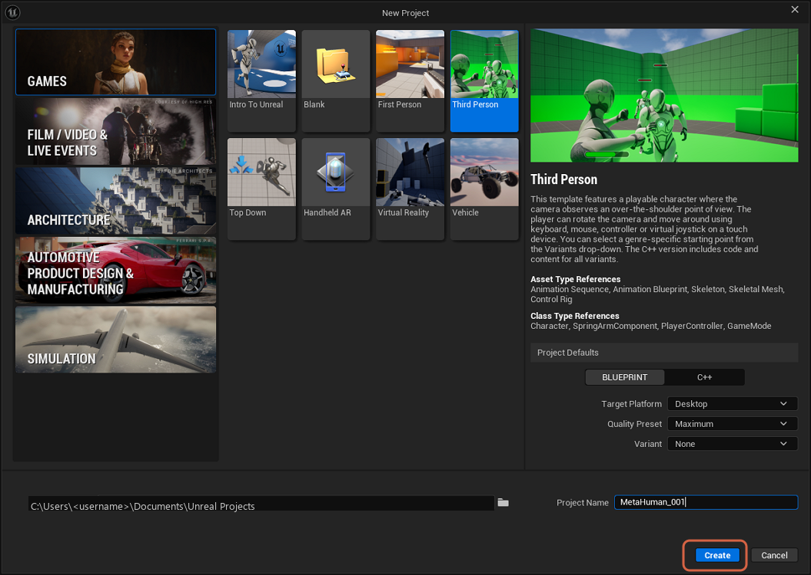

## Step 2: Install MetaHuman Creator Core Data

In the Epic Games Launcher, go to **Unreal Engine** → **Library**, open the dropdown arrow next to **Launch** on your engine version, and choose **Options**.

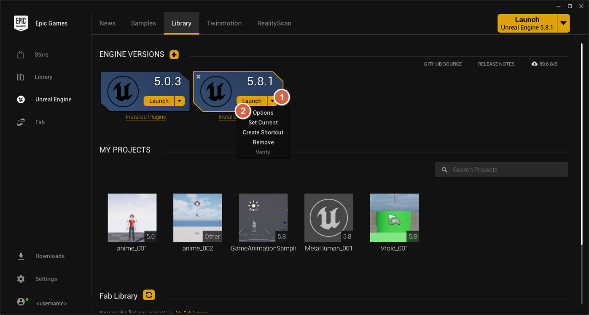

Tick **MetaHuman Creator Core Data** (about 5.75 GB) and click **Apply**.

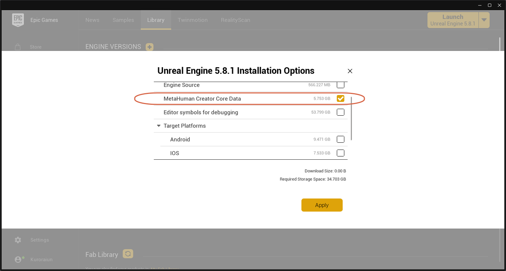

## Step 3: Enable the MetaHuman Creator Plugin

In the editor, open **Edit** → **Plugins**, search for `meta`, tick **MetaHuman Creator** (marked Beta), and click **Restart Now**.

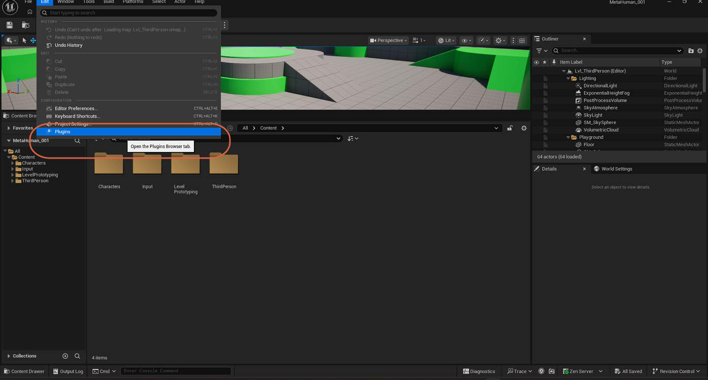

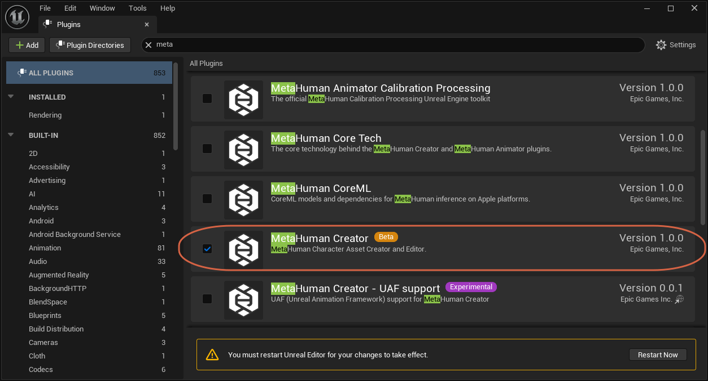

## Step 4: Add a MetaHuman Character Asset

In the Content Browser, create a folder called `MetaHuman`. Open it, right-click empty space, and choose **MetaHuman** → **MetaHuman Character**.

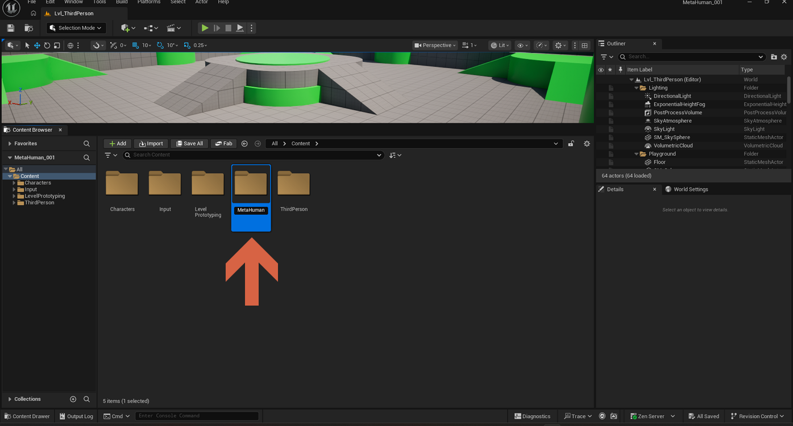

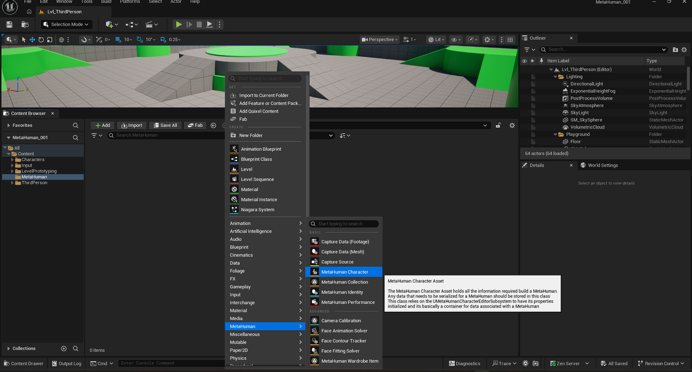

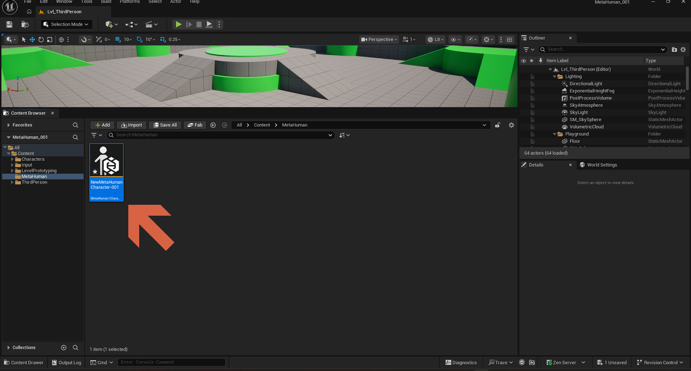

> **Note:** Epic's docs suggest naming these assets with an `MHC_` prefix, for example `MHC_Sunita`. Rename before you build more on top of it.

## Step 5: Open Creator and Pick a Preset

Double-click the asset to open MetaHuman Creator. The left toolbox has seven tabs: **Presets**, **Import**, **Head & Body**, **Materials**, **Hair & Clothing**, **Export**, **Assembly**.

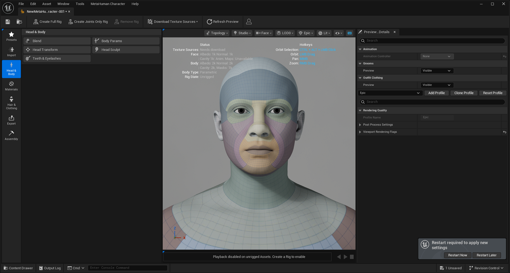

Open **Presets**, click a character, and press **Apply Preset**.

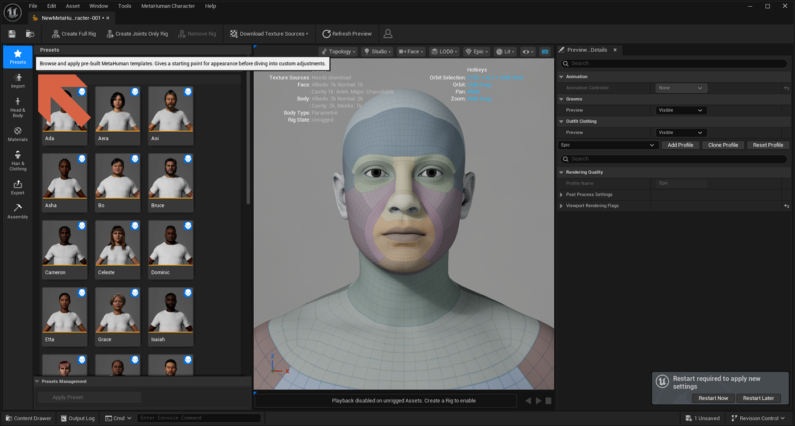

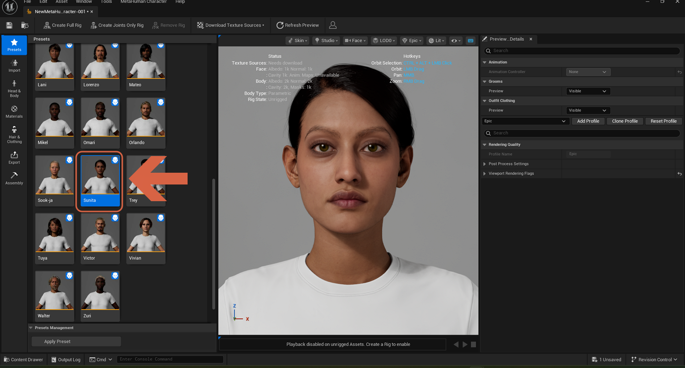

## Step 6: Choose Hair and Clothing

Open **Hair & Clothing**. The **Selection** sub-tab lists hairstyles, eyebrows, and other grooms — click one to apply it.

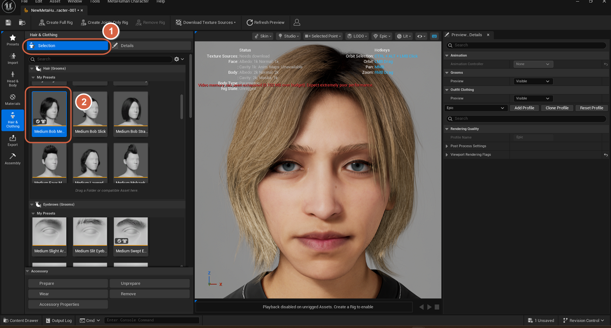

The **Details** sub-tab holds the overrides: hair color, roughness, whiteness, lightness, dye color, and the outfit's primary and secondary colors.

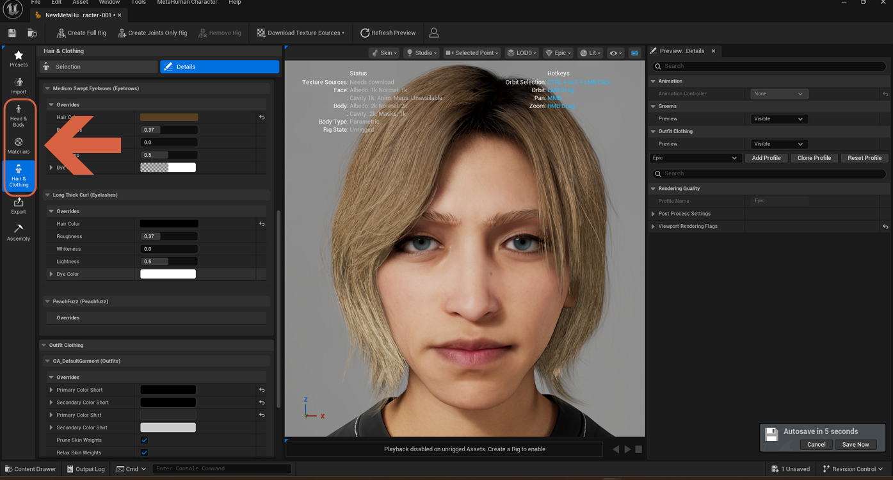

> **Warning:** A red "Video memory has been exhausted … over budget" line in the viewport means the preview is using more VRAM than the GPU has (an 8 GB card can hit this). Try lowering the viewport rendering quality profile, close other GPU-heavy apps, and avoid downloading 8K textures until you need them. If it persists, restart the editor.
