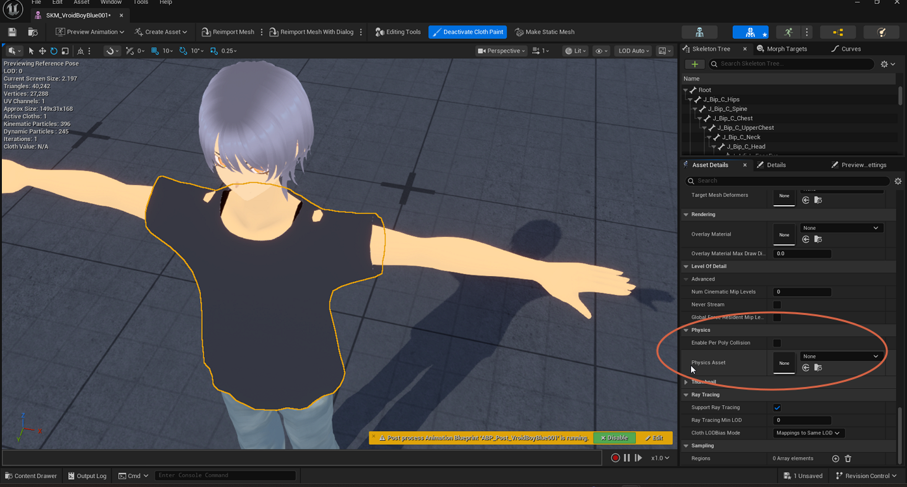
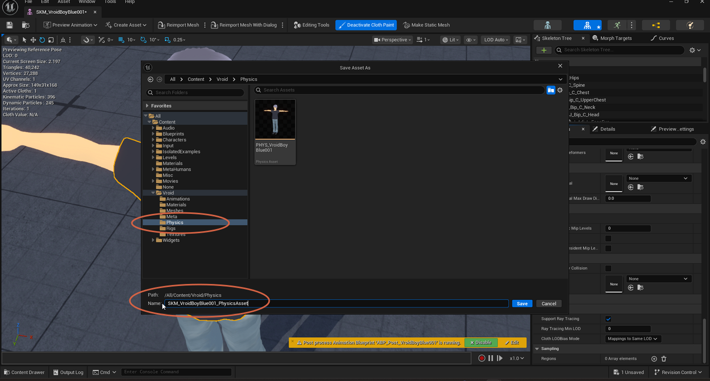
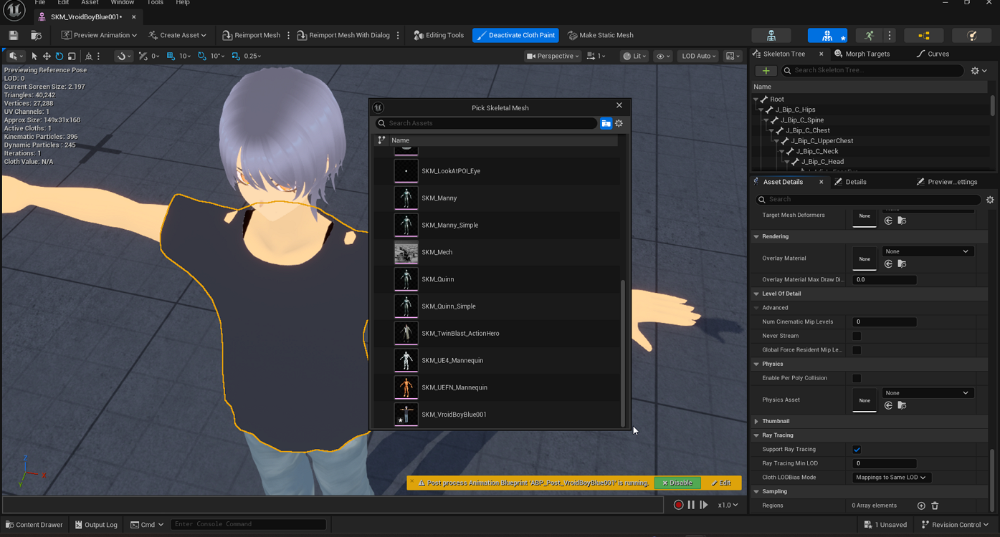
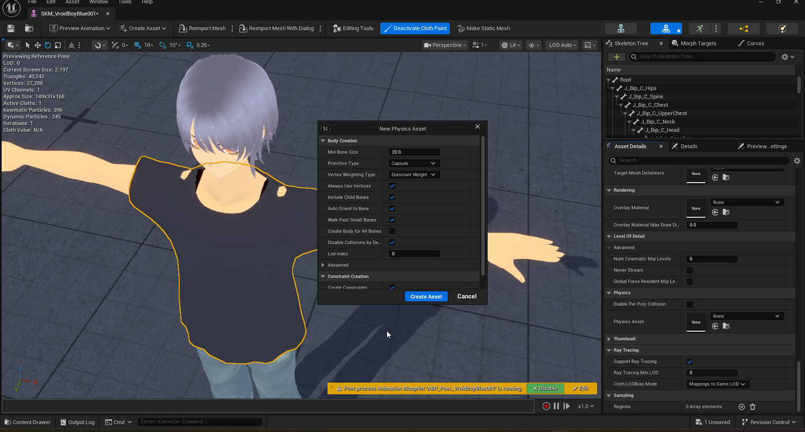
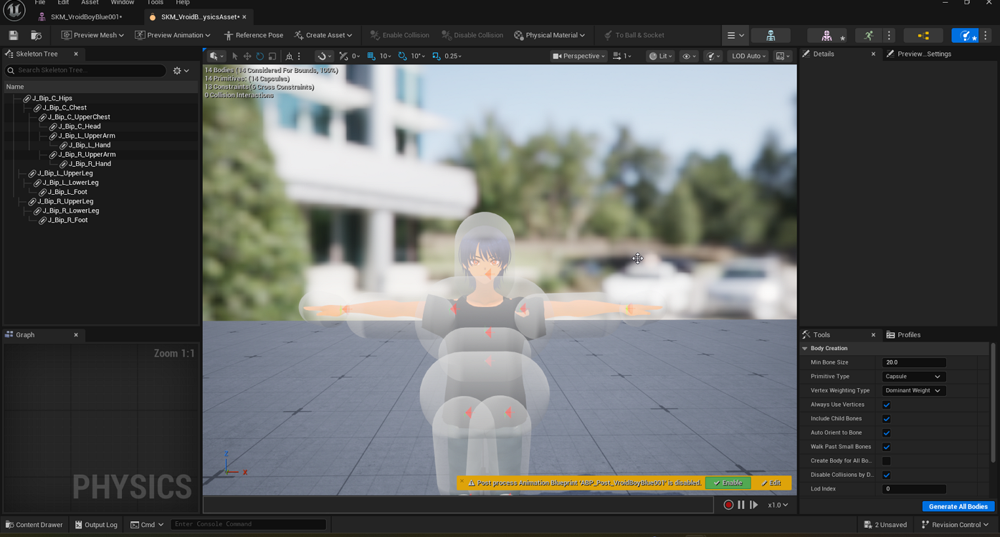
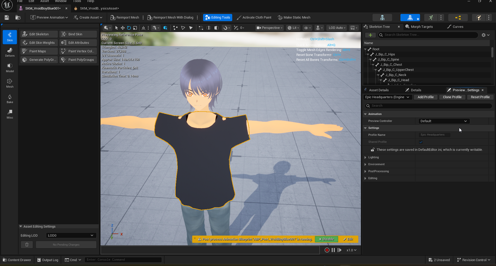
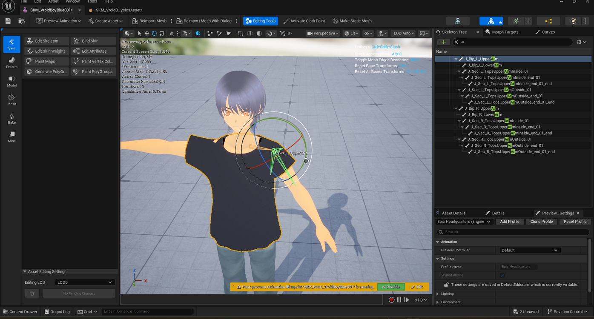
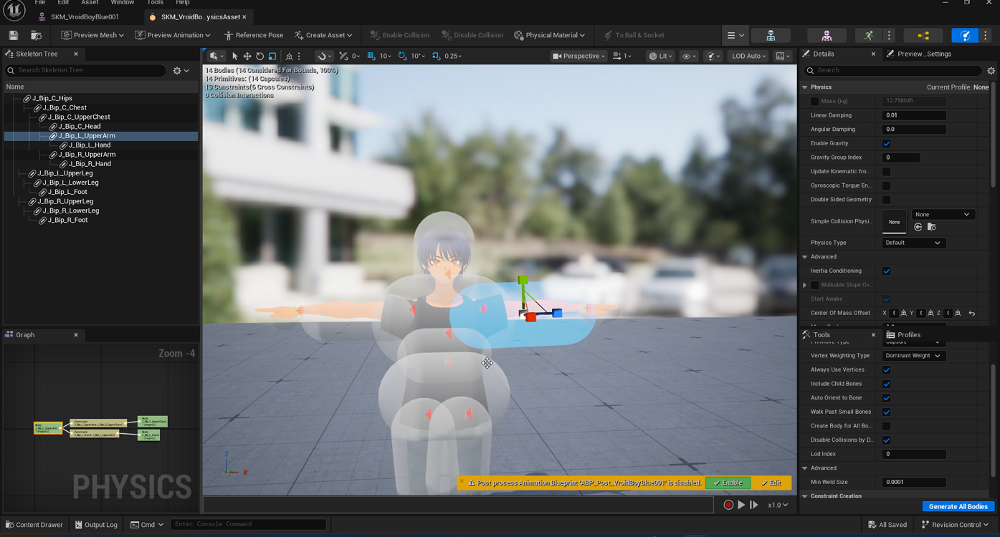

# Creating a Physics Asset

> **Note:** This document was generated by Claude Code and has not been reviewed by a human. Please use it as a reference only.

A **Physics Asset** builds collision bodies for a skeleton's bones, so simulated Chaos Cloth (and ragdoll physics) can collide with the character's body instead of clipping through it. This guide covers generating a new Physics Asset for a skeletal mesh, reviewing the auto-generated collision bodies, and regenerating an individual body after adjusting a bone.

## Step 1: Open the Physics Asset Field

In the **Skeletal Mesh** editor, open the **Asset Details** panel and scroll to the **Physics** section. If no Physics Asset is assigned yet, the **Physics Asset** field shows `None`.

## Step 2: Name and Save the New Asset

Create a new Physics Asset from this field. In the **Save Asset As** dialog, choose a destination folder and a name for the asset — for example, `SKM_VroidBoyBlue001_PhysicsAsset` — then click **Save**.

> **Note:** If a physics asset already exists in the destination folder, give the new one a distinct name so you don't overwrite it.

## Step 3: Confirm the Source Skeletal Mesh

A **Pick Skeletal Mesh** dialog lists the skeletal meshes in the project. Select the mesh the Physics Asset should be generated from (for example, `SKM_VroidBoyBlue001`).

## Step 4: Configure Body Creation and Create the Asset

The **New Physics Asset** dialog controls how collision bodies are generated:

- **Min Bone Size** — `20.0`.
- **Primitive Type** — `Capsule`.
- **Vertex Weighting Type** — `Dominant Weight`.
- **Include Child Bones**, **Auto Orient to Bone**, and **Walk Past Small Bones** — checked.
- **Create Body for All Bones** — unchecked (only bones large enough or weighted enough get a body).
- **Disable Collisions by Default** — checked, under **Constraint Creation**.

Click **Create Asset**.

## Step 5: Review the Generated Physics Asset

The new Physics Asset opens in its own editor tab, with capsule collision bodies generated for the main skeleton bones. The viewport stats confirm the result — for example, `14 Bodies`, `14 Primitives (14 Capsules)`, and `13 Constraints (6 Cross Constraints)`.

> **Note:** If you need to regenerate the bodies with different settings, adjust the **Body Creation** options in the bottom-right panel and click **Generate All Bodies**.

## Step 6: Adjust a Bone in the Skeleton Tree

If a generated collision body doesn't line up correctly with a limb, go back to the **Skeletal Mesh** editor and open **Edit Skeleton** mode to reposition the underlying bone.

Use the **Skeleton Tree** search box to filter for the bone — for example, typing `ar` filters the list down to the arm bones. Select the bone (such as `J_Bip_L_UpperArm`); a move/rotate gizmo appears on it in the viewport.

Drag the gizmo to reposition or rotate the bone as needed.

## Step 7: Review and Regenerate the Affected Body

Switch back to the **Physics Asset** editor tab. Select the same bone in its **Skeleton Tree** to highlight the corresponding collision body in the viewport, and check its properties in the **Details** panel — **Mass**, **Linear Damping**, **Angular Damping**, **Enable Gravity**, and **Physics Type**.

Use the **Center Of Mass Offset** gizmo to fine-tune the body's pivot if needed, then click **Re-generate Bodies** (or **Generate All Bodies**) to rebuild collision for the adjusted bone.

> **Note:** A Physics Asset created here can be assigned as the collision source when [applying Chaos Cloth simulation](apply-chaos-cloth.md#step-5-assign-collision).
