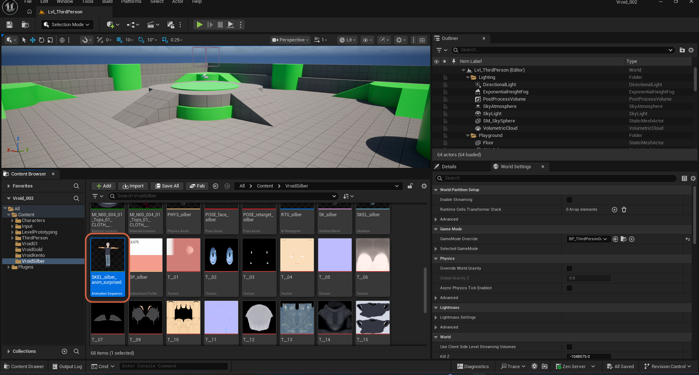
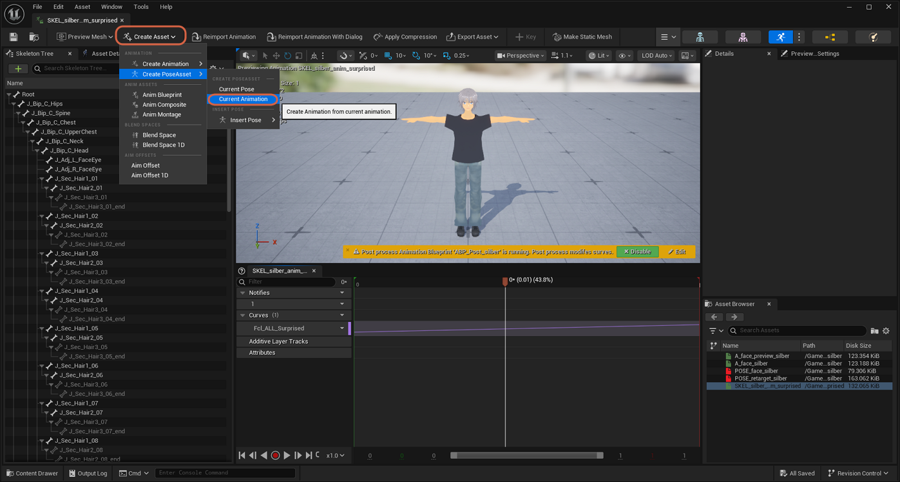

# Creating a Pose Asset from an Animation Sequence

> **Note:** This document was generated by Claude Code and has not been reviewed by a human. Please use it as a reference only.

A `Pose Asset` can be generated directly from an already-open `Animation Sequence`, instead of building one from scratch. This example uses `A_face_kento-blue_sorrow`, a single-curve animation holding one facial expression.

> **Note:** See [Creating a Single-Expression Facial Animation](create-single-expression-animation.md) for how a source animation like this one gets isolated down to a single curve first.

## Step 1: Open the Create Asset Menu

With the animation open, click **Create Asset** in the toolbar, then open the **Create PoseAsset** flyout. It offers two options under **CREATE POSEASSET** — **Current Pose** and **Current Animation** — plus a separate **Insert Pose** option under **INSERT POSE**.

Select **Current Animation** ("Create Animation from current animation") rather than **Current Pose**, which would only capture whatever single frame the playhead was on.

## Step 2: Choose a Destination and Name

A **Create a New Animation Asset** dialog opens, prompting you to select a destination folder and confirm a name for the new Pose Asset. The screenshot shows the `VroidKento` folder selected and the name field pre-filled as `SKEL_kento-blue_PoseAsset_sorrow`.

Click **OK** to create the Pose Asset in that folder.

> **Warning:** **Current Animation** creates one pose per sampled frame of the source animation, not a single named pose — a 75-frame clip produces 76 poses (`Pose_0` through `Pose_75`). See [Isolating a Single Pose in a Pose Asset](isolate-single-pose.md) to clean this up.

> **Note:** A Pose Asset created this way only reflects the curve values baked into the source animation at the time you ran this command. To learn how a Pose Asset's per-pose **Weight** slider differs from those baked values, see [Understanding Pose Weights vs. Curve Values](understand-pose-weights-vs-curves.md).
