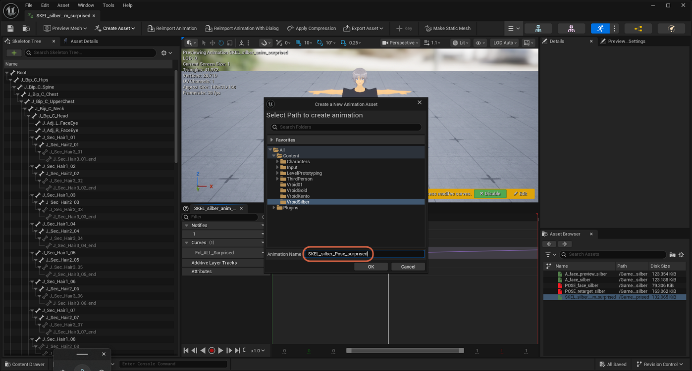
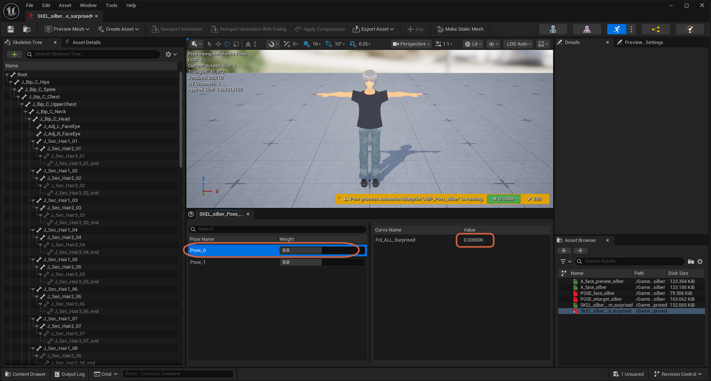
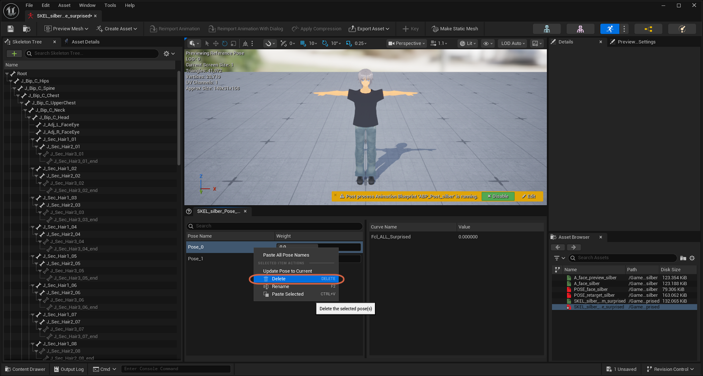
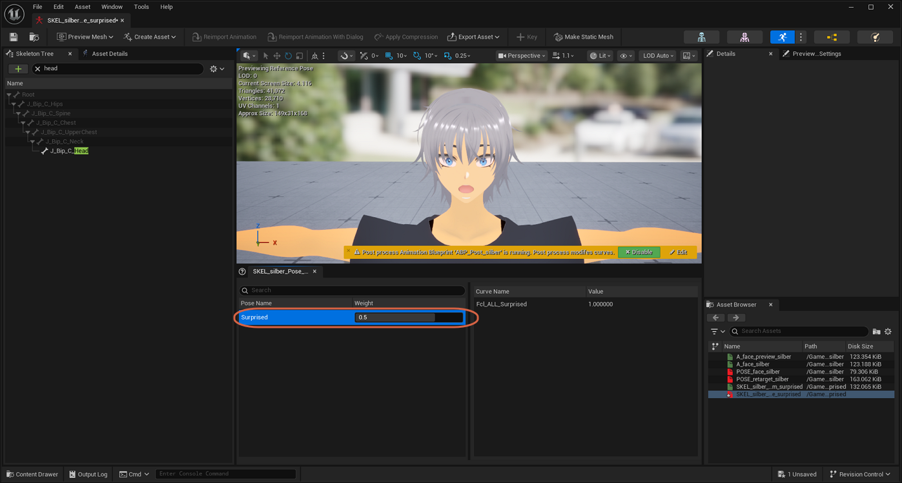

# Creating a Pose Asset from an Animation Sequence

> **Note:** This document was generated by Claude Code and has not been reviewed by a human. Please use it as a reference only.

A `Pose Asset` can be generated directly from an already-open `Animation Sequence` using **Current Animation**, instead of building one from scratch. This example uses `SKEL_silber_anim_surprised`, the two-keyed animation built in [Creating an Animation from a Pose](create-animation-from-pose.md) — because that source animation has only two keys (a start key at `0` and an end key at `1`), **Current Animation** produces exactly two poses to clean up here, not one per every sampled frame.

## Step 1: Open the Source Animation

In the Content Browser, open the source `Animation Sequence` — here, `SKEL_silber_anim_surprised`.

## Step 2: Create the Pose Asset

Click **Create Asset** → **Create PoseAsset**, then select **Current Animation** ("Create Animation from current animation") rather than **Current Pose**, which would only capture whatever single frame the playhead was on.

## Step 3: Name and Create the Asset

A **Create a New Animation Asset** dialog opens, prompting you to select a destination folder and confirm a name. The screenshot shows the `VroidSilber` folder selected and the name field pre-filled as `SKEL_silber_Pose_surprised`. Click **OK**.

## Step 4: Check the Generated Poses

The new Pose Asset opens automatically, with one pose per key in the source animation — `Pose_0` and `Pose_1`. Select `Pose_0` and check its value in the curve list on the right: it reads `0.000000`, matching the animation's start key.

> **Note:** If your source animation has many sampled frames instead of just a couple of hand-placed keys, **Current Animation** generates one pose per frame instead of two — see [Isolating a Single Pose in a Pose Asset](isolate-single-pose.md) for cleaning up that larger case.

## Step 5: Delete the Unwanted Pose

Right-click `Pose_0` (the `0.000000` pose) and select **Delete**.

## Step 6: Rename the Remaining Pose

Only `Pose_1` remains, holding the curve's `1.000000` value. Right-click it, select **Rename**, and give it a meaningful name — for example, `Surprised`.

## Step 7: Check the Final Pose

Change the pose's **Weight** slider to confirm it blends correctly — setting it to `0.5` here shows the expression at half strength.

