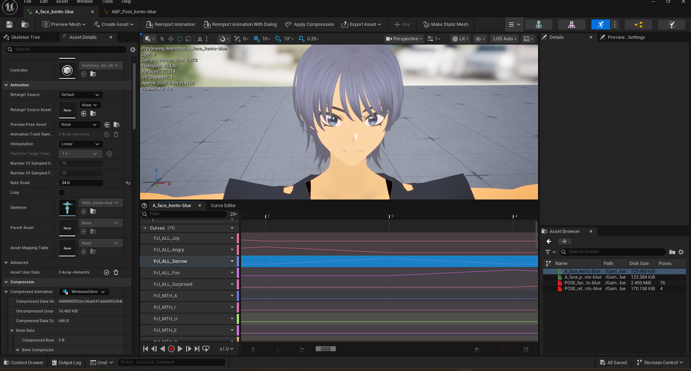
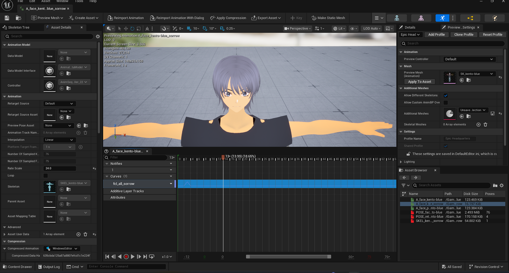

# Creating a Single-Expression Facial Animation

> **Note:** This document was generated by Claude Code and has not been reviewed by a human. Please use it as a reference only.

A combined facial animation like `A_face_kento-blue` can hold dozens of curves — one per expression and viseme. To get a standalone animation for just one expression, duplicate the combined file and strip it down to a single curve.

## Step 1: Duplicate the Combined Animation

Duplicate `A_face_kento-blue` in the Content Browser and rename the copy after the expression you're isolating — for example, `A_face_kento-blue_sorrow`.

> **Note:** This step comes from this page's source memo, not a screenshot — the duplicate/rename action itself isn't captured in the images below.

The screenshot below shows the original `A_face_kento-blue` before this process, with its full **Curves (75)** list — `Fcl_ALL_Joy`, `Fcl_ALL_Angry`, `Fcl_ALL_Sorrow`, `Fcl_ALL_Fun`, `Fcl_ALL_Surprised`, and dozens more.

## Step 2: Delete the Unnecessary Curve Rows

In the duplicated animation, delete every curve row except the one you're keeping — here, only `fcl_all_sorrow` remains.

> **Note:** These two screenshots show the before and after state — a jump from 75 curves down to 1 — but not the deletion of each individual row in between. Each curve row has its own `▼ Curve` dropdown with a **Remove Curve** option; see [Opening a Curve in the Curve Editor](open-curve-editor.md), which shows that same menu. Using it curve-by-curve is the likely method, but that repeated deletion isn't directly captured here.

The result is a solo animation you can use on its own, or as a clean source for [Creating a Pose Asset from an Animation Sequence](create-pose-asset-from-animation.md).

> **Note:** The **Post process Animation Blueprint** status bar visible in both screenshots is unrelated to this process — see [Understanding the Post Process Animation Blueprint](understand-post-process-anim-blueprint.md) if you haven't already.
