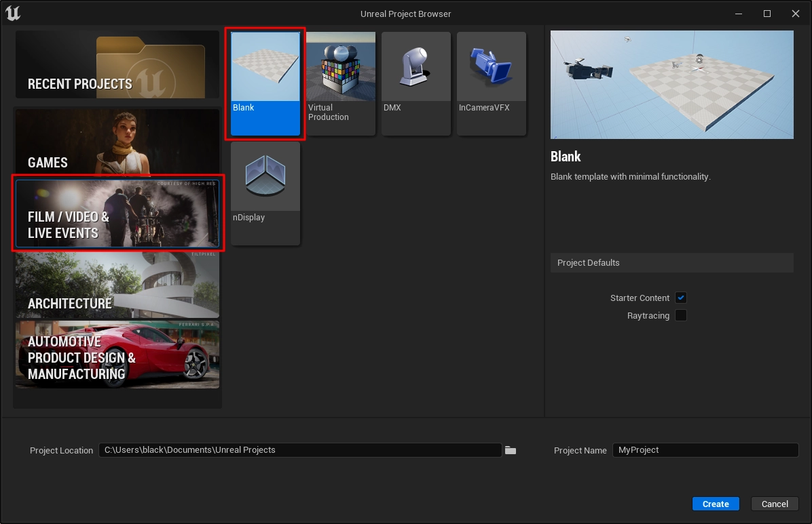

# Creating a Video Project

Create a new Unreal Engine project configured for film and video production.

## Steps

1. Open **Unreal Engine** and launch the **Unreal Project Browser**.

2. Select **Film / Video & Live Events** in the left category panel.

3. Select **Blank** under project templates.

4. Configure the project settings:

    * Enable or disable **Starter Content** as needed.
    * Enable **Raytracing** if required.
    * Set the project location.
    * Enter a **Project Name**.

5. Click **Create**.

## Note

The **Film / Video & Live Events** category configures Unreal Engine with tools optimized for cinematic production workflows.

