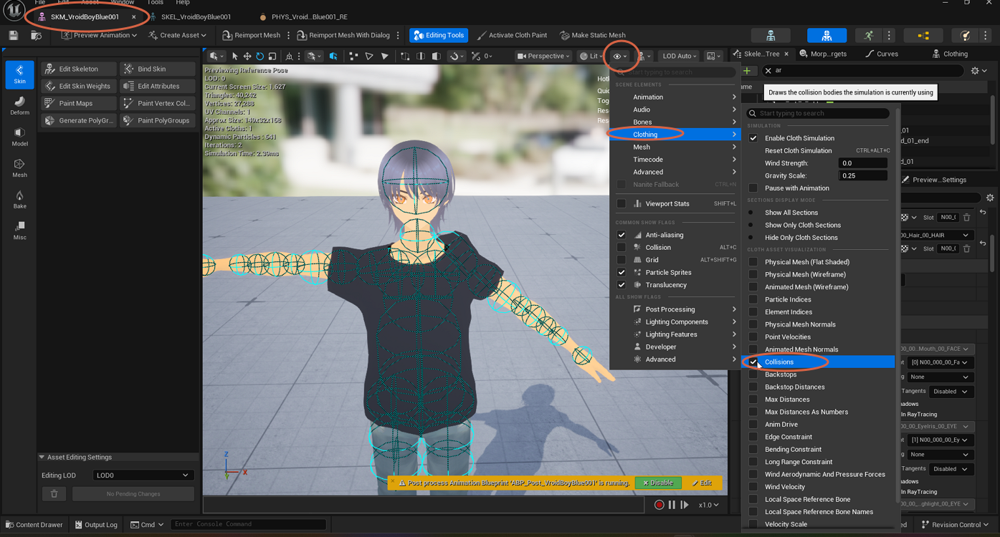

# Displaying Collisions in the Skeletal Mesh Editor

> **Note:** This document was generated by Claude Code and has not been reviewed by a human. Please use it as a reference only.

This shows the collision bodies a Chaos Cloth simulation is currently using, drawn directly on the mesh in the Skeletal Mesh editor's viewport. Use this to check collision fit while previewing the simulation, without switching to the Physics Asset editor.

## Step 1: Open the Character Show-Flags Menu

In the **Skeletal Mesh** editor, click the eye icon in the viewport toolbar to open the **Character** menu.

## Step 2: Open the Clothing Submenu

Hover over **Clothing** in the **Scene Elements** list to open its flyout submenu.

## Step 3: Enable the Collisions Flag

Under **Cloth Asset Visualization**, check **Collisions** ("Draws the collision bodies the simulation is currently using"). Collision capsules appear directly on the mesh in the viewport, following the simulated cloth.

> **Note:** The same submenu has other **Cloth Asset Visualization** flags worth knowing about — **Max Distances** and **Backstops** visualize the weight maps painted in [Applying Chaos Cloth Simulation](apply-chaos-cloth.md), and **Physical Mesh Wireframe** shows the simulation mesh itself. The **Sections Display Mode** group above it (**Show All Sections**, **Show Only Cloth Sections**, **Hide Only Cloth Sections**) controls which mesh sections render at all, independent of these visualization flags.
